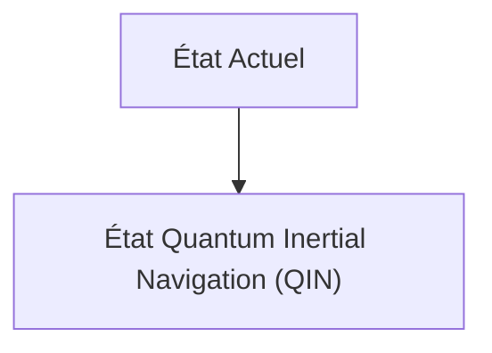
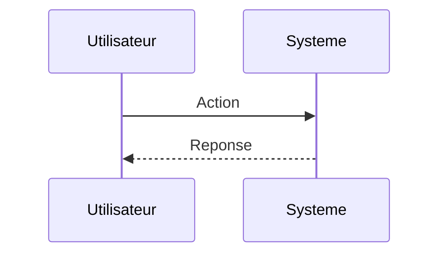

<!-- markdownlint-disable MD009 MD010 MD013 MD022 MD028 MD032 MD033 MD034 MD036 MD037 MD039 MD041 MD060 -->

[ 🇬🇧 English Version ](./README.md)

# Quantum Inertial Navigation (QIN)

> **Résumé exécutif :** Utilisation d'interférométrie atomique pour mesurer l'accélération et la rotation avec une précision extrême sans aucune dérive sur de longues périodes, permettant un positionnement absolu en autonomie totale (sans signal externe).

---

## 1. Aperçu visuel & Effet Wahou

## 2. La thèse contrariante (Peter Thiel Style)

**La croyance populaire :** Les solutions généralistes IA peuvent résoudre ce problème.

**La vérité cachée :** Ce problème est purement physique et matériel. Un LLM ou un algorithme classique ne peut pas inventer un signal GPS absent. Il faut des capteurs quantiques refroidis par laser (cold atoms) pour atteindre la sensibilité requise.

## 3. Le problème & La cible

**Modèle économique :** B2B / B2G

**Cible précise :** Armées (sous-marins, drones), aviation commerciale, flottes maritimes, et opérateurs d'infrastructures critiques.

**La douleur urgente :** Le brouillage, le spoofing et la perte de signaux GNSS/GPS (par des acteurs malveillants ou en environnement extrême comme sous l'eau ou sous terre) paralysent les systèmes de navigation modernes, causant des pertes financières massives et des risques mortels.

## 4. Architecture technique & Plomberie

## 5. Modèle économique & Viabilité financière

| Métrique                    | Valeur                        |
| --------------------------- | ----------------------------- |
| Structure de prix           | Abonnement SaaS               |
| Objectif 12 mois            | 10 clients                    |
| Calcul du CA (Target 100k€) | 10 clients \* 10k€/an = 100k€ |
| Marge brute estimée         | 80%                           |

## 6. Moteur de distribution & Fossé défensif (Moat)

**Stratégie d'acquisition :** Vente directe B2B

**Moat (Barrière à l'entrée) :** Miniaturisation matérielle extrême requise (SWaP-C : Size, Weight, Power, and Cost), coûts de R&D prohibitifs, dépendance aux chaînes d'approvisionnement en lasers et composants optiques de haute précision.

## 7. Grille d'évaluation détaillée

| Critère                           | Score VC (/100) | Score Terrain (/100) |
| --------------------------------- | --------------- | -------------------- |
| Thèse & Monopole / Urgence        | -- / 25         | -- / 25              |
| Moat / Résistance aux LLM natifs  | -- / 25         | -- / 25              |
| Scalabilité / Friction d'adoption | -- / 25         | -- / 25              |
| Unit Economics / ROI direct       | -- / 25         | -- / 25              |
| **TOTAL**                         | **-- / 100**    | **-- / 100**         |

> **Verdict VC :** En attente d'évaluation.

> **Verdict Terrain :** En attente d'évaluation.
