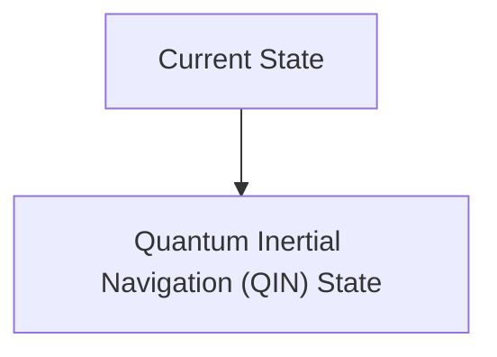
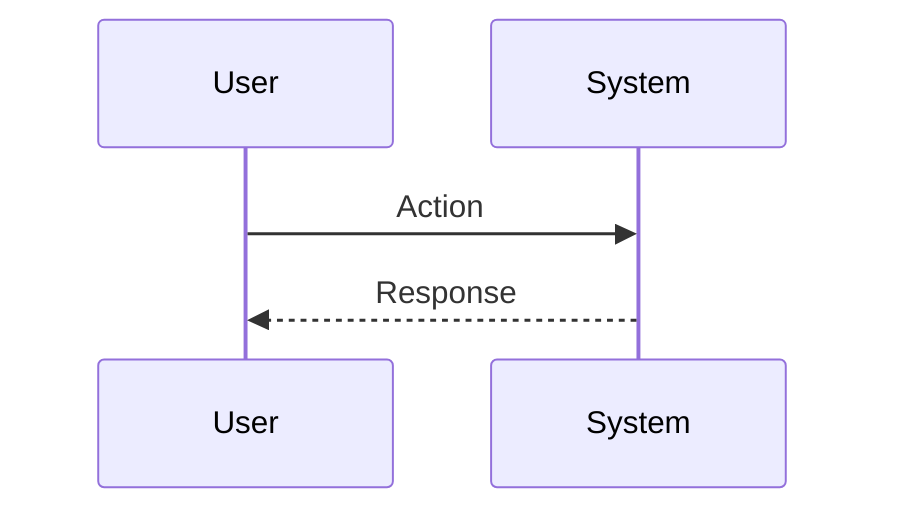

<!-- markdownlint-disable MD009 MD010 MD013 MD022 MD028 MD032 MD033 MD034 MD036 MD037 MD039 MD041 MD060 -->

[ 🇫🇷 Version Française ](./README.fr.md)

# Quantum Inertial Navigation (QIN)

> **Executive Summary:** Use of atomic interferometry to measure acceleration and rotation with extreme precision without any drift over long periods, allowing absolute positioning in total autonomy (without external signal).

---

## 1. Visual Overview & Wow Effect

## 2. Contrarian Thesis (Peter Thiel Style)

**Popular Belief:** General AI solutions can solve this problem.

**Hidden Truth:** This problem is purely physical and material. An LLM or a classical algorithm cannot invent a missing GPS signal. Laser-cooled quantum sensors (cold atoms) are required to achieve the required sensitivity.

## 3. Problem & Target Market

**Business Model:** B2B / B2G

**Target Audience:** Armies (submarines, drones), commercial aviation, maritime fleets, and critical infrastructure operators.

**Urgent Pain Point:** Jamming, spoofing and loss of GNSS/GPS signals (by malicious actors or in extreme environments such as underwater or underground) cripple modern navigation systems, causing massive financial losses and life-threatening risks.

## 4. Technical Architecture & Infrastructure

## 5. Business Model & Financial Viability

| Metric                 | Value                           |
| ---------------------- | ------------------------------- |
| Pricing Structure      | SaaS subscription               |
| 12-Month Target        | 10 customers                    |
| Revenue Formula        | 10 clients \* 10k€/year = 100k€ |
| Estimated Gross Margin | 80%                             |

## 6. Distribution Engine & Moat

**Acquisition Strategy:** B2B direct sales

**Moat (Defensibility):** Required extreme hardware miniaturization (SWaP-C: Size, Weight, Power, and Cost), prohibitive R&D costs, dependence on supply chains for high-precision lasers and optical components.

## 7. Detailed Evaluation Grid

| Criterion                   | VC Score (/100) | Market Score (/100) |
| --------------------------- | --------------- | ------------------- |
| Thesis & Monopoly / Urgency | -- / 25         | -- / 25             |
| Moat / LLM Immunity         | -- / 25         | -- / 25             |
| Scalability / UX Friction   | -- / 25         | -- / 25             |
| Unit Economics / ROI        | -- / 25         | -- / 25             |
| **TOTAL**                   | **-- / 100**    | **-- / 100**        |

> **VC Verdict:** Pending evaluation.

> **Market Verdict:** Pending evaluation.
