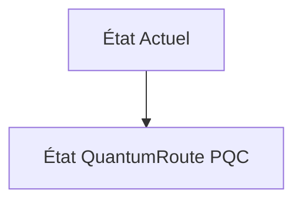
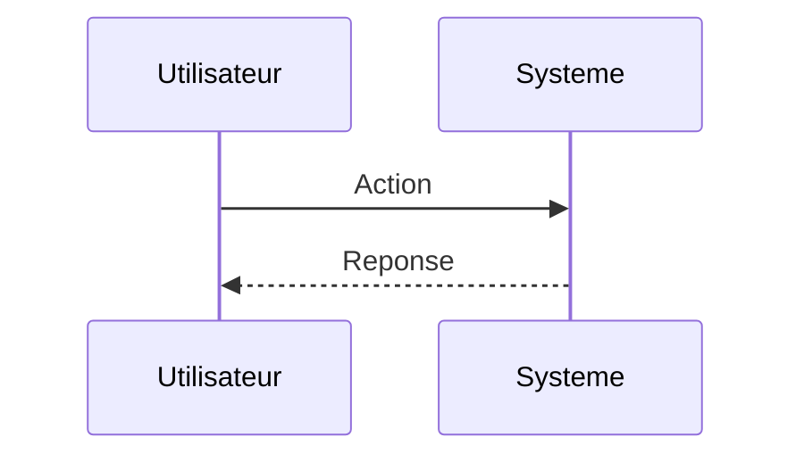

<!-- markdownlint-disable MD009 MD010 MD013 MD022 MD028 MD032 MD033 MD034 MD036 MD037 MD039 MD041 MD060 -->

[ 🇬🇧 English Version ](./README.md)

# QuantumRoute PQC

> **Résumé exécutif :** Routeur logiciel de niveau 3 et proxy PQC implémentant les standards NIST (Kyber/Dilithium) avec un overhead réseau minimal, intégrant un mécanisme de "Crypto-Agility" pour changer d'algorithme dynamiquement sans interruption de service (zero-downtime).

---

## 1. Aperçu visuel & Effet Wahou

## 2. La thèse contrariante (Peter Thiel Style)

**La croyance populaire :** Les solutions généralistes IA peuvent résoudre ce problème.

**La vérité cachée :** Les SaaS de sécurité habituels gèrent la couche applicative. Ici, le problème se situe au niveau du routage de bas niveau et du transport (couches 3/4 du modèle OSI). Une feuille Excel ou un LLM ne peut pas intercepter et chiffrer des paquets réseau à des vitesses térabits avec de nouveaux algorithmes mathématiques.

## 3. Le problème & La cible

**Modèle économique :** B2B / M2M

**Cible précise :** Fournisseurs de télécommunications, banques centrales, opérateurs de réseaux électriques (OIV/OSE).

**La douleur urgente :** La transition vers la cryptographie post-quantique (PQC) nécessite de remplacer les protocoles de routage BGP et TLS actuels qui seront vulnérables aux attaques "Store Now, Decrypt Later" (SNDL) par des ordinateurs quantiques, risquant de compromettre les données d'infrastructure critique.

## 4. Architecture technique & Plomberie

## 5. Modèle économique & Viabilité financière

| Métrique                    | Valeur                        |
| --------------------------- | ----------------------------- |
| Structure de prix           | Abonnement SaaS               |
| Objectif 12 mois            | 10 clients                    |
| Calcul du CA (Target 100k€) | 10 clients \* 10k€/an = 100k€ |
| Marge brute estimée         | 80%                           |

## 6. Moteur de distribution & Fossé défensif (Moat)

**Stratégie d'acquisition :** Vente directe B2B

**Moat (Barrière à l'entrée) :** Adoption lente des standards PQC par les industriels, besoin de certification de sécurité stricte (FIPS, ANSSI), risques de performances (latence accrue due aux nouveaux algorithmes).

## 7. Grille d'évaluation détaillée

| Critère                           | Score VC (/100) | Score Terrain (/100) |
| --------------------------------- | --------------- | -------------------- |
| Thèse & Monopole / Urgence        | -- / 25         | -- / 25              |
| Moat / Résistance aux LLM natifs  | -- / 25         | -- / 25              |
| Scalabilité / Friction d'adoption | -- / 25         | -- / 25              |
| Unit Economics / ROI direct       | -- / 25         | -- / 25              |
| **TOTAL**                         | **-- / 100**    | **-- / 100**         |

> **Verdict VC :** En attente d'évaluation.

> **Verdict Terrain :** En attente d'évaluation.
