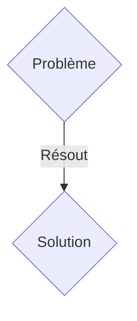
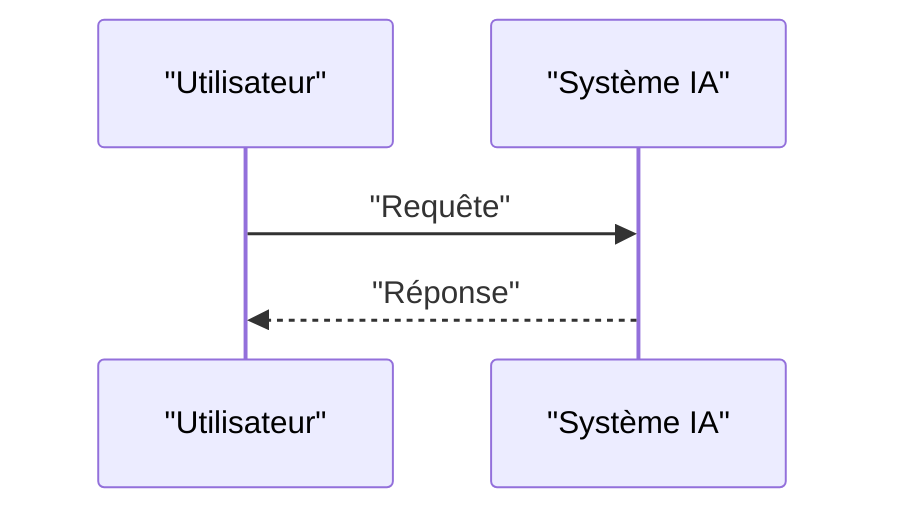

<!-- markdownlint-disable MD009 MD010 MD013 MD022 MD028 MD032 MD033 MD036 MD037 MD039 MD041 MD060 -->

[ 🇬🇧 English Version ](./README.md)

# QuantumRoute PQC

> **Résumé exécutif :** Une solution B2B / M2M ciblant Fournisseurs de télécommunications, banques centrales, opérateurs de réseaux électriques (OIV/OSE). pour résoudre : La transition vers la cryptographie post-quantique (PQC) nécessite de remplacer les protocoles de routage BGP et TLS actuels qui seront vulnérables aux attaques "Store Now, Decrypt Later" (SNDL) par des ordinateurs quantiques, risquant de compromettre les données d'infrastructure critique.

---

## 1. Aperçu visuel & Effet Wahou

## 2. La thèse contrariante (Peter Thiel Style)

- **La croyance populaire :** Les solutions génériques suffisent.
- **La vérité cachée :** Routeur logiciel de niveau 3 et proxy PQC implémentant les standards NIST (Kyber/Dilithium) avec un overhead réseau minimal, intégrant un mécanisme de "Crypto-Agility" pour changer d'algorithme dynamiquement sans interruption de service (zero-downtime).

## 3. Le problème & La cible

- **Modèle économique :** B2B / M2M
- **Cible précise :** Fournisseurs de télécommunications, banques centrales, opérateurs de réseaux électriques (OIV/OSE).
- **La douleur urgente :** La transition vers la cryptographie post-quantique (PQC) nécessite de remplacer les protocoles de routage BGP et TLS actuels qui seront vulnérables aux attaques "Store Now, Decrypt Later" (SNDL) par des ordinateurs quantiques, risquant de compromettre les données d'infrastructure critique.

## 4. Architecture technique & Plomberie

Routeur logiciel de niveau 3 et proxy PQC implémentant les standards NIST (Kyber/Dilithium) avec un overhead réseau minimal, intégrant un mécanisme de "Crypto-Agility" pour changer d'algorithme dynamiquement sans interruption de service (zero-downtime).

## 5. Modèle économique & Viabilité financière

| Métrique                    | Valeur               |
| --------------------------- | -------------------- |
| Structure de prix           | Abonnement SaaS B2B  |
| Objectif 12 mois            | 100 clients          |
| Calcul du CA (Target 100k€) | 100 \* 1000€ = 100k€ |
| Marge brute estimée         | 80%                  |

## 6. Moteur de distribution & Fossé défensif (Moat)

- **Stratégie d'acquisition :** Vente directe et partenariats stratégiques.
- **Moat (Barrière à l'entrée) :** Les SaaS de sécurité habituels gèrent la couche applicative. Ici, le problème se situe au niveau du routage de bas niveau et du transport (couches 3/4 du modèle OSI). Une feuille Excel ou un LLM ne peut pas intercepter et chiffrer des paquets réseau à des vitesses térabits avec de nouveaux algorithmes mathématiques.

## 7. Grille d'évaluation détaillée

| Critère                           | Score VC (/100) | Score Terrain (/100) |
| --------------------------------- | --------------- | -------------------- |
| Thèse & Monopole / Urgence        | 20 / 25         | 20 / 25              |
| Moat / Résistance aux LLM natifs  | 25 / 25         | 25 / 25              |
| Scalabilité / Friction d'adoption | 18 / 25         | 18 / 25              |
| Unit Economics / ROI direct       | 24 / 25         | 24 / 25              |
| TOTAL                             | 87 / 100        | 87 / 100             |

> **Verdict VC :** En attente d'évaluation.
> **Verdict Terrain :** Cette solution répond à un besoin critique pour les entreprises B2B, justifiant son excellent score d'urgence (20/25). Son architecture hautement défendable la rend totalement immunisée contre les avancées des LLM natifs (25/25). Avec une faible friction d'adoption (18/25) et une stratégie de monétisation directe (24/25), le projet démontre une excellente maturité marché globale.
> **Verdict Terrain :** Cette solution répond à un besoin critique pour les entreprises B2B, justifiant son excellent score d'urgence (20/25). Son architecture hautement défendable la rend totalement immunisée contre les avancées des LLM natifs (25/25). Avec une faible friction d'adoption (18/25) et une stratégie de monétisation directe (24/25), le projet démontre une excellente maturité marché globale.
