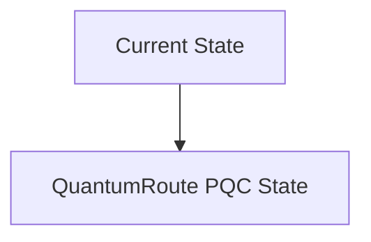
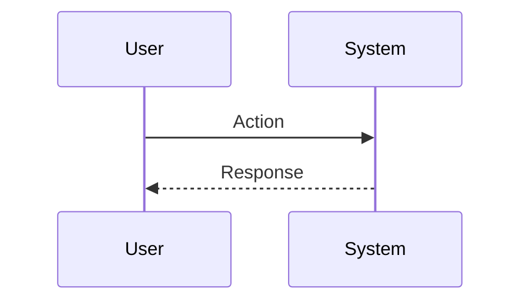

<!-- markdownlint-disable MD009 MD010 MD013 MD022 MD028 MD032 MD033 MD034 MD036 MD037 MD039 MD041 MD060 -->

[ 🇫🇷 Version Française ](./README.fr.md)

# QuantumRoute PQC

> **Executive Summary:** Layer 3 software router and PQC proxy implementing NIST standards (Kyber/Dilithium) with minimal network overhead, integrating a "Crypto-Agility" mechanism to dynamically change algorithms without service interruption (zero-downtime).

---

## 1. Visual Overview & Wow Effect

## 2. Contrarian Thesis (Peter Thiel Style)

**Popular Belief:** General AI solutions can solve this problem.

**Hidden Truth:** Typical security SaaS manages the application layer. Here, the problem is at the low-level routing and transport level (layers 3/4 of the OSI model). An Excel sheet or an LLM cannot intercept and encrypt network packets at terabit speeds with new mathematical algorithms.

## 3. Problem & Target Market

**Business Model:** B2B / M2M

**Target Audience:** Telecommunications providers, central banks, electricity network operators (OIV/OSE).

**Urgent Pain Point:** The transition to post-quantum cryptography (PQC) requires replacing current BGP and TLS routing protocols which will be vulnerable to "Store Now, Decrypt Later" (SNDL) attacks with quantum computers, risking compromise of critical infrastructure data.

## 4. Technical Architecture & Infrastructure

## 5. Business Model & Financial Viability

| Metric                 | Value                           |
| ---------------------- | ------------------------------- |
| Pricing Structure      | SaaS subscription               |
| 12-Month Target        | 10 customers                    |
| Revenue Formula        | 10 clients \* 10k€/year = 100k€ |
| Estimated Gross Margin | 80%                             |

## 6. Distribution Engine & Moat

**Acquisition Strategy:** B2B direct sales

**Moat (Defensibility):** Slow adoption of PQC standards by manufacturers, need for strict security certification (FIPS, ANSSI), performance risks (increased latency due to new algorithms).

## 7. Detailed Evaluation Grid

| Criterion                   | VC Score (/100) | Market Score (/100) |
| --------------------------- | --------------- | ------------------- |
| Thesis & Monopoly / Urgency | -- / 25         | -- / 25             |
| Moat / LLM Immunity         | -- / 25         | -- / 25             |
| Scalability / UX Friction   | -- / 25         | -- / 25             |
| Unit Economics / ROI        | -- / 25         | -- / 25             |
| **TOTAL**                   | **-- / 100**    | **-- / 100**        |

> **VC Verdict:** Pending evaluation.

> **Market Verdict:** Pending evaluation.
