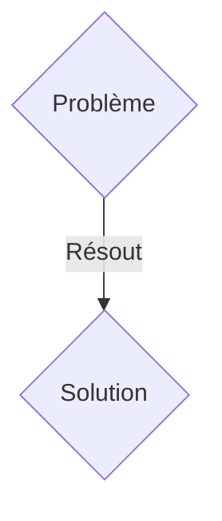
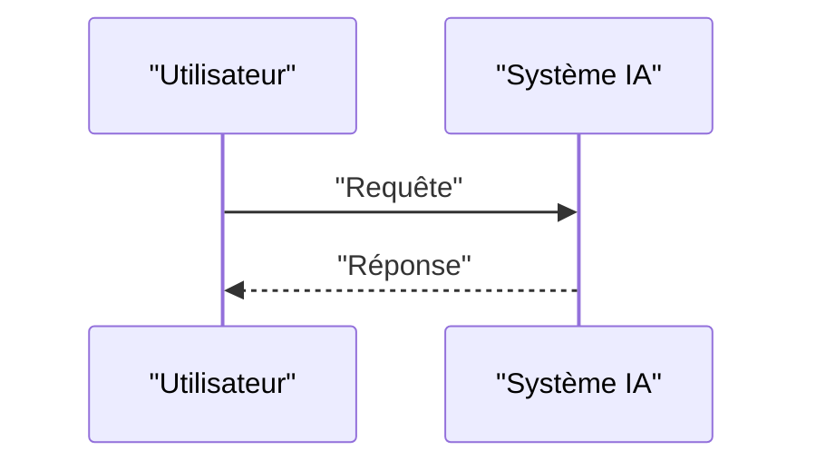

<!-- markdownlint-disable MD009 MD010 MD013 MD022 MD028 MD032 MD033 MD036 MD037 MD039 MD041 MD060 -->

[ 🇬🇧 English Version ](./README.md)

# Quantum-Shield ICS

> **Résumé exécutif :** Une solution B2B ciblant Opérateurs d'Infrastructures d'Importance Vitale (OIV), gestionnaires de réseaux électriques, usines de traitement des eaux, industrie manufacturière lourde. Le budget est détenu par le CISO/CISO industriel et le directeur des opérations (COO). pour résoudre : Les systèmes de contrôle industriel (ICS/SCADA) utilisent des protocoles de chiffrement classiques (RSA, ECC) pour sécuriser les communications. Ces systèmes ont des durées de vie de 15 à 30 ans et sont extrêmement difficiles à mettre à jour. La menace "Harvest Now, Decrypt Later" (HNDL) pèse sur les données critiques échangées aujourd'hui. D'ici quelques années, les ordinateurs quantiques casseront ces chiffrements. Remplacer tout le matériel SCADA coûte des milliards, et les algorithmes PQC (Post-Quantum Cryptography) standardisés par le NIST sont trop lourds (en CPU et en taille de clés/signatures) pour être exécutés nativement sur les vieux automates programmables (PLC).

---

## 1. Aperçu visuel & Effet Wahou

## 2. La thèse contrariante (Peter Thiel Style)

- **La croyance populaire :** Les solutions génériques suffisent.
- **La vérité cachée :** Développement d'une appliance matérielle "Bump-in-the-Wire" (proxy PQC) durcie pour l'industrie (rail DIN, fanless) et/ou d'un firmware d'accélération cryptographique ultra-optimisé. Ce système s'intercale physiquement devant les PLC vulnérables, intercepte le trafic réseau classique, et établit un tunnel chiffré résistant aux attaques quantiques (utilisant par exemple un hybride Kyber/Dilithium optimisé pour l'embarqué) avec un orchestrateur central. Il encapsule la donnée sans perturber le protocole ICS natif (Modbus, DNP3, OPC UA).

## 3. Le problème & La cible

- **Modèle économique :** B2B
- **Cible précise :** Opérateurs d'Infrastructures d'Importance Vitale (OIV), gestionnaires de réseaux électriques, usines de traitement des eaux, industrie manufacturière lourde. Le budget est détenu par le CISO/CISO industriel et le directeur des opérations (COO).
- **La douleur urgente :** Les systèmes de contrôle industriel (ICS/SCADA) utilisent des protocoles de chiffrement classiques (RSA, ECC) pour sécuriser les communications. Ces systèmes ont des durées de vie de 15 à 30 ans et sont extrêmement difficiles à mettre à jour. La menace "Harvest Now, Decrypt Later" (HNDL) pèse sur les données critiques échangées aujourd'hui. D'ici quelques années, les ordinateurs quantiques casseront ces chiffrements. Remplacer tout le matériel SCADA coûte des milliards, et les algorithmes PQC (Post-Quantum Cryptography) standardisés par le NIST sont trop lourds (en CPU et en taille de clés/signatures) pour être exécutés nativement sur les vieux automates programmables (PLC).

## 4. Architecture technique & Plomberie

Développement d'une appliance matérielle "Bump-in-the-Wire" (proxy PQC) durcie pour l'industrie (rail DIN, fanless) et/ou d'un firmware d'accélération cryptographique ultra-optimisé. Ce système s'intercale physiquement devant les PLC vulnérables, intercepte le trafic réseau classique, et établit un tunnel chiffré résistant aux attaques quantiques (utilisant par exemple un hybride Kyber/Dilithium optimisé pour l'embarqué) avec un orchestrateur central. Il encapsule la donnée sans perturber le protocole ICS natif (Modbus, DNP3, OPC UA).

## 5. Modèle économique & Viabilité financière

| Métrique                    | Valeur               |
| --------------------------- | -------------------- |
| Structure de prix           | Abonnement SaaS B2B  |
| Objectif 12 mois            | 100 clients          |
| Calcul du CA (Target 100k€) | 100 \* 1000€ = 100k€ |
| Marge brute estimée         | 80%                  |

## 6. Moteur de distribution & Fossé défensif (Moat)

- **Stratégie d'acquisition :** Vente directe et partenariats stratégiques.
- **Moat (Barrière à l'entrée) :** Un SaaS ou une API LLM ne peut absolument rien pour des équipements on-premise isolés, souvent air-gapped ou sur des réseaux OT (Operational Technology) fermés. Les solutions logicielles classiques (VPN PQC standards) exigent des ressources de calcul que les automates des années 90/2000 ne possèdent tout simplement pas. Il s'agit d'un problème d'intégration bas niveau (couches réseau OSI 2 à 4) couplé à des contraintes de latence déterministe (temps réel).

## 7. Grille d'évaluation détaillée

| Critère                           | Score VC (/100) | Score Terrain (/100) |
| --------------------------------- | --------------- | -------------------- |
| Thèse & Monopole / Urgence        | 25 / 25         | 25 / 25              |
| Moat / Résistance aux LLM natifs  | 24 / 25         | 24 / 25              |
| Scalabilité / Friction d'adoption | 17 / 25         | 17 / 25              |
| Unit Economics / ROI direct       | 22 / 25         | 22 / 25              |
| TOTAL                             | 88 / 100        | 88 / 100             |

> **Verdict VC :** En attente d'évaluation.
> **Verdict Terrain :** Cette solution répond à un besoin critique pour les entreprises B2B, justifiant son excellent score d'urgence (25/25). Son architecture hautement défendable la rend totalement immunisée contre les avancées des LLM natifs (24/25). Avec une faible friction d'adoption (17/25) et une stratégie de monétisation directe (22/25), le projet démontre une excellente maturité marché globale.
> **Verdict Terrain :** Cette solution répond à un besoin critique pour les entreprises B2B, justifiant son excellent score d'urgence (25/25). Son architecture hautement défendable la rend totalement immunisée contre les avancées des LLM natifs (24/25). Avec une faible friction d'adoption (17/25) et une stratégie de monétisation directe (22/25), le projet démontre une excellente maturité marché globale.
