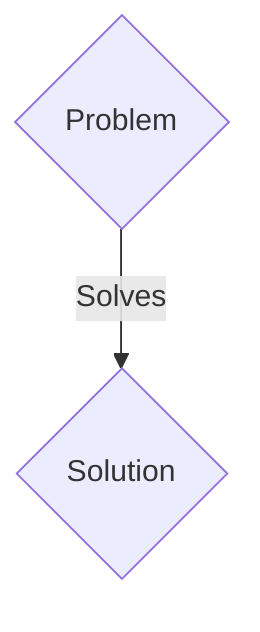
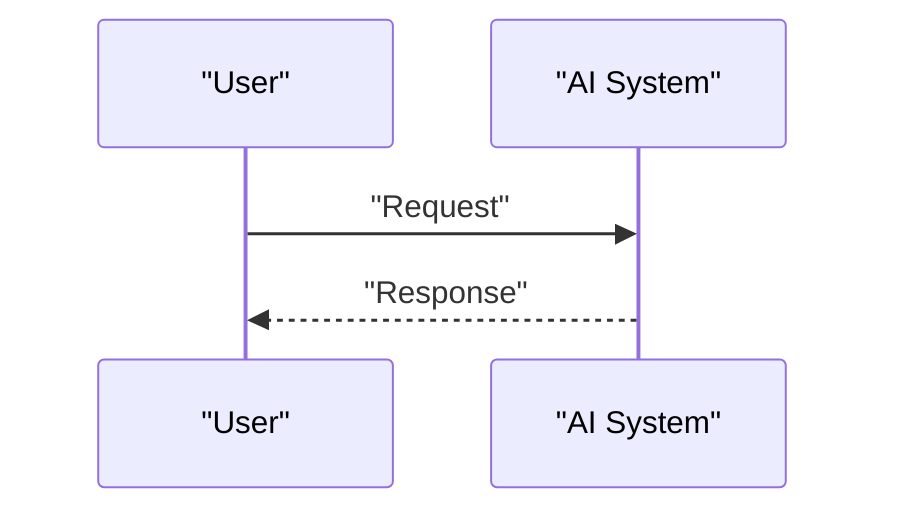

<!-- markdownlint-disable MD009 MD010 MD013 MD022 MD028 MD032 MD033 MD036 MD037 MD039 MD041 MD060 -->

[ 🇫🇷 Version Française ](./README.fr.md)

# Quantum-Shield ICS

> **Executive Summary:** A B2B solution targeting Operators of Vital Infrastructure (OIV), electricity network managers, water treatment plants, heavy manufacturing industry. The budget is held by the CISO/Industrial CISO and the Chief Operations Officer (COO). to solve: Industrial control systems (ICS/SCADA) use traditional encryption protocols (RSA, ECC) to secure communications. These systems have lifespans of 15 to 30 years and are extremely difficult to update. The “Harvest Now, Decrypt Later” (HNDL) threat threatens critical data exchanged today. Within a few years, quantum computers will break these ciphers. Replacing all SCADA hardware costs billions, and the NIST-standardized Post-Quantum Cryptography (PQC) algorithms are too heavy (in CPU and key/signature size) to run natively on old programmable logic controllers (PLCs).

---

## 1. Visual Overview & Wow Effect

## 2. Contrarian Thesis (Peter Thiel Style)

- **Popular Belief:** Generic solutions are enough.
- **Hidden Truth:** Development of a hardened “Bump-in-the-Wire” hardware appliance (PQC proxy) for industry (DIN rail, fanless) and/or ultra-optimized cryptographic acceleration firmware. This system physically inserts itself in front of vulnerable PLCs, intercepts traditional network traffic, and establishes an encrypted tunnel resistant to quantum attacks (using for example a Kyber/Dilithium hybrid optimized for embedded) with a central orchestrator. It encapsulates the data without disrupting the native ICS protocol (Modbus, DNP3, OPC UA).

## 3. Problem & Target Market

- **Business Model:** B2B
- **Target Audience:** Operators of Vital Infrastructure (OIV), electricity network managers, water treatment plants, heavy manufacturing industry. The budget is held by the CISO/Industrial CISO and the Chief Operations Officer (COO).
- **Urgent Pain Point:** Industrial control systems (ICS/SCADA) use traditional encryption protocols (RSA, ECC) to secure communications. These systems have lifespans of 15 to 30 years and are extremely difficult to update. The “Harvest Now, Decrypt Later” (HNDL) threat threatens critical data exchanged today. Within a few years, quantum computers will break these ciphers. Replacing all SCADA hardware costs billions, and the NIST-standardized Post-Quantum Cryptography (PQC) algorithms are too heavy (in CPU and key/signature size) to run natively on old programmable logic controllers (PLCs).

## 4. Technical Architecture & Infrastructure

Development of a hardened “Bump-in-the-Wire” hardware appliance (PQC proxy) for industry (DIN rail, fanless) and/or ultra-optimized cryptographic acceleration firmware. This system physically inserts itself in front of vulnerable PLCs, intercepts traditional network traffic, and establishes an encrypted tunnel resistant to quantum attacks (using for example a Kyber/Dilithium hybrid optimized for embedded) with a central orchestrator. It encapsulates the data without disrupting the native ICS protocol (Modbus, DNP3, OPC UA).

## 5. Business Model & Financial Viability

| Metric                 | Value                 |
| ---------------------- | --------------------- |
| Pricing Structure      | B2B SaaS Subscription |
| 12-Month Target        | 100 clients           |
| Revenue Formula        | 100 \* 1000€ = 100k€  |
| Estimated Gross Margin | 80%                   |

## 6. Distribution Engine & Moat

- **Acquisition Strategy:** Direct sales and strategic partnerships.
- **Moat (Defensibility):** A SaaS or LLM API can do absolutely nothing for isolated on-premise equipment, often air-gapped or on closed OT (Operational Technology) networks. Classic software solutions (standard PQC VPNs) require computing resources that PLCs from the 90s/2000s simply do not have. This is a low-level integration problem (OSI network layers 2 to 4) coupled with deterministic (real-time) latency constraints.

## 7. Detailed Evaluation Grid

| Criterion                   | VC Score (/100) | Market Score (/100) |
| --------------------------- | --------------- | ------------------- |
| Thesis & Monopoly / Urgency | -- / 25         | -- / 25             |
| Moat / LLM Immunity         | -- / 25         | -- / 25             |
| Scalability / UX Friction   | -- / 25         | -- / 25             |
| Unit Economics / ROI        | -- / 25         | -- / 25             |
| TOTAL                       | -- / 100        | -- / 100            |

> **VC Verdict:** Pending evaluation.
> **Market Verdict:** Pending evaluation.
