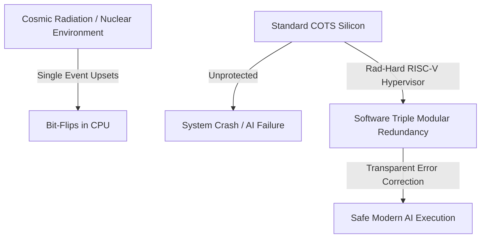
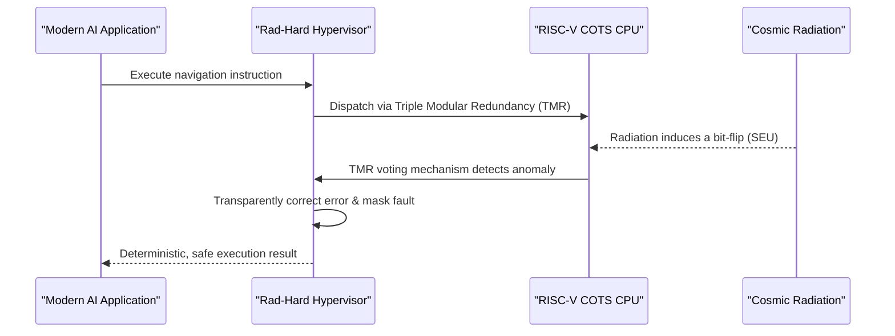

<!-- markdownlint-disable MD009 MD010 MD013 MD022 MD028 MD032 MD033 MD034 MD036 MD037 MD039 MD041 MD060 -->

[ 🇫🇷 Version Française ](./README.fr.md)

# Rad-Hard RISC-V Hypervisor

> **Executive Summary:** An ultra-secure software hypervisor coupled with an open-source RISC-V architecture optimized for soft-error mitigation, allowing modern AI to run safely on commercial silicon in high-radiation environments (Space/Nuclear).

---

## 1. Visual Overview & Wow Effect

## 2. Contrarian Thesis (Peter Thiel Style)

- **Popular Belief:** To compute in space or nuclear environments, you must use physically "rad-hardened" chips, which are incredibly expensive, proprietary, and fundamentally decades behind modern CPU architectures.
- **Hidden Truth:** By deeply co-designing a Bare Metal hypervisor with an open-source RISC-V architecture, we can shift the radiation protection burden from hardware physical constraints to intelligent software/micro-architecture redundancy, unlocking modern AI capabilities on cheap commercial off-the-shelf (COTS) silicon.

## 3. Problem & Target Market

- **Business Model:** B2B
- **Target Audience:** Space agencies (NASA, ESA), commercial satellite builders, nuclear power plant operators, extreme decommissioning robotics.
- **Urgent Pain Point:** Running modern image processing or navigation AI safely in space is nearly impossible without suffering constant bit-flips (Single Event Upsets) on traditional, slow rad-hardened chips.

## 4. Technical Architecture & Infrastructure

## 5. Business Model & Financial Viability

| Metric                     | Value                                                    |
| -------------------------- | -------------------------------------------------------- |
| **Pricing Structure**      | High-ticket Enterprise License + Support / Certification |
| **12-Month Target**        | 1-2 pilot licenses with New Space startups               |
| **Revenue Formula**        | 2 licenses \* 50k€/year                                  |
| **Estimated Gross Margin** | ~95% (Pure Software)                                     |

## 6. Distribution Engine & Moat

- **Acquisition Strategy:** Direct B2B sales to New Space engineering teams, heavily leveraging open-source RISC-V community trust and successful cyclotron irradiation test certifications.
- **Moat (Defensibility):** This requires deep embedded OS development (Ring 0 / Bare Metal) coupled with micro-architecture (RTL) expertise. No cloud API or LLM can physically protect a CPU register against real-time cosmic radiation while guaranteeing deterministic execution times. Space certification itself is a massive moat.

## 7. Detailed Evaluation Grid

| Criterion                   | VC Score (/100) | Market Score (/100) |
| --------------------------- | --------------- | ------------------- |
| Thesis & Monopoly / Urgency | 25 / 25         | -- / 25             |
| Moat / LLM Immunity         | 24 / 25         | -- / 25             |
| Scalability / UX Friction   | 22 / 25         | -- / 25             |
| Unit Economics / ROI        | 21 / 25         | -- / 25             |
| **TOTAL**                   | **92 / 100**    | **-- / 100**        |

> **VC Verdict:** A brilliant counter-positioning against legacy radiation-hardened hardware. Using software to error-correct commercial silicon unlocks massive performance gains for space/nuclear AI. The technical lock-in and regulatory moats are absolute.

> **Market Verdict:** Pending evaluation.
