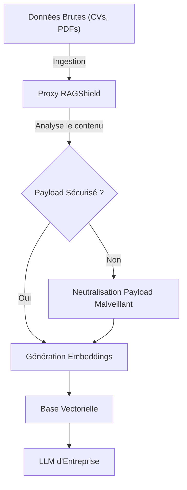
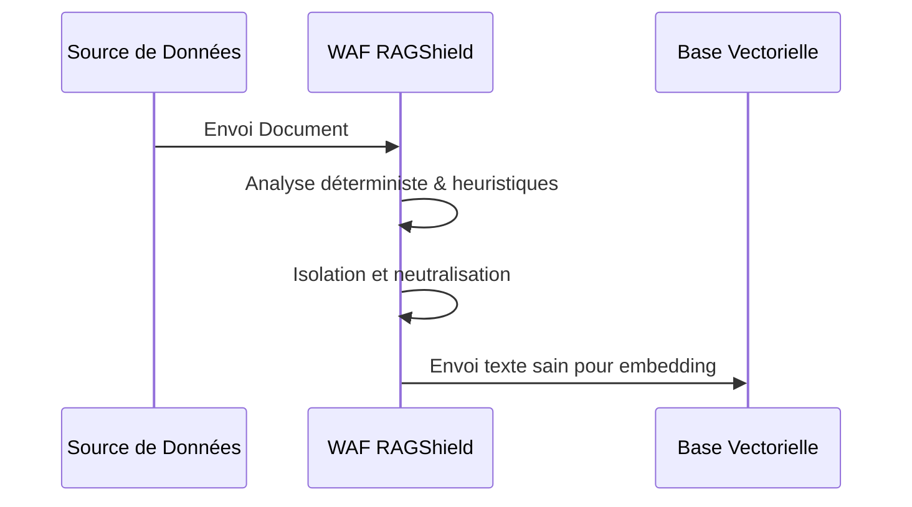

<!-- markdownlint-disable MD013 MD028 MD033 MD036 MD039 MD041 MD060 -->

[ 🇬🇧 English Version ](./README.md)

# RAGShield

> **Résumé exécutif :** Un pare-feu applicatif (WAF) pour IA agissant comme un proxy de sanitisation entre les sources de données et les bases vectorielles pour contrer les injections indirectes.

---

## 1. Aperçu visuel

## 2. La thèse contrariante (Peter Thiel Style)

La croyance populaire : Un "system prompt" robuste suffit à sécuriser un LLM d'entreprise.
La vérité cachée : Par conception, un LLM ne sait pas isoler parfaitement les instructions du système des données injectées dans son contexte. Une donnée corrompue dans le RAG prendra le pas sur les règles.

## 3. Le problème & La cible

Modèle économique : B2B
Cible précise : Entreprises déployant des applications d'IA générative (pipelines RAG), RSSI (CISO) et équipes Data Engineering.
La douleur urgente : L'ingestion de documents tiers expose l'entreprise aux injections de prompt indirectes (exfiltration de données, actions malveillantes via le LLM).

## 4. Architecture technique & Plomberie

## 5. Modèle économique & Viabilité financière

| Métrique                    | Valeur                  |
| --------------------------- | ----------------------- |
| Structure de prix           | Abonnement B2B / Volume |
| Objectif 12 mois            | 100 clients entreprise  |
| Calcul du CA (Target 100k€) | Clients \* Abonnement   |
| Marge brute estimée         | 80-90%                  |

## 6. Moteur de distribution & Fossé défensif (Moat)

Stratégie d'acquisition : Ventes directes B2B (RSSI, Data).
Moat (Barrière à l'entrée) : Combine analyse syntaxique déterministe et isolation stricte avant l'embedding. Les LLMs natifs échouent car ils mélangent intrinsèquement instructions et contexte.

## 7. Grille d'évaluation détaillée

| Critère                           | Score VC (/100) | Score Terrain (/100) |
| --------------------------------- | --------------- | -------------------- |
| Thèse & Monopole / Urgence        | 20 / 25         | -- / 25              |
| Moat / Résistance aux LLM natifs  | 22 / 25         | -- / 25              |
| Scalabilité / Friction d'adoption | 24 / 25         | -- / 25              |
| Unit Economics / ROI direct       | 24 / 25         | -- / 25              |
| **TOTAL**                         | **90 / 100**    | **-- / 100**         |

> **Verdict VC :** Protéger les bases de données vectorielles contre les injections de prompt indirectes est un besoin critique et non satisfait. La solution se place directement dans le flux de données, capturant un trafic très précieux. Extrêmement scalable et facile à monétiser au volume.

> **Verdict Terrain :** En attente d'évaluation.
