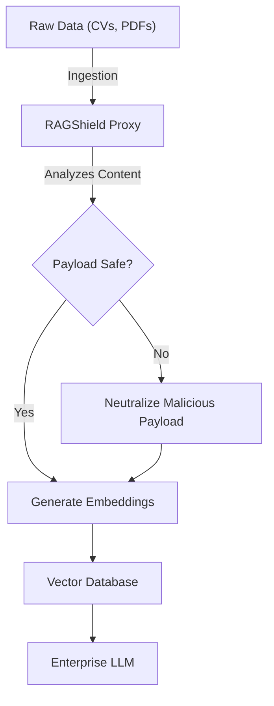
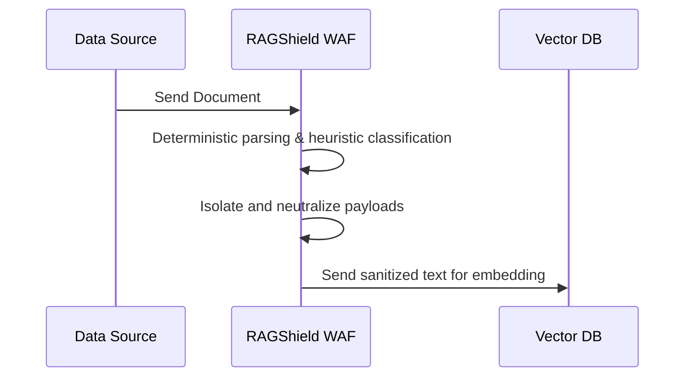

<!-- markdownlint-disable MD013 MD028 MD033 MD036 MD039 MD041 MD060 -->

[ 🇫🇷 Version Française ](./README.fr.md)

# RAGShield

> **Executive Summary:** An AI Web Application Firewall (WAF) acting as a sanitization proxy between raw data sources and vector databases to prevent indirect prompt injections.

---

## 1. Visual Overview

## 2. Contrarian Thesis (Peter Thiel Style)

Popular Belief: A robust "system prompt" is enough to secure Enterprise LLMs against malicious inputs.
Hidden Truth: By design, LLMs cannot perfectly isolate system instructions from injected context data. Corrupted data in a RAG pipeline will routinely override security rules. Pre-embedding sanitization is required.

## 3. Problem & Target Market

Business Model: B2B
Target Audience: Enterprises deploying generative AI applications (RAG pipelines), CISOs, and Data Engineering teams.
Urgent Pain Point: Ingesting third-party documents into vector databases exposes the enterprise to indirect prompt injections, which can lead to data exfiltration or malicious actions when the LLM reads the corrupted document.

## 4. Technical Architecture & Infrastructure

## 5. Business Model & Financial Viability

| Metric                 | Value                               |
| ---------------------- | ----------------------------------- |
| Pricing Structure      | B2B Subscription / Volume processed |
| 12-Month Target        | 100 enterprise customers            |
| Revenue Formula        | Customers \* Avg Subscription       |
| Estimated Gross Margin | 80-90%                              |

## 6. Distribution Engine & Moat

Acquisition Strategy: Direct B2B sales (CISO, Data teams).
Moat (Defensibility): Specialized deterministic and lightweight heuristic sanitization pipeline pre-embedding. Native LLMs cannot do this because their architecture fundamentally blends instructions and data.

## 7. Detailed Evaluation Grid

| Criterion                   | VC Score (/100) | Market Score (/100) |
| --------------------------- | --------------- | ------------------- |
| Thesis & Monopoly / Urgency | 20 / 25         | -- / 25             |
| Moat / LLM Immunity         | 22 / 25         | -- / 25             |
| Scalability / UX Friction   | 24 / 25         | -- / 25             |
| Unit Economics / ROI        | 24 / 25         | -- / 25             |
| **TOTAL**                   | **90 / 100**    | **-- / 100**        |

> **VC Verdict:** Protecting vector databases from indirect prompt injection is a critical, unmet need. It sits directly in the data flow, capturing highly valuable traffic data. Extremely scalable and easy to monetize on a per-query basis.
Market Verdict: Pending evaluation.
