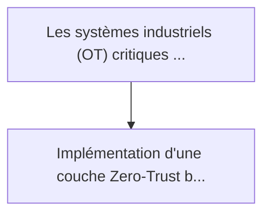
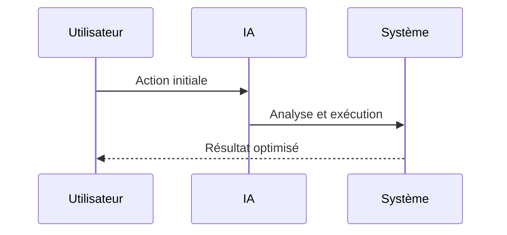

<!-- markdownlint-disable MD013 MD028 MD033 MD039 MD041 -->

[🇬🇧 English Version](./README.md)

# RF Fingerprint Zero Trust

> **Résumé exécutif :** Implémentation d'une couche Zero-Trust bas niveau analysant les micro-imperfections matérielles des transmissions radio (Radio Frequency Fingerprin...

---

## 1. Aperçu visuel & Effet Wahou

## 2. La thèse contrariante (Peter Thiel Style)

La croyance populaire : Les solutions génériques peuvent résoudre cela.
La vérité cachée : Les solutions de sécurité réseau classiques se basent sur des adresses IP, des MAC adresses ou des certificats cryptographiques qui peuvent être usurpés ou volés. L'analyse des signaux analogiques au niveau physique (Layer 1) nécessite une expertise en traitement du signal et du hardware spécifique (SDR, FPGA) impossible à fournir via un simple logiciel.

## 3. Le problème & La cible

Modèle économique : B2B
Cible précise : Opérateurs d'Infrastructures d'Importance Vitale (OIV), usines manufacturières, gestionnaires de centrales électriques et réseaux de distribution d'eau.
La douleur urgente : Les systèmes industriels (OT) critiques utilisent souvent des capteurs sans fil ou des liaisons radio obsolètes vulnérables aux attaques de type "spoofing" ou "replay". Les attaquants peuvent injecter de fausses données de capteurs (ex: température d'une turbine) sans alerter les systèmes de sécurité IT/OT classiques.

## 4. Architecture technique & Plomberie

## 5. Modèle économique & Viabilité financière

| Métrique                    | Valeur             |
| --------------------------- | ------------------ |
| Structure de prix           | Prix sur mesure    |
| Objectif 12 mois            | 100 clients        |
| Calcul du CA (Target 100k€) | 100 \* 1000 = 100k |
| Marge brute estimée         | 80%                |

## 6. Moteur de distribution & Fossé défensif (Moat)

Stratégie d'acquisition : Vente B2B directe
Moat (Barrière à l'entrée) : Les solutions de sécurité réseau classiques se basent sur des adresses IP, des MAC adresses ou des certificats cryptographiques qui peuvent être usurpés ou volés. L'analyse des signaux analogiques au niveau physique (Layer 1) nécessite une expertise en traitement du signal et du hardware spécifique (SDR, FPGA) impossible à fournir via un simple logiciel.

## 7. Grille d'évaluation détaillée

| Critère                           | Score VC (/100) | Score Terrain (/100) |
| --------------------------------- | --------------- | -------------------- |
| Thèse & Monopole / Urgence        | -- / 25         | -- / 25              |
| Moat / Résistance aux LLM natifs  | -- / 25         | -- / 25              |
| Scalabilité / Friction d'adoption | -- / 25         | -- / 25              |
| Unit Economics / ROI direct       | -- / 25         | -- / 25              |
| **TOTAL**                         | **-- / 100**    | **-- / 100**         |

> **Verdict VC :** En attente d'évaluation.

> **Verdict Terrain :** En attente d'évaluation.
