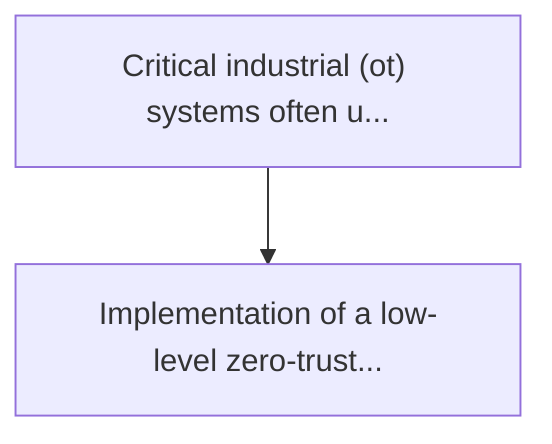
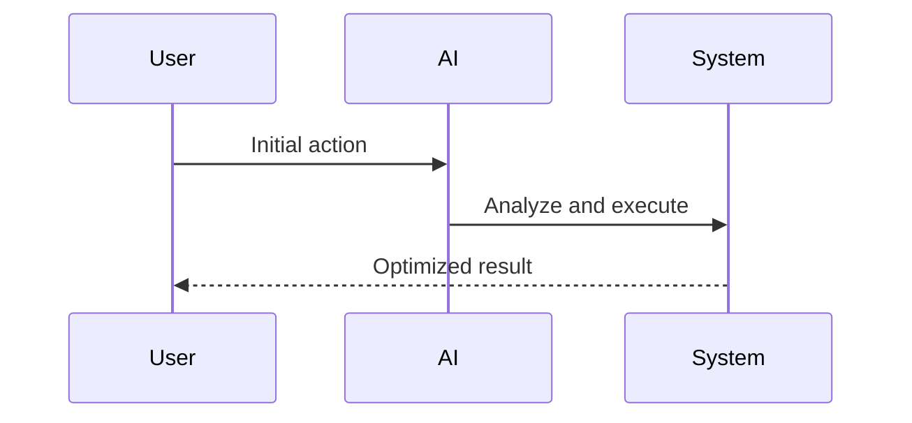

<!-- markdownlint-disable MD013 MD028 MD033 MD039 MD041 -->

[ 🇫🇷 Version Française ](./README.fr.md)

# Rf fingerprint zero trust

> **Executive Summary:** Implementation of a low-level zero-trust layer analysing the physical micro-imperfections of radio transmissions (radio frequency fingerprin...

---

## 1. Visual Overview & Wow Effect

## 2. Contrarian Thesis (Peter Thiel Style)

Popular Belief: Generic solutions can solve this.
Hidden Truth: Conventional network security solutions are based on ip addresses, mac addresses or cryptographic certificates that can be usurped or stolen. analogue signal analysis at the physical level (layer 1) requires expertise in signal processing and specific hardware (sdr, fpga) that cannot be provided via simple software.

## 3. Problem & Target Market

Business Model: B2B
Target Audience: Vital import infrastructure (vio) operators, manufacturing plants, power plant managers and water distribution systems.
Urgent Pain Point: Critical industrial (ot) systems often use wireless sensors or obsolete radio links that are vulnerable to "spoofing" or "replay" attacks. attackers can inject false sensor data (e.g. turbine temperature) without warning conventional it/ot safety systems.

## 4. Technical Architecture & Infrastructure

## 5. Business Model & Financial Viability

| Metric                 | Value              |
| ---------------------- | ------------------ |
| Pricing Structure      | Custom Pricing     |
| 12-Month Target        | 100 customers      |
| Revenue Formula        | 100 \* 1000 = 100k |
| Estimated Gross Margin | 80%                |

## 6. Distribution Engine & Moat

Acquisition Strategy: Direct B2B Sales
Moat (Defensibility): Conventional network security solutions are based on ip addresses, mac addresses or cryptographic certificates that can be usurped or stolen. analogue signal analysis at the physical level (layer 1) requires expertise in signal processing and specific hardware (sdr, fpga) that cannot be provided via simple software.

## 7. Detailed Evaluation Grid

| Criterion                   | VC Score (/100) | Market Score (/100) |
| --------------------------- | --------------- | ------------------- |
| Thesis & Monopoly / Urgency | -- / 25         | -- / 25             |
| Moat / LLM Immunity         | -- / 25         | -- / 25             |
| Scalability / UX Friction   | -- / 25         | -- / 25             |
| Unit Economics / ROI        | -- / 25         | -- / 25             |
| **TOTAL**                   | **-- / 100**    | **-- / 100**        |

> **VC Verdict:** Pending evaluation.

> **Market Verdict:** Pending evaluation.
