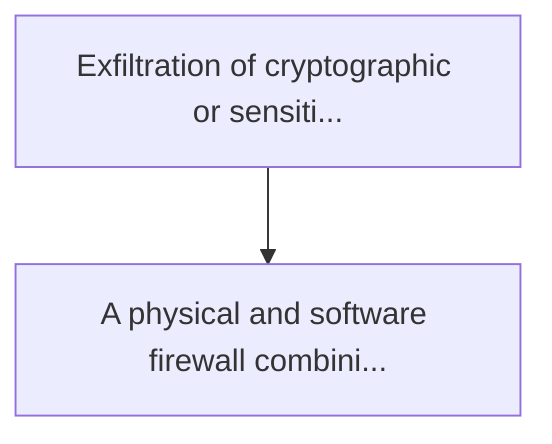
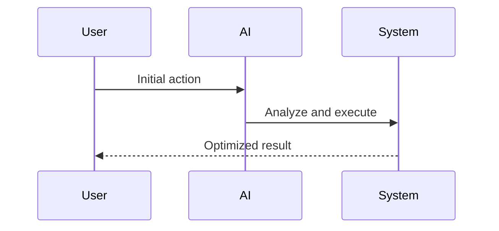

<!-- markdownlint-disable MD013 MD028 MD033 MD039 MD041 -->

[ 🇫🇷 Version Française ](./README.fr.md)

# Rf side-channel firewall

> **Executive Summary:** A physical and software firewall combining metamaterial cover specifically absorbing the cpu leak frequencies, and a local orchestrator.

---

## 1. Visual Overview & Wow Effect

## 2. Contrarian Thesis (Peter Thiel Style)

Popular Belief: Generic solutions can solve this.
Hidden Truth: It is a fundamental problem of material physics. network software firewalls or bdus are blind to radio frequency emissions generated by cpu transistors running an aes key.

## 3. Problem & Target Market

Business Model: B2B
Target Audience: Critical industries, sovereign data centres, defence, vital infrastructure operators (vio)
Urgent Pain Point: Exfiltration of cryptographic or sensitive data via auxiliary channel attacks (side-channel) using the electromagnetic (rf) or acoustic emissions of the processors. the so-called air-gapped environments are no longer safe against the advanced sensors of industrial spying.

## 4. Technical Architecture & Infrastructure

## 5. Business Model & Financial Viability

| Metric                 | Value              |
| ---------------------- | ------------------ |
| Pricing Structure      | Custom Pricing     |
| 12-Month Target        | 100 customers      |
| Revenue Formula        | 100 \* 1000 = 100k |
| Estimated Gross Margin | 80%                |

## 6. Distribution Engine & Moat

Acquisition Strategy: Direct B2B Sales
Moat (Defensibility): It is a fundamental problem of material physics. network software firewalls or bdus are blind to radio frequency emissions generated by cpu transistors running an aes key.

## 7. Detailed Evaluation Grid

| Criterion                   | VC Score (/100) | Market Score (/100) |
| --------------------------- | --------------- | ------------------- |
| Thesis & Monopoly / Urgency | 22 / 25         | -- / 25             |
| Moat / LLM Immunity         | 25 / 25         | -- / 25             |
| Scalability / UX Friction   | 18 / 25         | -- / 25             |
| Unit Economics / ROI        | 22 / 25         | -- / 25             |
| **TOTAL**                   | **87 / 100**    | **-- / 100**        |

> **VC Verdict:** The RF Side-Channel Firewall tackles an esoteric but critical vector for data exfiltration: physical electromagnetic leakage from CPUs. The use of custom metamaterials integrated with local orchestration creates a deep physical moat that software cannot replicate. While hardware integration friction exists, securing sovereign data centers and classified military infrastructure ensures a highly lucrative, monopolistic niche.

> **Market Verdict:** Pending evaluation.
