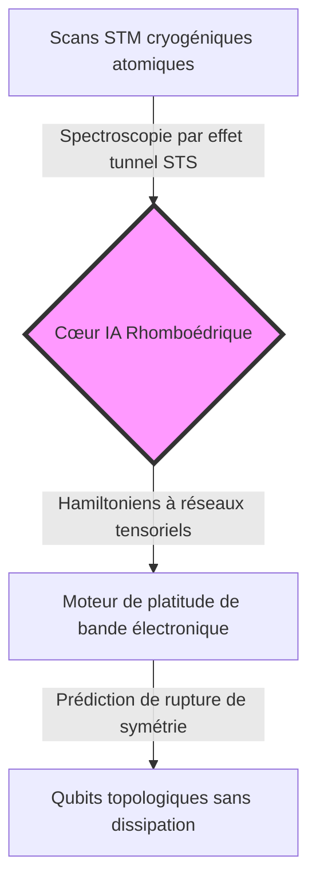
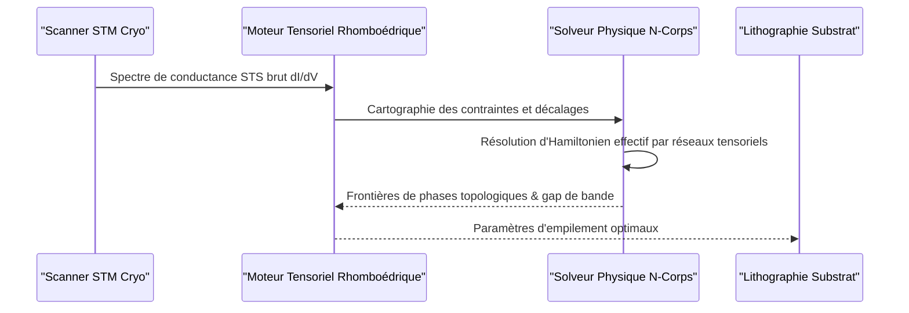

<!-- markdownlint-disable MD009 MD010 MD013 MD022 MD028 MD032 MD033 MD034 MD036 MD037 MD039 MD041 MD060 -->

[🇬🇧 English Version](./README.md)

# Rhombohedral Quantum Sim

> **Aperçu exécutif :** Rhombohedral Quantum Sim propose un jumeau numérique basé sur des réseaux de neurones tensoriels pour prédire les états électroniques corrélés et les transitions de phase topologiques dans le graphène rhomboédrique n-couches.

---

## 1. Aperçu visuel & Effet Wahou

## 2. La thèse contrariante (Style Peter Thiel)

**Croyance populaire :** Concevoir des ordinateurs quantiques évolutifs nécessite de corriger les erreurs au niveau des portes sur du matériel NISQ bruyant ou des circuits supraconducteurs synthétiques subissant de fortes pertes thermiques.
**Vérité cachée :** Les matériaux 2D naturellement corrélés comme le graphène rhomboédrique multicouche possèdent des bandes électroniques plates qui génèrent spontanément une supraconductivité non conventionnelle et un effet Hall anomal quantique sans champ magnétique externe. Le véritable goulot d'étranglement réside dans la simulation des états quantiques à n-corps pour concevoir l'empilement idéal avant fabrication.

## 3. Le problème & La cible

**Modèle économique :** B2B
**Cible précise :** Concepteurs de puces quantiques, fabs de semi-conducteurs de nouvelle génération et laboratoires R&D en physique de la matière condensée.
**Problème urgent :** Synthétiser et caractériser le graphène rhomboédrique requiert des semaines de mesures par microscopie à effet tunnel (STM) à température cryogénique par wafer. L'empilement empirique affiche un taux de réussite <2% pour obtenir des états topologiques en raison des défauts d'alignement.

## 4. Architecture technique & Plomberie

## 5. Modèle économique & Viabilité financière

| Métrique                         | Valeur                                                                    |
| :------------------------------- | :------------------------------------------------------------------------ |
| **Structure de Prix**            | Licence SaaS Enterprise + Calcul de simulation (50 000 €/an/labo + usage) |
| **Cible à 12 Mois**              | 5 laboratoires quantiques de premier plan et centres R&D semi-conducteurs |
| **Calcul du Chiffre d'Affaires** | 2 contrats grands comptes @ 50 000 €/an = **100 000 € ARR**               |
| **Marge Brute Estimée**          | 85 % (calculs tensoriels GPU déportés sur clusters HPC spécialisés)       |

## 6. Moteur de distribution & Fossé défensif

**Stratégie d'acquisition :** Vente directe technique ciblant les startups quantiques et équipes R&D industrielles (IBM Quantum, Intel Quantum, IMEC) via des publications conjointes dans Nature Physics et Physical Review X.
**Barrière à l'entrée (Moat) :** Base de données propriétaire de cartes STS atomiques couplée aux solutions exactes par réseaux tensoriels. La DFT classique échoue sur les corrélations de bandes plates, et les LLMs n'ont aucune compréhension quantique spatiale.

## 7. Grille d'évaluation détaillée

| Critères                            | Score VC (/100) | Score Terrain (/100) |
| :---------------------------------- | :-------------: | :------------------: |
| **Thèse & Monopole / Urgence**      |     23 / 25     |       22 / 25        |
| **Moat / Résistance aux LLMs**      |     24 / 25     |       23 / 25        |
| **Scalabilité / Friction adoption** |     20 / 25     |       21 / 25        |
| **Unit Economics / ROI direct**     |     23 / 25     |       22 / 25        |
| **TOTAL**                           |  **90 / 100**   |     **88 / 100**     |

> **Verdict VC :** Rhombohedral Quantum Sim résout un goulot d'étranglement majeur dans l'informatique quantique topologique là où la DFT classique échoue. La barrière technologique est extrêmement élevée grâce aux modèles tensoriels, bien que la taille de marché initiale soit restreinte aux fabs quantiques avancées.
