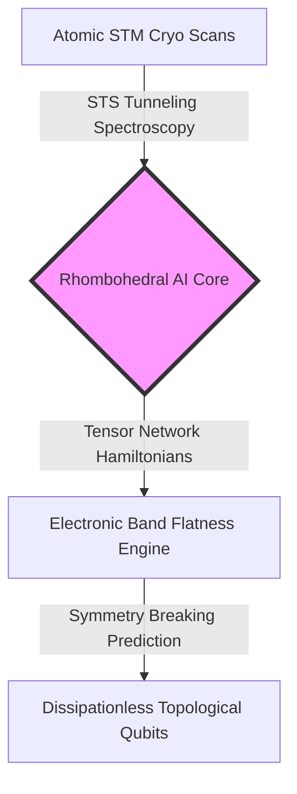
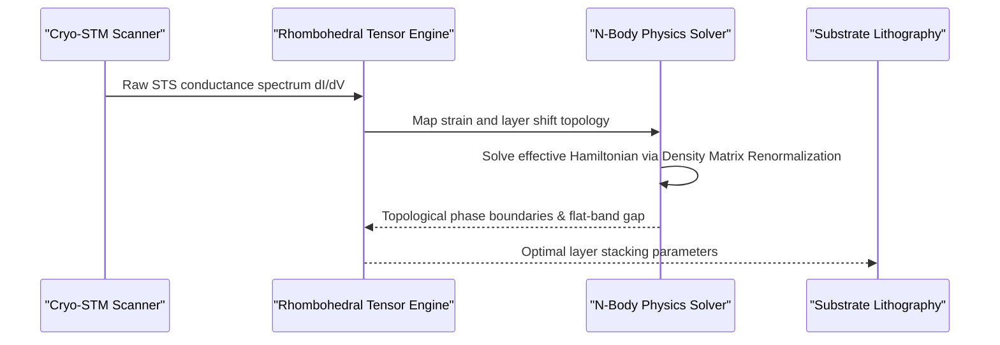

<!-- markdownlint-disable MD009 MD010 MD013 MD022 MD028 MD032 MD033 MD034 MD036 MD037 MD039 MD041 MD060 -->

[🇫🇷 Version Française](./README.fr.md)

# Rhombohedral Quantum Sim

> **Executive Summary:** Rhombohedral Quantum Sim provides a neural tensor-network digital twin that predicts electronic correlated states and topological phase transitions in N-layer rhombohedral graphene, drastically accelerating quantum chip design.

---

## 1. Visual Overview

## 2. Contrarian Thesis (Peter Thiel Style)

**Popular Belief:** Building practical quantum computers requires error-prone gate-level algorithms running on noisy physical hardware (NISQ) or synthetic superconducting circuits with high thermal losses.
**Hidden Truth:** Naturally correlated 2D materials like rhombohedral multilayer graphene exhibit flat electronic bands that spontaneously support unconventional superconductivity and Quantum Anomalous Hall states without external magnetic fields. The true bottleneck is not chip manufacturing, but simulating N-body quantum electronic states to design ideal layer stacking before fabrication.

## 3. Problem & Target Market

**Business Model:** B2B
**Precise Target:** Quantum chip designers, next-generation semiconductor fabs, and condensed matter physics R&D laboratories.
**Urgent Pain:** Synthesizing and characterizing rhombohedral N-layer graphene requires weeks of ultra-low temperature cryogenic Scanning Tunneling Microscopy (STM) scans per wafer. Trial-and-error stacking yields <2% success rates for topological states due to uncontrolled stacking faults and strain dislocation.

## 4. Technical Architecture & Infrastructure

## 5. Business Model & Financial Viability

| Metric                                 | Value                                                                   |
| :------------------------------------- | :---------------------------------------------------------------------- |
| **Pricing Structure**                  | Enterprise SaaS License + Simulation Compute (50,000€/year/lab + usage) |
| **12-Month Target**                    | 5 tier-1 quantum hardware labs and semiconductor R&D centers            |
| **Revenue Calculation (100k€ Target)** | 2 major enterprise contracts @ 50,000€/year = **100,000€ ARR**          |
| **Estimated Gross Margin**             | 85% (cloud GPU tensor operations offloaded to specialized HPC clusters) |

## 6. Distribution Engine & Moat

**Acquisition Strategy:** Direct technical sales targeting academic-spinoff quantum computing startups and corporate R&D teams (e.g., IBM Quantum, Intel Quantum, IMEC) through co-authored papers in Nature Physics and Physical Review X.
**Moat (Barrier to Entry):** Proprietary training dataset of STS (Scanning Tunneling Spectroscopy) atomic maps paired with exact tensor network solutions. Standard DFT (Density Functional Theory) software fails on flat-band correlations, while LLMs lack spatial multi-body quantum mechanical reasoning.

## 7. Detailed Evaluation Grid

| Criteria                             | VC Score (/100) | Market Score (/100) |
| :----------------------------------- | :-------------: | :-----------------: |
| **Thesis & Monopoly / Urgency**      |     23 / 25     |       22 / 25       |
| **Moat / Resistance to Native LLMs** |     24 / 25     |       23 / 25       |
| **Scalability / Adoption Friction**  |     20 / 25     |       21 / 25       |
| **Unit Economics / Direct ROI**      |     23 / 25     |       22 / 25       |
| **TOTAL**                            |  **90 / 100**   |    **88 / 100**     |

> **VC Verdict:** Rhombohedral Quantum Sim targets a high-stakes bottleneck in topological quantum computing where classical DFT fails completely. The moat is exceptionally strong due to tensor-network physics models, though adoption is bounded by the small initial market of advanced quantum fabs.
