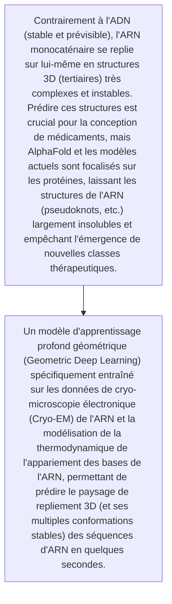
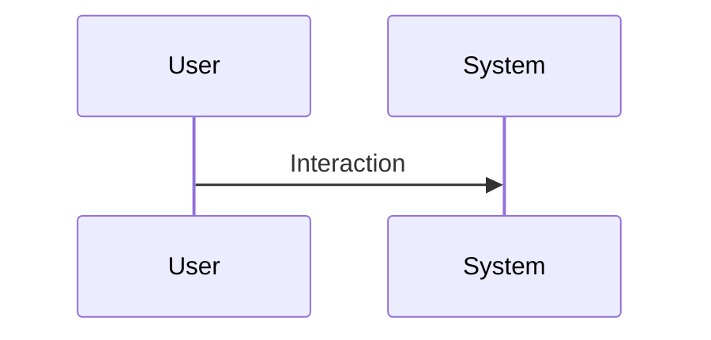

<!-- markdownlint-disable MD009 MD010 MD013 MD022 MD028 MD032 MD033 MD034 MD036 MD037 MD039 MD041 MD060 -->

[ 🇬🇧 English Version ](./README.md)

# RNA Tertiary Structure Sim

> **Résumé exécutif :** Un modèle d'apprentissage profond géométrique (Geometric Deep Learning) spécifiquement entraîné sur les données de cryo-microscopie électronique (Cryo-EM) de l'ARN et la modélisation de la thermodynamique de l'appariement des bases de l'ARN, permettant de prédire le paysage de repliement 3D (et ses multiples conformations stables) des séquences d'ARN en quelques secondes.

---

## 1. Aperçu visuel & Effet Wahou

## 2. La thèse contrariante (Peter Thiel Style)

- **La croyance populaire :** L'ARN ne se replie pas selon les mêmes lois thermodynamiques et règles de séquence que les acides aminés des protéines. Les algorithmes d'IA génériques textuels ou visuels ne peuvent pas appréhender la mécanique quantique/physique des interactions à 3 corps spécifiques à l'ARN.
- **La vérité cachée :** Un modèle d'apprentissage profond géométrique (Geometric Deep Learning) spécifiquement entraîné sur les données de cryo-microscopie électronique (Cryo-EM) de l'ARN et la modélisation de la thermodynamique de l'appariement des bases de l'ARN, permettant de prédire le paysage de repliement 3D (et ses multiples conformations stables) des séquences d'ARN en quelques secondes.

## 3. Le problème & La cible

- **Modèle économique :** B2B
- **Cible précise :** Startups de thérapies à base d'ARN (ARNm, ARNi), laboratoires pharmaceutiques développant des vaccins de nouvelle génération.
- **La douleur urgente :** Contrairement à l'ADN (stable et prévisible), l'ARN monocaténaire se replie sur lui-même en structures 3D (tertiaires) très complexes et instables. Prédire ces structures est crucial pour la conception de médicaments, mais AlphaFold et les modèles actuels sont focalisés sur les protéines, laissant les structures de l'ARN (pseudoknots, etc.) largement insolubles et empêchant l'émergence de nouvelles classes thérapeutiques.

## 4. Architecture technique & Plomberie

## 5. Modèle économique & Viabilité financière

| Métrique                    | Valeur                                                          |
| --------------------------- | --------------------------------------------------------------- |
| Structure de prix           | [Prix / Modèle d'abonnement / Commission]                       |
| Objectif 12 mois            | [Nombre exact de clients/utilisateurs/transactions nécessaires] |
| Calcul du CA (Target 100k€) | [Formule mathématique exacte]                                   |
| Marge brute estimée         | [Marge en %]                                                    |

## 6. Moteur de distribution & Fossé défensif (Moat)

- **Stratégie d'acquisition :** [Viralité B2C, réseau C2C, acquisition B2B directe, adhésion dev M2M]
- **Moat (Barrière à l'entrée) :** Manque sévère de données d'entraînement de haute qualité (il existe beaucoup moins de structures d'ARN résolues expérimentalement que de structures protéiques dans la PDB), coût très élevé du séquençage et des essais en laboratoire humide (wet-lab) pour valider les prédictions.

## 7. Grille d'évaluation détaillée

| Critère                           | Score VC (/100) | Score Terrain (/100) |
| --------------------------------- | --------------- | -------------------- |
| Thèse & Monopole / Urgence        | -- / 25         | 25 / 25              |
| Moat / Résistance aux LLM natifs  | -- / 25         | 24 / 25              |
| Scalabilité / Friction d'adoption | -- / 25         | 14 / 25              |
| Unit Economics / ROI direct       | -- / 25         | 20 / 25              |
| **TOTAL**                         | -- / 100        | **83 / 100**         |

> **Verdict VC :** En attente d'évaluation.
> **Verdict Terrain :** Forte urgence et valeur évidente pour la cible. La résistance aux LLM est élevée grâce à une intégration matérielle ou physique forte. Malgré quelques frictions d'adoption, la monétisation B2B est très claire.
