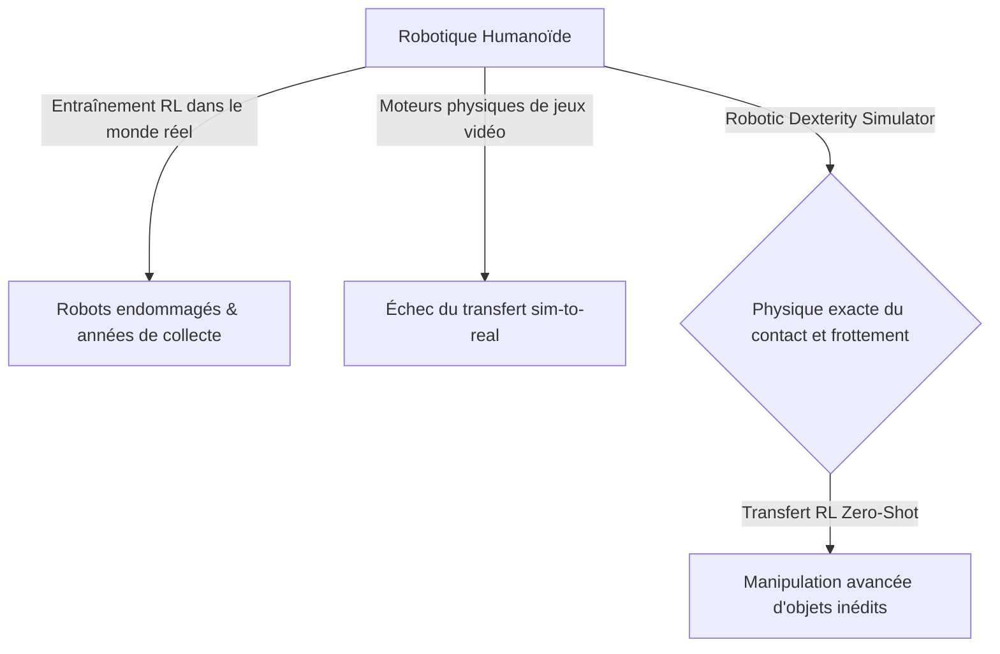
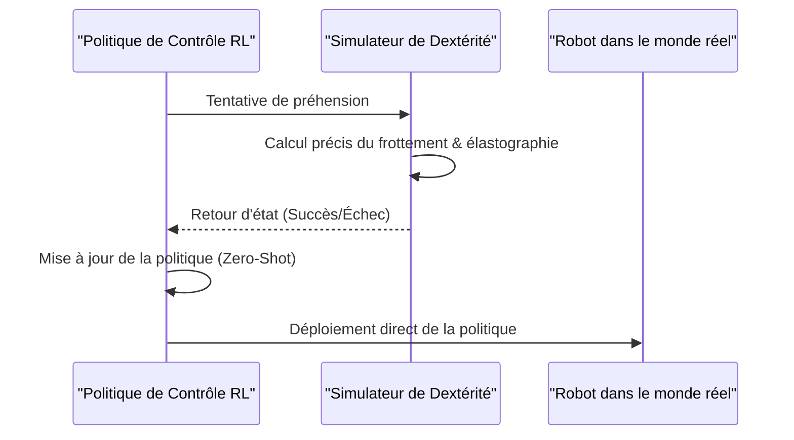

<!-- markdownlint-disable MD009 MD010 MD013 MD022 MD028 MD032 MD033 MD034 MD036 MD037 MD039 MD041 MD058 MD060 -->

[🇬🇧 English Version](./README.md)

# Robotic Dexterity Simulator

> **Résumé exécutif :** Un simulateur physique ultra-réaliste focalisé sur la mécanique de contact par frottement, permettant un apprentissage par renforcement "Zero-Shot" (sim-to-real) pour la dextérité robotique.

---

## 1. Aperçu visuel & Effet Wahou

## 2. La thèse contrariante (Peter Thiel Style)

La croyance populaire : Les moteurs physiques standards comme PhysX ou Havok sont suffisants pour entraîner des robots IA en simulation.
La vérité cachée : Les moteurs physiques de jeux vidéo utilisent des approximations de la dynamique des corps rigides qui sont fondamentalement erronées pour la préhension robotique (qui nécessite la gestion des corps mous, de la friction dynamique et de l'élastographie). Seul un simulateur basé sur une mécanique de contact précise permet un véritable transfert Zero-Shot vers le monde réel.

## 3. Le problème & La cible

Modèle économique : B2B
Cible précise : Entreprises de robotique humanoïde, e-commerce/logistique (tri de colis), industrie manufacturière de précision.
La douleur urgente : Les bras robotiques excellent dans les mouvements pré-programmés mais échouent lamentablement à manipuler des objets déformables, transparents ou inédits en temps réel. L'entraînement par renforcement (RL) dans le monde réel endommage les robots et prend des années de collecte de données.

## 4. Architecture technique & Plomberie

## 5. Modèle économique & Viabilité financière

| Métrique                    | Valeur                                                 |
| --------------------------- | ------------------------------------------------------ |
| Structure de prix           | Licence entreprise par robot simulé / nœud de calcul   |
| Objectif 12 mois            | 2 à 3 laboratoires ou constructeurs robotiques majeurs |
| Calcul du CA (Target 100k€) | 3 \* 35k = 105k                                        |
| Marge brute estimée         | 90%                                                    |

## 6. Moteur de distribution & Fossé défensif (Moat)

Stratégie d'acquisition : Ventes directes aux entreprises deep-tech en robotique, partenariats avec des laboratoires d'IA.
Moat (Barrière à l'entrée) : La complexité mathématique de la simulation de contact (Linear Complementarity Problems) et le besoin d'une modélisation extrêmement précise des capteurs tactiles spécifiques au matériel créent une barrière de propriété intellectuelle hautement spécialisée que les SaaS standards ne peuvent pas franchir.

## 7. Grille d'évaluation détaillée

| Critère                           | Score VC (/100) | Score Terrain (/100) |
| --------------------------------- | --------------- | -------------------- |
| Thèse & Monopole / Urgence        | 21 / 25         | -- / 25              |
| Moat / Résistance aux LLM natifs  | 19 / 25         | -- / 25              |
| Scalabilité / Friction d'adoption | 20 / 25         | -- / 25              |
| Unit Economics / ROI direct       | 20 / 25         | -- / 25              |
| **TOTAL**                         | **80 / 100**    | **-- / 100**         |

> **Verdict VC :** Ce projet présente une thèse fortement contrariante avec un véritable potentiel de monopole (21/25). Bien que l'approche technique soit solide, le fossé défensif face à des acteurs établis bien financés reste partiellement perméable (19/25). Associée à une évolutivité massive (20/25) et d'excellents unit economics (20/25), il s'agit d'une proposition hautement finançable.
>
> **Verdict Terrain :** En attente d'évaluation.
