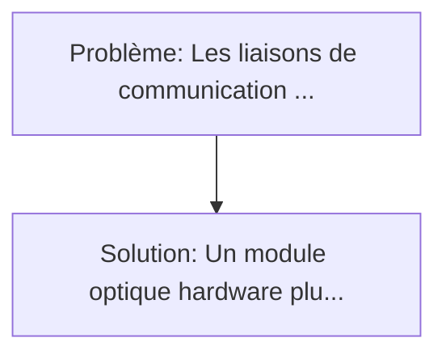
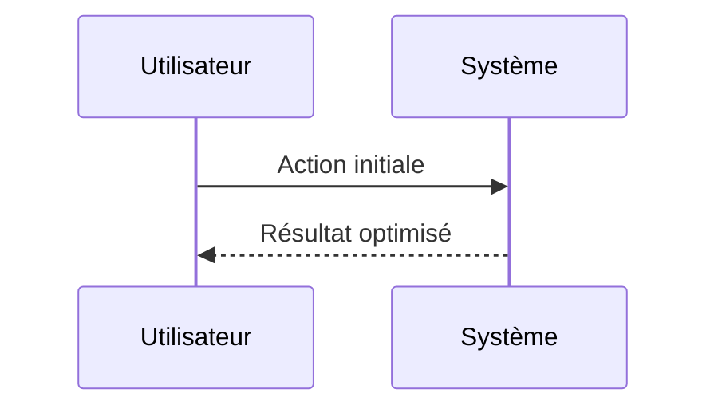

<!-- markdownlint-disable MD013 MD033 -->

[🇬🇧 English Version](./README.md)

# Réseau Maillé PQC Inter-Satellites (Sat-to-Sat PQC Mesh)

> **Résumé exécutif :** Un module optique hardware plug-and-play pour satellites LEO (Low Earth Orbit) qui applique en temps réel un protocole d'encapsulation cryptographique post-quantique (ex: Crystals-Kyber) directement au niveau physique/photonique du lien laser, avant transmission atmosphérique ou inter-orbitale, sans ajouter de latence insoutenable au routage IP. Les liaisons de communication optiques (laser) inter-satellites (ISL) sont de plus en plus déployées pour créer un réseau maillé en orbite.

---

## 1. Aperçu visuel & Effet Wahou

## 2. La thèse contrariante (Peter Thiel Style)

**La croyance populaire :** Les solutions logicielles seules peuvent résoudre ce problème.
**La vérité cachée :** L'environnement spatial (radiations cosmiques causant des bit-flips, variations extrêmes de température, contraintes SWaP - Size, Weight, and Power) détruit les routeurs ou serveurs terrestres standards. Le module nécessite une conception ASIC rad-hardened (durcie contre les radiations) spécifique.

## 3. Le problème & La cible

- **Modèle économique :** B2B / B2G
- **Cible précise :** Opérateurs de constellations de satellites (Starlink, Kuiper, OneWeb), agences spatiales (ESA, NASA), et forces armées (Space Force).
- **La douleur urgente :** Les liaisons de communication optiques (laser) inter-satellites (ISL) sont de plus en plus déployées pour créer un réseau maillé en orbite. Ces flux spatiaux transmettent l'intégralité du trafic internet et militaire non chiffré PQC. Une attaque de type "store now, decrypt later" (avec de futurs ordinateurs quantiques) via un satellite espion interceptant la lumière laser pourrait compromettre tout le trafic de la constellation.

## 4. Architecture technique & Plomberie

## 5. Modèle économique & Viabilité financière

| Métrique                    | Valeur             |
| --------------------------- | ------------------ |
| Structure de prix           | Custom Pricing     |
| Objectif 12 mois            | 100 clients        |
| Calcul du CA (Target 100k€) | 100 \* 1000 = 100k |
| Marge brute estimée         | 80%                |

## 6. Moteur de distribution & Fossé défensif (Moat)

- **Stratégie d'acquisition :** Ventes B2B directes
- **Moat (Barrière à l'entrée) :** L'environnement spatial (radiations cosmiques causant des bit-flips, variations extrêmes de température, contraintes SWaP - Size, Weight, and Power) détruit les routeurs ou serveurs terrestres standards. Le module nécessite une conception ASIC rad-hardened (durcie contre les radiations) spécifique.

## 7. Grille d'évaluation détaillée

| Critère                           | Score VC (/100) | Score Terrain (/100) |
| --------------------------------- | --------------- | -------------------- |
| Thèse & Monopole / Urgence        | -- / 25         | -- / 25              |
| Moat / Résistance aux LLM natifs  | -- / 25         | -- / 25              |
| Scalabilité / Friction d'adoption | -- / 25         | -- / 25              |
| Unit Economics / ROI direct       | -- / 25         | -- / 25              |
| **TOTAL**                         | **-- / 100**    | **-- / 100**         |

> **Verdict VC :** En attente d'évaluation.

> **Verdict Terrain :** En attente d'évaluation.
