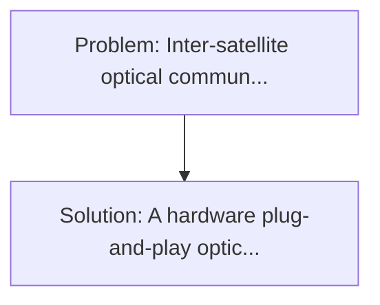
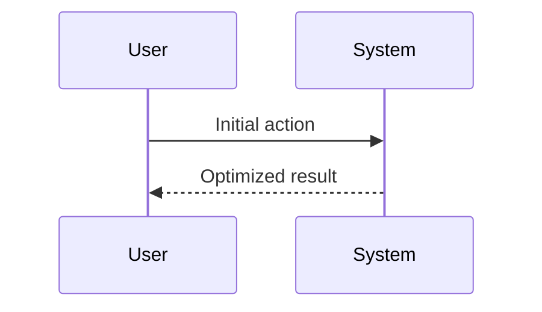

<!-- markdownlint-disable MD013 MD033 -->

[🇫🇷 Version Française](./README.fr.md)

# PQC Inter-Satellite Network (Sat-to-Sat PQC Mesh)

> **Executive Summary:** A hardware plug-and-play optical module for LEO satellites (Low Earth Orbit) that applies in real time a post-quantum cryptographic encapsulation protocol (e. Inter-satellite optical communications (laser) links (ISLs) are increasingly deployed to create an orbited mesh network.

---

## 1. Visual Overview & Wow Effect

## 2. Contrarian Thesis (Peter Thiel Style)

**Popular Belief:** Generic software solutions can solve this.
**Hidden Truth:** The space environment (cosmic radiation causing bit flips, extreme temperature variations, SWaP - Size, Weight, and Power constraints) destroys standard land routers or servers. The module requires a specific ASIC rad-hardened design.

## 3. Problem & Target Market

- **Business Model:** B2B / B2G
- **Target Audience:** Satellite constellation operators (Starlink, Kuiper, OneWeb), space agencies (ESA, NASA), and armed forces (Space Force).
- **Urgent Pain Point:** Inter-satellite optical communications (laser) links (ISLs) are increasingly deployed to create an orbited mesh network. These space flows transmit the entire unencrypted PQC Internet and military traffic. A "store now, decrypt later" attack (with future quantum computers) via a spy satellite intercepting laser light could compromise all the traffic in the constellation.

## 4. Technical Architecture & Infrastructure

## 5. Business Model & Financial Viability

| Metric                 | Value              |
| ---------------------- | ------------------ |
| Pricing Structure      | Custom Pricing     |
| 12-Month Target        | 100 customers      |
| Revenue Formula        | 100 \* 1000 = 100k |
| Estimated Gross Margin | 80%                |

## 6. Distribution Engine & Moat

- **Acquisition Strategy:** Direct B2B Sales
- **Moat (Defensibility):** The space environment (cosmic radiation causing bit flips, extreme temperature variations, SWaP - Size, Weight, and Power constraints) destroys standard land routers or servers. The module requires a specific ASIC rad-hardened design.

## 7. Detailed Evaluation Grid

| Criterion                   | VC Score (/100) | Market Score (/100) |
| --------------------------- | --------------- | ------------------- |
| Thesis & Monopoly / Urgency | -- / 25         | -- / 25             |
| Moat / LLM Immunity         | -- / 25         | -- / 25             |
| Scalability / UX Friction   | -- / 25         | -- / 25             |
| Unit Economics / ROI        | -- / 25         | -- / 25             |
| **TOTAL**                   | **-- / 100**    | **-- / 100**        |

> **VC Verdict:** Pending evaluation.

> **Market Verdict:** Pending evaluation.
