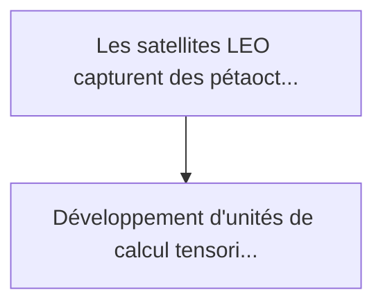
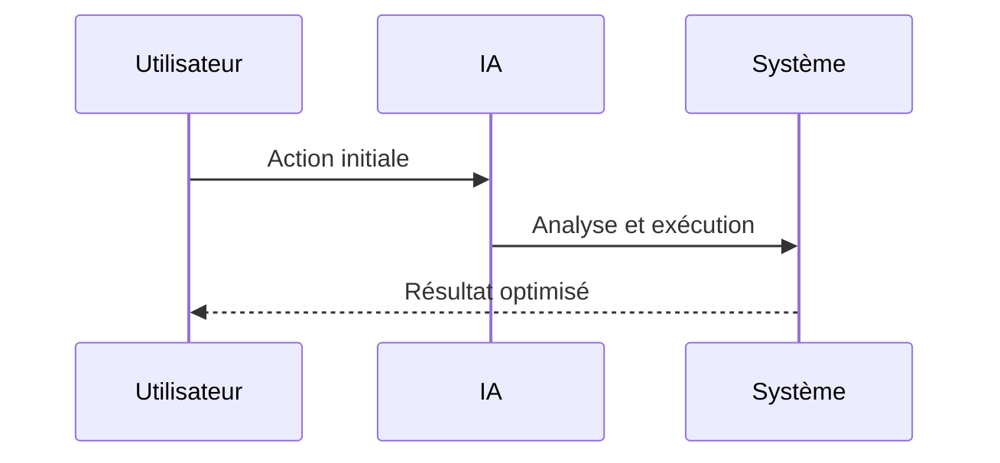

<!-- markdownlint-disable MD013 MD028 MD033 MD039 MD041 -->

[ 🇬🇧 English Version ](./README.md)

# Satellite Photonic Tensor

> **Résumé exécutif :** Développement d'unités de calcul tensoriel photoniques (Photonic Tensor Cores) spatialisées. Ces puces calculent les multiplications de matrices po...

---

## 1. Aperçu visuel & Effet Wahou

## 2. La thèse contrariante (Peter Thiel Style)

La croyance populaire : Les solutions génériques peuvent résoudre cela.
La vérité cachée : L'optimisation logicielle des modèles (quantization, pruning) a atteint ses limites physiques. Seule une rupture au niveau de l'architecture matérielle (utiliser des photons au lieu d'électrons) permet de franchir le mur de l'énergie et de la dissipation thermique dans les environnements spatiaux extrêmes (SWaP-C).

## 3. Le problème & La cible

Modèle économique : B2B
Cible précise : Opérateurs de constellations LEO (Starlink, Kuiper), agences de renseignement géospatial, et fournisseurs de données d'observation de la Terre.
La douleur urgente : Les satellites LEO capturent des pétaoctets de données brutes (images hyperspectrales, SAR) mais sont limités par la bande passante descendante (downlink) pour les renvoyer sur Terre. Traiter ces données à bord avec des GPU classiques nécessite trop de puissance (Watts) et génère une chaleur impossible à dissiper dans le vide spatial.

## 4. Architecture technique & Plomberie

## 5. Modèle économique & Viabilité financière

| Métrique                    | Valeur             |
| --------------------------- | ------------------ |
| Structure de prix           | Prix sur mesure    |
| Objectif 12 mois            | 100 clients        |
| Calcul du CA (Target 100k€) | 100 \* 1000 = 100k |
| Marge brute estimée         | 80%                |

## 6. Moteur de distribution & Fossé défensif (Moat)

Stratégie d'acquisition : Vente B2B directe
Moat (Barrière à l'entrée) : L'optimisation logicielle des modèles (quantization, pruning) a atteint ses limites physiques. Seule une rupture au niveau de l'architecture matérielle (utiliser des photons au lieu d'électrons) permet de franchir le mur de l'énergie et de la dissipation thermique dans les environnements spatiaux extrêmes (SWaP-C).

## 7. Grille d'évaluation détaillée

| Critère                           | Score VC (/100) | Score Terrain (/100) |
| --------------------------------- | --------------- | -------------------- |
| Thèse & Monopole / Urgence        | -- / 25         | 22 / 25              |
| Moat / Résistance aux LLM natifs  | -- / 25         | 25 / 25              |
| Scalabilité / Friction d'adoption | -- / 25         | 16 / 25              |
| Unit Economics / ROI direct       | -- / 25         | 21 / 25              |
| **TOTAL**                         | **-- / 100**    | **84 / 100**         |

> **Verdict VC :** En attente d'évaluation.

> **Verdict Terrain :** Le calcul en orbite nécessite une consommation d'énergie drastiquement réduite, rendant les puces photoniques très désirables. La conception de matériel optique est une prouesse d'ingénierie physique totalement immunisée. Une forte friction existe à cause des processus stricts de qualification spatiale.
