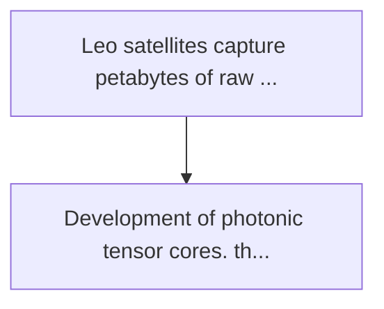
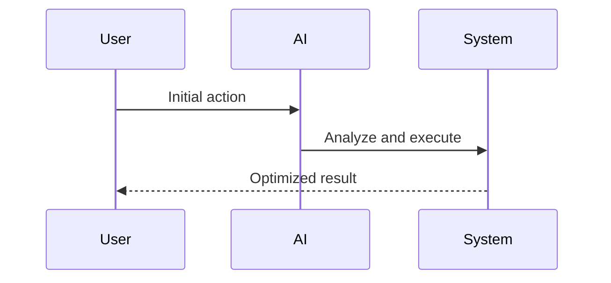

<!-- markdownlint-disable MD013 MD028 MD033 MD039 MD041 -->

[🇫🇷 Version Française](./README.fr.md)

# Photonic tensor satellite

> **Executive Summary:** Development of photonic tensor cores. these chips calculate the multiplications of matrices...

---

## 1. Visual Overview & Wow Effect

## 2. Contrarian Thesis (Peter Thiel Style)

Popular Belief: Generic solutions can solve this.
Hidden Truth: The software optimization of models (quantization, pruning) has reached its physical limits. only a break in the physical architecture (use photons instead of electrons) allows to cross the wall of energy and thermal dissipation in extreme space environments (swap-c).

## 3. Problem & Target Market

Business Model: B2B
Target Audience: Leo constellation operators (starlink, kuiper), geospatial intelligence agencies, and earth observation data providers.
Urgent Pain Point: Leo satellites capture petabytes of raw data (hyperspectral images, sar) but are limited by downlink to return them to earth. treating this data on board with conventional gpus requires too much power (watts) and generates heat that is impossible to dissipate in space vacuum.

## 4. Technical Architecture & Infrastructure

## 5. Business Model & Financial Viability

| Metric                 | Value              |
| ---------------------- | ------------------ |
| Pricing Structure      | Custom Pricing     |
| 12-Month Target        | 100 customers      |
| Revenue Formula        | 100 \* 1000 = 100k |
| Estimated Gross Margin | 80%                |

## 6. Distribution Engine & Moat

Acquisition Strategy: Direct B2B Sales
Moat (Defensibility): The software optimization of models (quantization, pruning) has reached its physical limits. only a break in the physical architecture (use photons instead of electrons) allows to cross the wall of energy and thermal dissipation in extreme space environments (swap-c).

## 7. Detailed Evaluation Grid

| Criterion                   | VC Score (/100) | Market Score (/100) |
| --------------------------- | --------------- | ------------------- |
| Thesis & Monopoly / Urgency | 24 / 25         | -- / 25             |
| Moat / LLM Immunity         | 25 / 25         | -- / 25             |
| Scalability / UX Friction   | 17 / 25         | -- / 25             |
| Unit Economics / ROI        | 20 / 25         | -- / 25             |
| **TOTAL**                   | **86 / 100**    | **-- / 100**        |

> **VC Verdict:** This project represents a massive leap in orbital edge computing by replacing power-hungry electronic GPUs with photonic tensor cores. Solving the heat and energy constraints of space-based AI inference creates an absolute hardware monopoly. The technical execution risk is immense, but dominating the intelligence layer of low earth orbit infrastructure provides unprecedented geopolitical and commercial value.

> **Market Verdict:** Pending evaluation.
