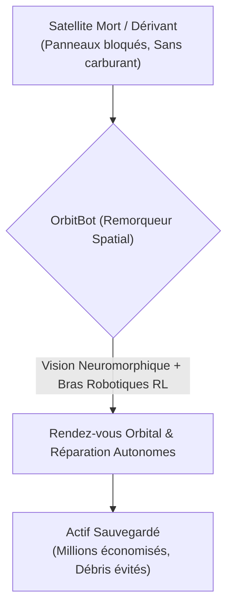
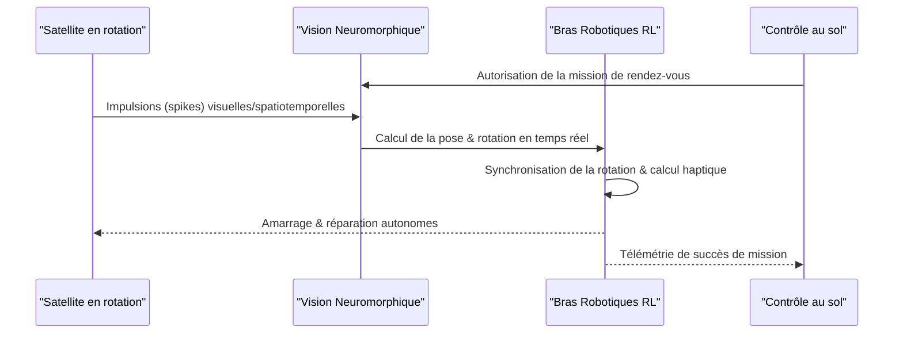

<!-- markdownlint-disable MD009 MD010 MD013 MD022 MD028 MD032 MD033 MD034 MD036 MD037 MD039 MD041 MD060 -->

[ 🇬🇧 English Version ](./README.md)

# OrbitBot Servicer

> **Résumé exécutif :** OrbitBot Servicer déploie une flotte de cobots spatiaux autonomes, dotés de vision neuromorphique, pour réparer, ravitailler ou désorbiter des satellites à plusieurs millions de dollars directement en orbite, évitant ainsi que des actifs critiques ne deviennent de dangereux débris spatiaux.

---

## 1. Aperçu visuel & Effet Wahou

## 2. La thèse contrariante (Peter Thiel Style)

**La croyance populaire :** La solution aux pannes de satellites est de lancer des satellites moins chers et jetables, ou de s'appuyer sur des robots téléopérés depuis le sol pour réparer les plus coûteux.
**La vérité cachée :** Téléopérer un bras robotique depuis la Terre avec une latence de signal supérieure à 2 secondes est impossible pour des opérations de contact délicates : le robot s'écraserait et détruirait la cible. La véritable résilience spatiale exige une autonomie orbitale totale — une IA "Edge" fonctionnant sur du matériel durci contre les radiations (Rad-Hardened) avec une vision neuromorphique pour gérer des cibles non coopératives en rotation, en temps réel et sans intervention humaine.

## 3. Le problème & La cible

**Modèle économique :** B2B / B2G
**Cible précise :** Opérateurs de constellations de satellites (Starlink, Kuiper, Intelsat), agences spatiales (ESA, NASA) et forces spatiales militaires (US Space Force).
**La douleur urgente :** Les satellites coûtent des centaines de millions à lancer. Or, une panne mécanique mineure (un panneau solaire bloqué) ou l'épuisement du carburant de maintien à poste rend le satellite complètement inutile, le transformant en un dangereux débris spatial. Il n'existe actuellement aucune infrastructure robotique agile et standardisée pour ravitailler, réparer physiquement ou désorbiter en toute sécurité ces actifs critiques directement en orbite.

## 4. Architecture technique & Plomberie

## 5. Modèle économique & Viabilité financière

| Métrique                | Valeur                                                                     |
| ----------------------- | -------------------------------------------------------------------------- |
| **Structure de prix**   | Servicing-as-a-Service (Forfait par mission) + Abonnement de disponibilité |
| **Objectif 12 mois**    | 1 contrat de démonstration orbitale avec l'ESA/NASA                        |
| **Calcul du CA**        | 1 Mission \* 2 000 000€                                                    |
| **Marge brute estimée** | >60% (CapEx élevé, mais forte marge par service)                           |

## 6. Moteur de distribution & Fossé défensif (Moat)

**Stratégie d'acquisition :** Contrats gouvernementaux stratégiques (programmes Tipping Point NASA/ESA) pour financer les premiers lancements, suivis de contrats de service (SLA) commerciaux avec les opérateurs de méga-constellations.
**Moat (Barrière à l'entrée) :** La qualification spatiale du matériel (durcissement aux radiations, résistance au vide et aux gradients thermiques) est une barrière massive. Le principal fossé technique est l'intégration de la vision neuromorphique pour le suivi en temps réel d'objets en rotation, combinée à des algorithmes d'apprentissage par renforcement (RL) entraînés pour le retour de force haptique en apesanteur sur des ports d'amarrage non standardisés. Ce niveau d'IA Edge autonome ne peut être répliqué par un SaaS cloud standard.

## 7. Grille d'évaluation détaillée

| Critère                               | Score VC (/100) | Score Terrain (/100) |
| ------------------------------------- | --------------- | -------------------- |
| **Thèse & Monopole / Urgence**        | -- / 25         | -- / 25              |
| **Moat / Résistance aux LLM natifs**  | -- / 25         | -- / 25              |
| **Scalabilité / Friction d'adoption** | -- / 25         | -- / 25              |
| **Unit Economics / ROI direct**       | -- / 25         | -- / 25              |
| **TOTAL**                             | -- / 100        | -- / 100             |

> **Verdict VC :** En attente d'évaluation.
> **Verdict Terrain :** En attente d'évaluation.
