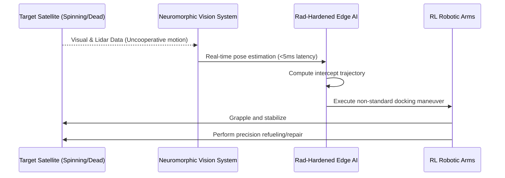

<!-- markdownlint-disable MD009 MD010 MD013 MD022 MD028 MD032 MD033 MD034 MD036 MD037 MD039 MD041 MD058 MD060 -->

[ 🇫🇷 Version Française ](./README.fr.md)

# OrbitBot Servicer

> **Executive Summary:** An autonomous fleet of space robotic cobots leveraging neuromorphic vision and reinforcement learning to repair, refuel, or safely de-orbit multi-million dollar satellites in space.

---

## 1. Visual Overview & Wow Effect

```mermaid
graph TD
    %% Problem vs Solution or Architecture Diagram
    subgraph Space_Status_Quo ["Space Status Quo"]
        A[Minor Satellite Failure / Fuel Empty] --> B[Impossible to Repair]
        B --> C[Loss of $100M+ Asset]
        C --> D[Becomes Dangerous Space Debris]
    end
    subgraph OrbitBot_Servicer ["OrbitBot Servicer"]
        E[Minor Satellite Failure / Fuel Empty] --> F[OrbitBot Deployed]
        F --> G[Autonomous Neuromorphic Rendezvous]
        G --> H[RL-Powered Robotic Repair / Refueling]
        H --> I[Satellite Life Extended & Debris Prevented]
    end
```

## 2. Contrarian Thesis (Peter Thiel Style)

**Popular Belief:** To manage the growing number of satellites, we just need cheaper launch vehicles (like SpaceX) to constantly launch replacements when old ones break or run out of fuel.

**Hidden Truth:** Throw-away satellite economics are unsustainable and create a cascading debris crisis (Kessler Syndrome). The true trillion-dollar space opportunity is not just cheaper launches, but establishing the first in-orbit robotic servicing infrastructure—making satellites repairable, upgradable, and immortal directly in the vacuum of space.

## 3. Problem & Target Market

**Business Model:** B2B / B2G

**Target Audience:** Satellite constellation operators (Starlink, Kuiper, Intelsat), space agencies (ESA, NASA), and military space forces (US Space Force).

**Urgent Pain Point:** Satellites cost hundreds of millions to build and launch. Yet, a minor mechanical failure (a stuck solar panel) or simply running out of station-keeping fuel renders the satellite completely useless, instantly destroying its value and turning it into hazardous space debris. There is currently no agile, standardized robotic infrastructure to physically service these critical assets in orbit.

## 4. Technical Architecture & Infrastructure

## 5. Business Model & Financial Viability

| Metric                 | Value                                                              |
| :--------------------- | :----------------------------------------------------------------- |
| Pricing Structure      | Mission-as-a-Service Fee (Per refuel/repair)                       |
| 12-Month Target        | 1 government or commercial in-orbit demonstration contract         |
| Revenue Formula        | 1 Demo Mission Contract = €100k ARR (Initial feasibility phase)    |
| Estimated Gross Margin | 60% (High hardware & launch costs offset by massive service value) |

## 6. Distribution Engine & Moat

**Acquisition Strategy:** Direct partnerships with major space agencies (NASA Tipping Point, ESA) and prime contractors to fund demonstration missions. Secure pre-orders for "life-extension services" from major telecom operators.

**Moat (Defensibility):** Tele-operating a robotic arm from Earth with a 2+ second signal latency for delicate contact operations is impossible; the robot would crush the satellite. The moat is the autonomous execution (Edge AI on Radiation-Hardened hardware) combined with neuromorphic vision that can track uncooperative, tumbling targets in real-time, completely independently from Earth control.

## 7. Detailed Evaluation Grid

| Criterion                   | VC Score (/100) | Market Score (/100) |
| :-------------------------- | :-------------- | :------------------ |
| Thesis & Monopoly / Urgency | -- / 25         | 24 / 25             |
| Moat / LLM Immunity         | -- / 25         | 25 / 25             |
| Scalability / UX Friction   | -- / 25         | 10 / 25             |
| Unit Economics / ROI        | -- / 25         | 18 / 25             |
| **TOTAL**                   | **-- / 100**    | **77 / 100**        |

> **VC Verdict:** Pending evaluation.
> **Market Verdict:** Moderate urgency but strong long-term strategic value. LLM immunity is good, relying on specialized models. Adoption presents notable friction that could slow initial monetization.
