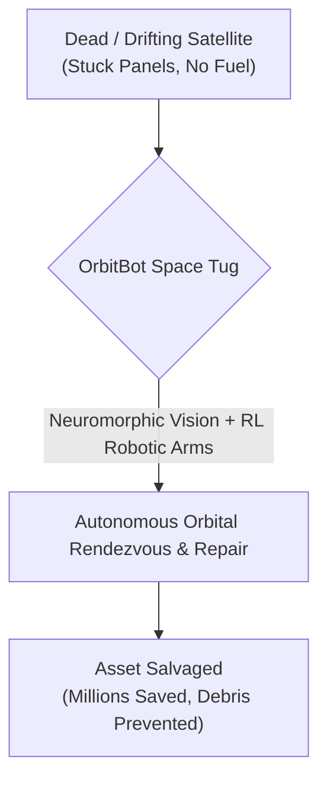
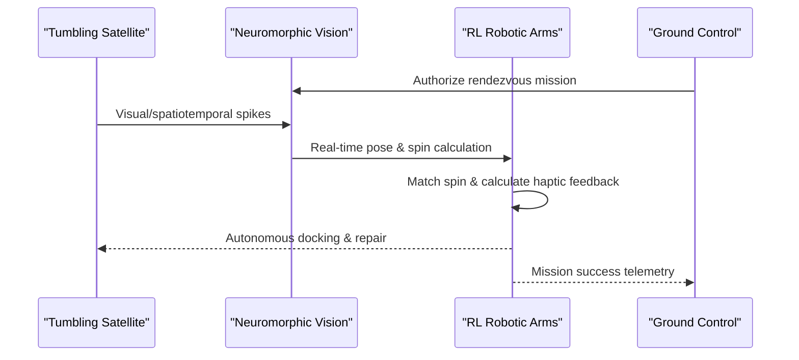

<!-- markdownlint-disable MD009 MD010 MD013 MD022 MD028 MD032 MD033 MD034 MD036 MD037 MD039 MD041 MD060 -->

[ 🇫🇷 Version Française ](./README.fr.md)

# OrbitBot Servicer

> **Executive Summary:** OrbitBot Servicer deploys a fleet of autonomous, neuromorphic-vision-powered space cobots to repair, refuel, or deorbit multi-million dollar satellites directly in orbit, preventing critical assets from becoming dangerous space debris.

---

## 1. Visual Overview & Wow Effect

## 2. Contrarian Thesis (Peter Thiel Style)

**Popular Belief:** The solution to satellite failure is to simply launch cheaper, disposable satellites, or rely on ground-controlled tele-operated robots to fix the expensive ones.
**Hidden Truth:** Tele-operating a robotic arm from Earth with a 2+ second signal latency is impossible for delicate contact operations; the robot will crash and destroy the target. True space resilience requires full orbital autonomy—Edge AI running on radiation-hardened hardware with neuromorphic vision to handle tumbling, non-cooperative targets in real-time without human intervention.

## 3. Problem & Target Market

**Business Model:** B2B / B2G
**Target Audience:** Satellite constellation operators (Starlink, Kuiper, Intelsat), space agencies (ESA, NASA), and military space forces (US Space Force).
**Urgent Pain Point:** Satellites cost hundreds of millions to launch. Yet, a minor mechanical failure (a stuck solar panel) or the depletion of station-keeping fuel renders the satellite completely useless, transforming it into a dangerous piece of space debris. Currently, there is no agile, standardized robotic infrastructure to refuel, physically repair, or safely deorbit these critical assets directly in space.

## 4. Technical Architecture & Infrastructure

## 5. Business Model & Financial Viability

| Metric                     | Value                                                     |
| -------------------------- | --------------------------------------------------------- |
| **Pricing Structure**      | Servicing-as-a-Service (Fixed fee per mission) + Retainer |
| **12-Month Target**        | 1 orbital demonstration contract with ESA/NASA            |
| **Revenue Formula**        | 1 Mission \* €2,000,000                                   |
| **Estimated Gross Margin** | >60% (High CapEx, high margin per service)                |

## 6. Distribution Engine & Moat

**Acquisition Strategy:** Strategic government contracts (NASA/ESA Tipping Point programs) to fund initial launches, followed by commercial service Level Agreements (SLAs) with mega-constellation operators.
**Moat (Defensibility):** The space qualification of hardware (Radiation hardening, resistance to vacuum and thermal gradients) is a massive barrier. The core technical moat is the integration of neuromorphic vision (processing visual data as spikes) for real-time tracking of tumbling objects, combined with Reinforcement Learning algorithms trained for zero-gravity haptic feedback on non-standardized docking ports. This level of autonomous Edge AI cannot be replicated by standard cloud-based SaaS.

## 7. Detailed Evaluation Grid

| Criterion                       | VC Score (/100) | Market Score (/100) |
| ------------------------------- | --------------- | ------------------- |
| **Thesis & Monopoly / Urgency** | -- / 25         | -- / 25             |
| **Moat / LLM Immunity**         | -- / 25         | -- / 25             |
| **Scalability / UX Friction**   | -- / 25         | -- / 25             |
| **Unit Economics / ROI**        | -- / 25         | -- / 25             |
| **TOTAL**                       | -- / 100        | -- / 100            |

> **VC Verdict:** Pending evaluation.
> **Market Verdict:** Pending evaluation.
