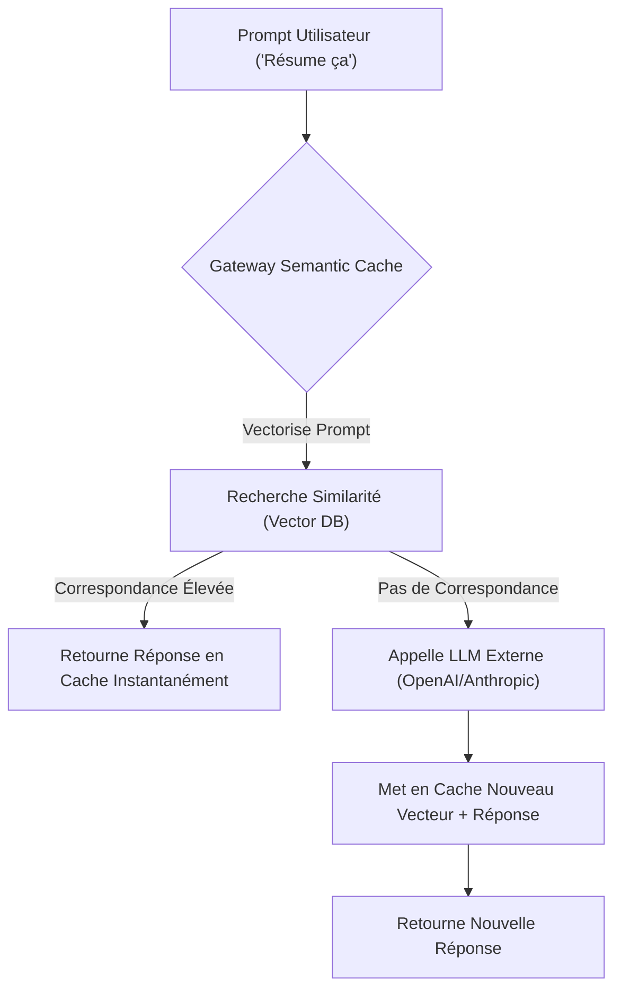
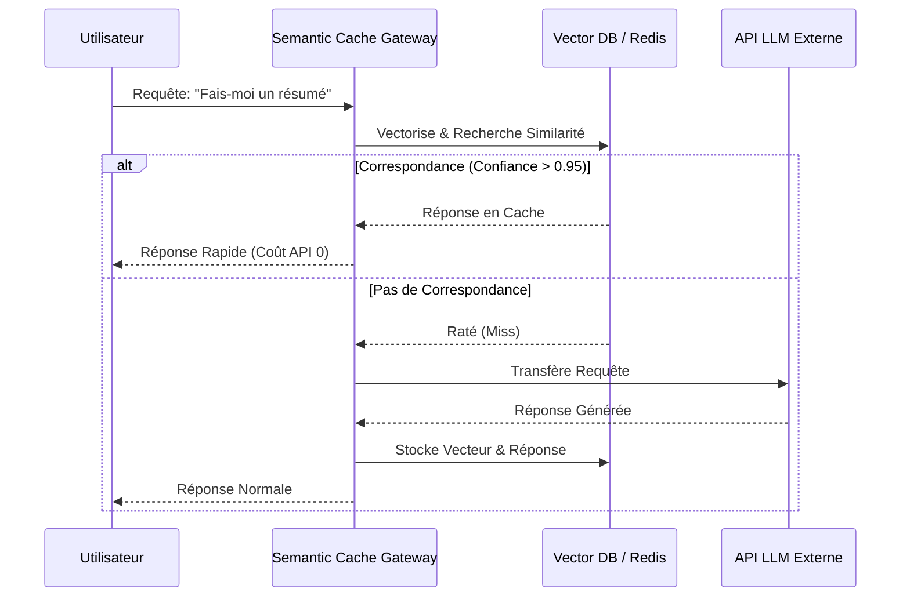

<!-- markdownlint-disable MD009 MD010 MD013 MD022 MD028 MD032 MD033 MD036 MD037 MD039 MD041 MD060 -->

[ 🇬🇧 English Version ](./README.md)

# Semantic Cache Gateway

> **Résumé exécutif :** Une passerelle API intelligente qui intercepte les requêtes LLM, effectue des recherches vectorielles ultra-rapides et sert des réponses en cache pour les questions sémantiquement identiques, réduisant drastiquement les coûts et la latence.

---

## 1. Aperçu visuel

## 2. La thèse contrariante (Peter Thiel Style)

- **La croyance populaire :** Avec la baisse des coûts et l'augmentation de la vitesse des LLMs, l'infrastructure de cache deviendra inutile.
- **La vérité cachée :** À l'échelle, les utilisateurs posent de manière répétée des questions sémantiquement identiques. Renvoyer chaque requête au modèle de fondation est un gaspillage financier massif. Une couche de cache sémantique est mathématiquement indispensable pour optimiser la rentabilité.

## 3. Le problème & La cible

- **Modèle économique :** B2B
- **Cible précise :** Éditeurs de logiciels SaaS, applications B2C et équipes d'ingénierie gérant de forts volumes d'appels API vers des LLMs.
- **La douleur urgente :** Transmettre systématiquement des requêtes sémantiquement similaires ("Fais-moi un résumé" vs "Résume ce texte") aux API engendre un gaspillage massif, une explosion des coûts liés aux tokens et une latence inutile.

## 4. Architecture technique & Plomberie

## 5. Modèle économique & Viabilité financière

| Métrique                    | Valeur                                      |
| --------------------------- | ------------------------------------------- |
| Structure de prix           | Abonnement par Paliers / Volume de Requêtes |
| Objectif 12 mois            | 200 Équipes Entreprise                      |
| Calcul du CA (Target 100k€) | 200 _ 500€ / mois _ 12 = 1.2M€              |
| Marge brute estimée         | 90%                                         |

## 6. Moteur de distribution & Fossé défensif (Moat)

- **Stratégie d'acquisition :** Positionnement comme "plugin de réduction de coûts" pour dev. PLG via des SDK open-source routant vers la passerelle cloud entreprise managée.
- **Moat (Barrière à l'entrée) :** Les modèles de fondation n'embarquent pas de cache partagé. Comparer les requêtes _avant_ l'inférence nécessite une infrastructure vectorielle externe spécialisée qu'un LLM ne peut pas auto-héberger.

## 7. Grille d'évaluation détaillée

| Critère                           | Score VC (/100) | Score Terrain (/100) |
| --------------------------------- | --------------- | -------------------- |
| Thèse & Monopole / Urgence        | 20 / 25         | -- / 25              |
| Moat / Résistance aux LLM natifs  | 18 / 25         | -- / 25              |
| Scalabilité / Friction d'adoption | 25 / 25         | -- / 25              |
| Unit Economics / ROI direct       | 25 / 25         | -- / 25              |
| **TOTAL**                         | **88 / 100**    | **-- / 100**         |

> **Verdict VC :** Cette passerelle offre une brillante opportunité d'arbitrage en réduisant radicalement la latence et les coûts de tokens grâce au cache sémantique, offrant un ROI immédiat et indéniable. Cependant, son fossé à long terme est très vulnérable aux solutions de cache natives inévitablement déployées par les fournisseurs de modèles. Pour survivre, il doit rapidement pivoter vers des couches de conformité et d'analyse spécifiques aux entreprises.

> **Verdict Terrain :** En attente d'évaluation.
