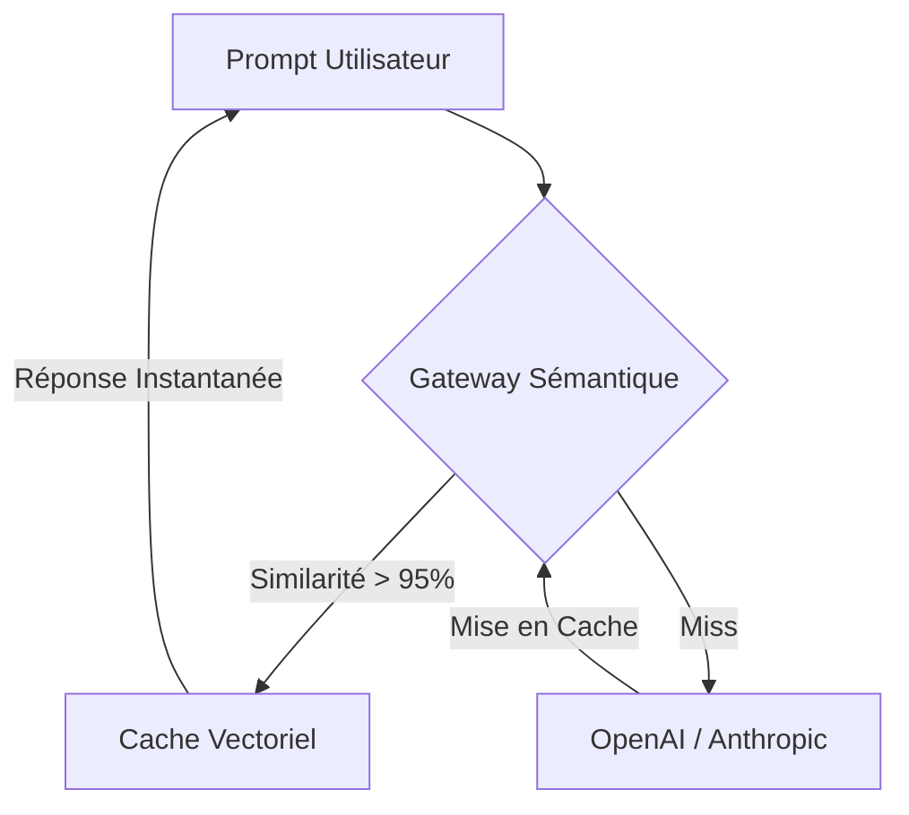
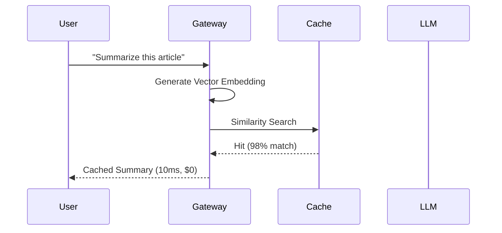

<!-- markdownlint-disable MD009 MD010 MD013 MD022 MD028 MD032 MD033 MD034 MD036 MD037 MD039 MD041 MD060 -->

[ 🇬🇧 English Version ](./README.md)

# Semantic Cache Gateway

> **Résumé exécutif :** Un reverse proxy intelligent qui vectorise les requêtes pour mettre en cache les réponses sémantiquement similaires, réduisant les coûts d'API LLM et la latence.

---

## 1. Aperçu visuel

```mermaid
graph TD
    %% Architecture
    A["Prompt Utilisateur"] --> B{"Gateway Sémantique"}
    B -->|Similarité > 95%| C["Cache Vectoriel"]
    C -->|Réponse Instantanée| A
    B -->|Miss| D["OpenAI / Anthropic"]
    D -->|Mise en Cache| B
```

## 2. La thèse contrariante (Peter Thiel Style)

**La croyance populaire :** Chaque prompt doit être envoyé au LLM pour obtenir une bonne réponse.

**La vérité cachée :** La grande majorité des requêtes sont des variations sémantiques identiques ; les renvoyer au LLM gaspille des ressources immenses.

## 3. Le problème & La cible

**Modèle économique :** B2B
**Cible précise :** Éditeurs SaaS, applications B2C et équipes d'ingénierie gérant de forts volumes d'appels LLM.
**La douleur urgente :** L'envoi systématique de requêtes similaires aux LLMs engendre un gaspillage massif, une explosion des coûts et une forte latence.

## 4. Architecture technique & Plomberie

**L'approche technique :** Reverse proxy vectorisant les requêtes pour recherche de similarité dans un cache. Si la confiance est suffisante, la réponse est renvoyée instantanément sans appel externe.

```mermaid
sequenceDiagram
    participant User
    participant Gateway
    participant Cache
    participant LLM
    User->>Gateway: "Summarize this article"
    Gateway->>Gateway: Generate Vector Embedding
    Gateway->>Cache: Similarity Search
    Cache-->>Gateway: Hit (98% match)
    Gateway-->>User: Cached Summary (10ms, $0)
```

## 5. Modèle économique & Viabilité financière

| Métrique                        | Valeur                                     |
| :------------------------------ | :----------------------------------------- |
| **Structure de prix**           | Volume-based SaaS / % of Saved Token Costs |
| **Objectif 12 mois**            | 200 SaaS Companies                         |
| **Calcul du CA (Target 100k€)** | 200 companies \* $500/mo = $100k/mo        |
| **Marge brute estimée**         | 95%                                        |

## 6. Moteur de distribution & Fossé défensif (Moat)

**Stratégie d'acquisition :** Adoption dev via modèle open-core, ventes SaaS premium pour entreprises.

**Moat (Barrière à l'entrée) :** Les LLMs n'embarquent pas de cache mutualisé. Une infrastructure externe dédiée est requise pour comparer les embeddings avant l'inférence.

## 7. Grille d'évaluation détaillée

| Critère                               | Score VC (/100) | Score Terrain (/100) |
| :------------------------------------ | :-------------- | :------------------- |
| **Thèse & Monopole / Urgence**        | -- / 25         | -- / 25              |
| **Moat / Résistance aux LLM natifs**  | -- / 25         | -- / 25              |
| **Scalabilité / Friction d'adoption** | -- / 25         | -- / 25              |
| **Unit Economics / ROI direct**       | -- / 25         | -- / 25              |
| **TOTAL**                             | -- / 100        | -- / 100             |

> **Verdict VC :** En attente d'évaluation.
> **Verdict Terrain :** En attente d'évaluation.
