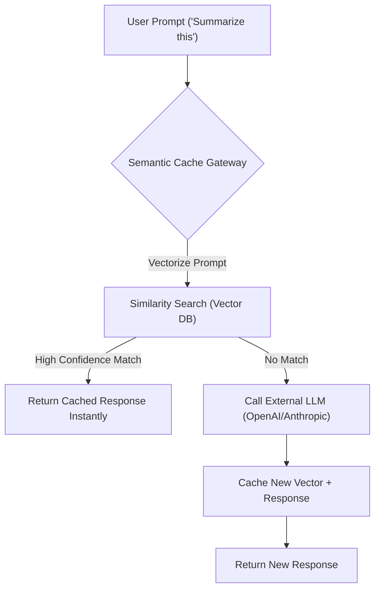
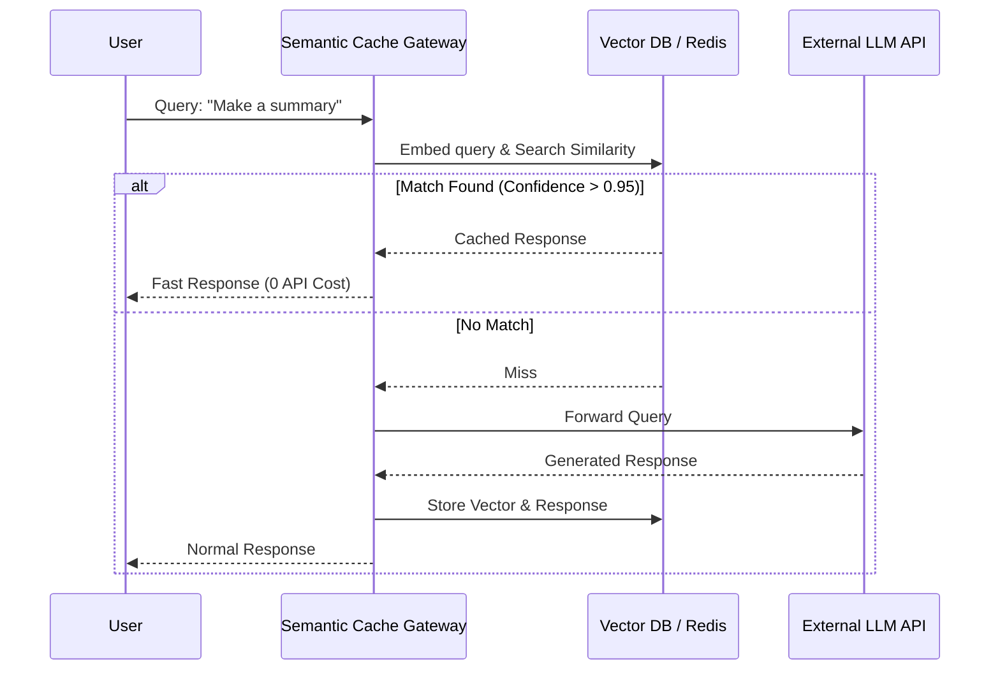

<!-- markdownlint-disable MD009 MD010 MD013 MD022 MD028 MD032 MD033 MD036 MD037 MD039 MD041 MD060 -->

[ 🇫🇷 Version Française ](./README.fr.md)

# Semantic Cache Gateway

> **Executive Summary:** An intelligent API gateway that intercepts LLM requests, performs ultra-fast vector similarity searches, and serves cached responses for semantically identical queries to slash API costs and latency.

---

## 1. Visual Overview

## 2. Contrarian Thesis (Peter Thiel Style)

- **Popular Belief:** As LLMs get cheaper and faster, caching infrastructure will become irrelevant.
- **Hidden Truth:** At scale, enterprise users repeatedly ask semantically identical questions. Routing every single query to a foundational model causes massive financial waste and unnecessary latency. A dedicated semantic caching layer is mathematically required to optimize unit economics, regardless of model cost drops.

## 3. Problem & Target Market

- **Business Model:** B2B
- **Target Audience:** SaaS vendors, B2C AI applications, and engineering teams managing high volumes of LLM API calls.
- **Urgent Pain Point:** Sending systematically identical or semantically similar queries to LLM APIs generates massive network resource waste, token cost explosions, and degraded user experience due to unnecessary latency.

## 4. Technical Architecture & Infrastructure

## 5. Business Model & Financial Viability

| Metric                 | Value                                       |
| ---------------------- | ------------------------------------------- |
| Pricing Structure      | Tiered Subscription based on Request Volume |
| 12-Month Target        | 200 Enterprise Teams                        |
| Revenue Formula        | 200 _ €500 / month _ 12 = 1.2M€             |
| Estimated Gross Margin | 90%                                         |

## 6. Distribution Engine & Moat

- **Acquisition Strategy:** Positioned as a "cost-reduction plugin" for developers. PLG (Product-Led Growth) via open-source SDKs routing towards the managed enterprise gateway.
- **Moat (Defensibility):** Foundation models do not natively include shared enterprise caching mechanisms. Comparing query embeddings _before_ inference requires external, specialized vector infrastructure that a pure LLM cannot self-host efficiently.

## 7. Detailed Evaluation Grid

| Criterion                   | VC Score (/100) | Market Score (/100) |
| --------------------------- | --------------- | ------------------- |
| Thesis & Monopoly / Urgency | 20 / 25         | -- / 25             |
| Moat / LLM Immunity         | 18 / 25         | -- / 25             |
| Scalability / UX Friction   | 25 / 25         | -- / 25             |
| Unit Economics / ROI        | 25 / 25         | -- / 25             |
| **TOTAL**                   | **88 / 100**    | **-- / 100**        |

> **VC Verdict:** This gateway offers a brilliant arbitrage opportunity by radically cutting latency and token costs through semantic caching, delivering an immediate, undeniable ROI. However, its long-term moat is highly vulnerable to native caching solutions inevitably rolled out by foundational model providers. To survive and dominate, it must quickly pivot to enterprise-specific compliance and analytics layers.

> **Market Verdict:** Pending evaluation.
