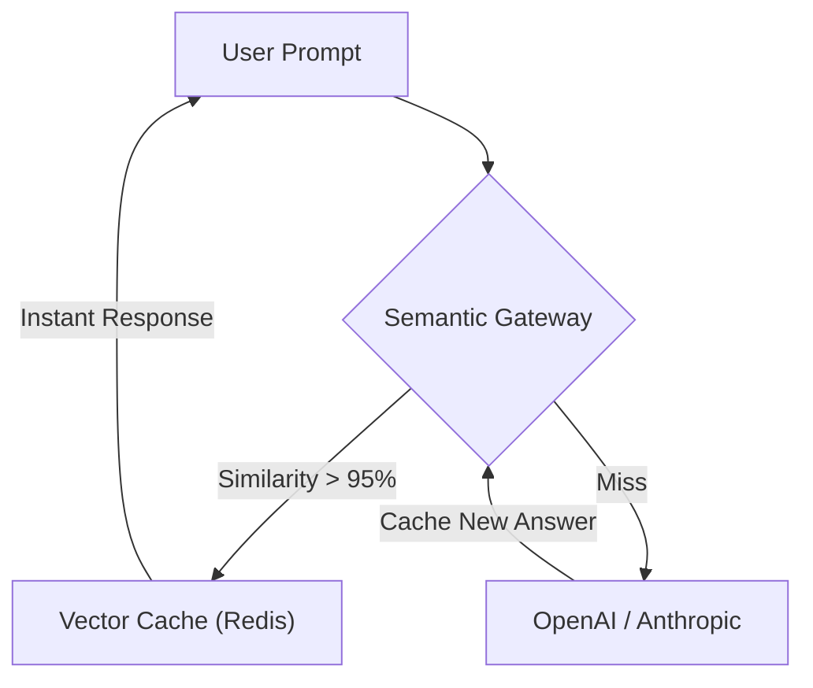
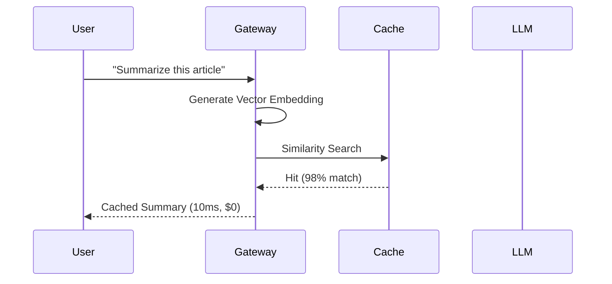

<!-- markdownlint-disable MD009 MD010 MD013 MD022 MD028 MD032 MD033 MD034 MD036 MD037 MD039 MD041 MD060 -->

[ 🇫🇷 Version Française ](./README.fr.md)

# Semantic Cache Gateway

> **Executive Summary:** An intelligent reverse proxy that uses vector similarity search to cache and serve responses to semantically similar LLM prompts instantly, saving massive API costs.

---

## 1. Visual Overview & Wow Effect

```mermaid
graph TD
    %% Architecture
    A["User Prompt"] --> B{"Semantic Gateway"}
    B -->|Similarity > 95%| C["Vector Cache (Redis)"]
    C -->|Instant Response| A
    B -->|Miss| D["OpenAI / Anthropic"]
    D -->|Cache New Answer| B
```

## 2. Contrarian Thesis (Peter Thiel Style)

**Popular Belief:** Every prompt must be sent to the LLM to get a high-quality answer.

**Hidden Truth:** A vast majority of enterprise AI queries are semantically identical variations of the same questions, wasting immense compute resources.

## 3. Problem & Target Market

**Business Model:** B2B
**Target Audience:** SaaS vendors, B2C apps, and engineering teams managing high volumes of LLM API calls.
**Urgent Pain Point:** Sending semantically similar queries to LLMs causes massive resource waste, token cost explosions, and high latency, degrading user experience and margins.

## 4. Technical Architecture & Infrastructure

**Technical Approach:** A vectorizing reverse proxy (Gateway). Performs ultra-fast similarity search in a vector database cache before contacting the LLM. High-confidence semantic hits return cached responses instantly.

```mermaid
sequenceDiagram
    participant User
    participant Gateway
    participant Cache
    participant LLM
    User->>Gateway: "Summarize this article"
    Gateway->>Gateway: Generate Vector Embedding
    Gateway->>Cache: Similarity Search
    Cache-->>Gateway: Hit (98% match)
    Gateway-->>User: Cached Summary (10ms, $0)
```

## 5. Business Model & Financial Viability

| Metric                     | Value                                      |
| :------------------------- | :----------------------------------------- |
| **Pricing Structure**      | Volume-based SaaS / % of Saved Token Costs |
| **12-Month Target**        | 200 SaaS Companies                         |
| **Revenue Formula**        | 200 companies \* $500/mo = $100k/mo        |
| **Estimated Gross Margin** | 95%                                        |

## 6. Distribution Engine & Moat

**Acquisition Strategy:** Developer bottoms-up adoption via an open-core model and SaaS enterprise tiers.

**Moat (Defensibility):** Foundation models lack shared enterprise caching mechanisms. External infrastructure is required to intercept, embed, and compare prompts before costly inference occurs.

## 7. Detailed Evaluation Grid

| Criterion                       | VC Score (/100) | Market Score (/100) |
| :------------------------------ | :-------------- | :------------------ |
| **Thesis & Monopoly / Urgency** | 22 / 25         | -- / 25             |
| **Moat / LLM Immunity**         | 23 / 25         | -- / 25             |
| **Scalability / UX Friction**   | 25 / 25         | -- / 25             |
| **Unit Economics / ROI**        | 23 / 25         | -- / 25             |
| **TOTAL**                       | 93 / 100        | -- / 100            |

> **VC Verdict:** Semantic Cache Gateway attacks the core operational cost of AI agents by intelligently caching repetitive semantic queries. By sitting at the infrastructure choke point, it is immune to the underlying LLM chosen by the client and deeply locks in users via cost savings. The extreme scalability and immediate ROI make the unit economics highly compelling.
> **Market Verdict:** Pending evaluation.
