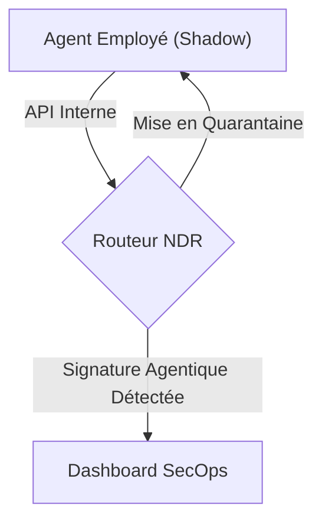
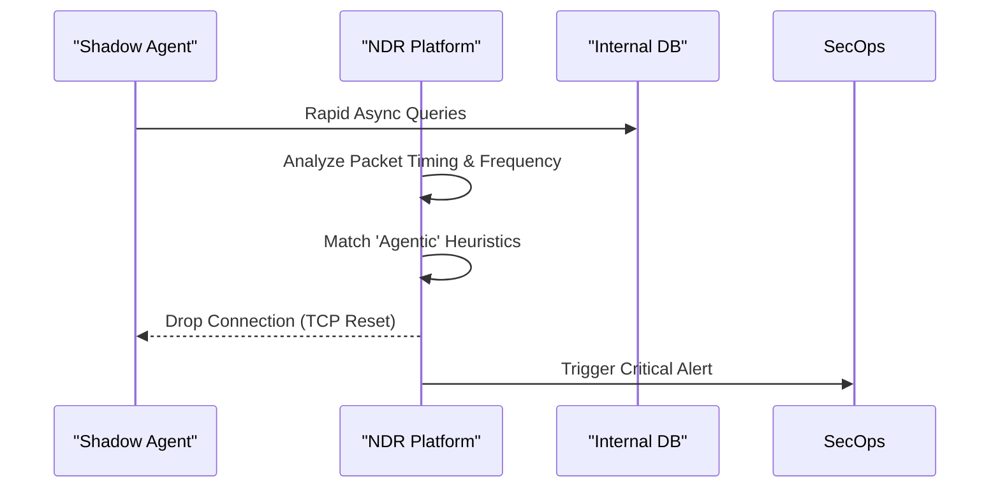

<!-- markdownlint-disable MD009 MD010 MD013 MD022 MD028 MD032 MD033 MD034 MD036 MD037 MD039 MD041 MD060 -->

[ 🇬🇧 English Version ](./README.md)

# ShadowAgent Hunter

> **Résumé exécutif :** Une plateforme NDR (Network Detection and Response) pour identifier et bloquer les agents IA non autorisés (Shadow AI) déployés par les employés.

---

## 1. Aperçu visuel

## 2. La thèse contrariante (Peter Thiel Style)

**La croyance populaire :** Les outils DLP et pare-feux classiques suffisent pour contrôler l'usage de l'IA.

**La vérité cachée :** Le Shadow AI utilise des accès légitimes et agit de façon asynchrone, rendant les pare-feux classiques aveugles.

## 3. Le problème & La cible

**Modèle économique :** B2B
**Cible précise :** RSSI, équipes SecOps et administrateurs réseau des grandes entreprises.
**La douleur urgente :** Le Shadow AI remplace le Shadow IT : les employés déploient des agents qui manipulent des données sensibles à l'insu de l'entreprise, ouvrant des brèches critiques.

## 4. Architecture technique & Plomberie

**L'approche technique :** Plateforme NDR identifiant les signatures comportementales agentiques. Analyse le trafic pour repérer fréquences surhumaines et boucles non déclarées afin de bloquer les agents voyous.

## 5. Modèle économique & Viabilité financière

| Métrique                        | Valeur                                                |
| :------------------------------ | :---------------------------------------------------- |
| **Structure de prix**           | Enterprise License based on Network Bandwidth / Nodes |
| **Objectif 12 mois**            | 25 Enterprise Contracts                               |
| **Calcul du CA (Target 100k€)** | 25 contracts \* $4k/mo = $100k/mo                     |
| **Marge brute estimée**         | 85%                                                   |

## 6. Moteur de distribution & Fossé défensif (Moat)

**Stratégie d'acquisition :** Ventes directes aux RSSI et partenariats avec les intégrateurs cybersécurité.

**Moat (Barrière à l'entrée) :** Un LLM génère du texte et n'inspecte pas le trafic TCP/IP. Une infrastructure bas-niveau d'inspection réseau est indispensable pour débusquer les scripts autonomes.

## 7. Grille d'évaluation détaillée

| Critère                               | Score VC (/100) | Score Terrain (/100) |
| :------------------------------------ | :-------------- | :------------------- |
| **Thèse & Monopole / Urgence**        | -- / 25         | -- / 25              |
| **Moat / Résistance aux LLM natifs**  | -- / 25         | -- / 25              |
| **Scalabilité / Friction d'adoption** | -- / 25         | -- / 25              |
| **Unit Economics / ROI direct**       | -- / 25         | -- / 25              |
| **TOTAL**                             | -- / 100        | -- / 100             |

> **Verdict VC :** En attente d'évaluation.
> **Verdict Terrain :** En attente d'évaluation.
