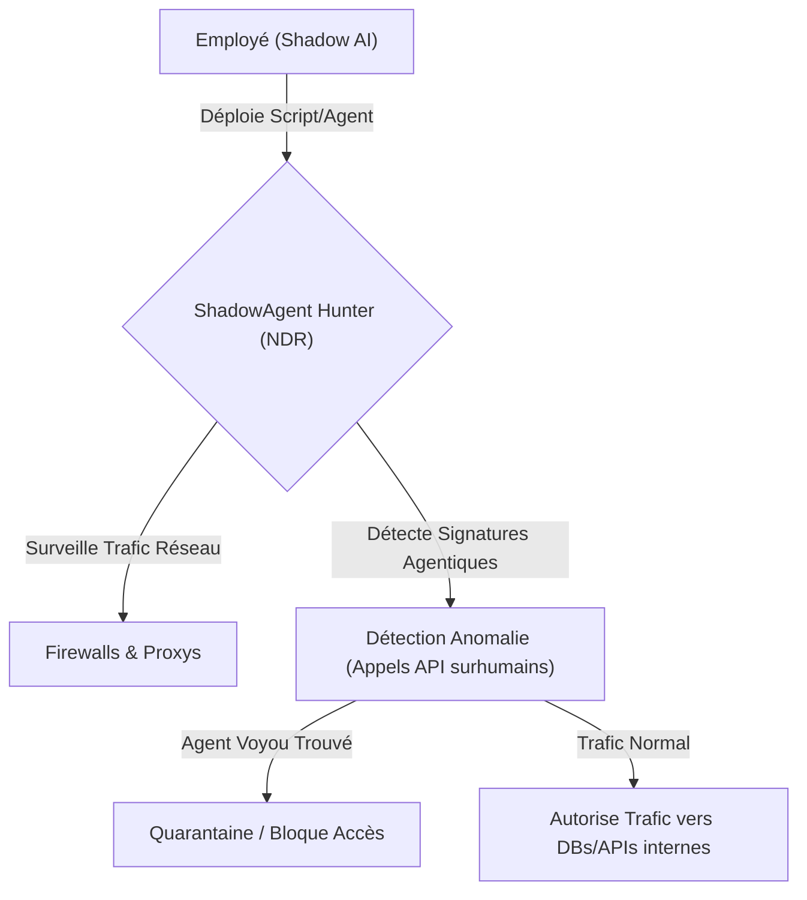
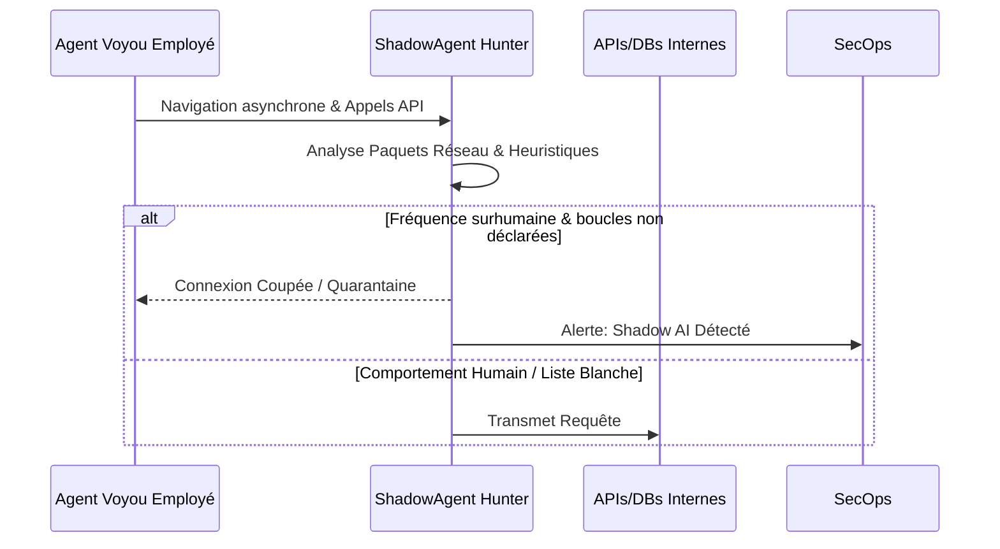

<!-- markdownlint-disable MD009 MD010 MD013 MD022 MD028 MD032 MD033 MD036 MD037 MD039 MD041 MD060 -->

[ 🇬🇧 English Version ](./README.md)

# ShadowAgent Hunter

> **Résumé exécutif :*x Une plateforme de détection réseau (NDR) conçue spécifiquement pour identifier, mettre en quarantaine et bloquer les agents autonomes "voyous" déployés discrètement par les employés.

---

## 1. Aperçu visuel

## 2. La thèse contrariante (Peter Thiel Style)

- **La croyance populaire :*x Le Shadow IT est un problème résolu grâce à la gestion des identités moderne et aux Cloud Access Security Brokers (CASB).
- **La vérité cachée :*x Le "Shadow AI" remplace le Shadow IT. Les employés déploient discrètement leurs propres agents autonomes (via des scripts locaux ou clés API personnelles) pour accomplir leurs tâches. Ces agents manipulent des données sensibles à l'insu de l'entreprise, échappent aux contrôles DLP classiques et ouvrent des brèches de sécurité critiques impossibles à auditer manuellement.

## 3. Le problème & La cible

- **Modèle économique :*x B2B
- **Cible précise :*x RSSI (CISO), équipes SecOps et administrateurs réseau dans les grandes entreprises.
- **La douleur urgente :*x Les agents non supervisés accèdent directement aux bases de données et aux identifiants internes. Ils exposent l'entreprise à des risques massifs d'exfiltration de données et de non-conformité, sans laisser de traces d'audit claires pour la sécurité classique.

## 4. Architecture technique & Plomberie

## 5. Modèle économique & Viabilité financière

| Métrique                    | Valeur                                        |
| --------------------------- | --------------------------------------------- |
| Structure de prix           | Licence Entreprise / Nombre de nœuds protégés |
| Objectif 12 mois            | 50 Clients Entreprise                         |
| Calcul du CA (Target 100k€) | 50 _ 2000€ / mois _ 12 = 1.2M€                |
| Marge brute estimée         | 85%                                           |

## 6. Moteur de distribution & Fossé défensif (Moat)

- **Stratégie d'acquisition :*x Ventes directes B2B aux équipes de sécurité d'entreprise. Intégration aux firewalls et proxys existants comme module de "Sécurité IA".
- **Moat (Barrière à l'entrée) :*x Un LLM est un modèle génératif de texte, pas un analyseur de paquets réseau. Un prompt ne peut pas s'interfacer aux routeurs de l'entreprise, inspecter le trafic TCP/IP en temps réel ou appliquer des heuristiques de détection sur des téraoctets de logs réseaux. Il faut une infrastructure d'inspection de bas niveau dédiée.

## 7. Grille d'évaluation détaillée

| Critère                           | Score VC (/100) | Score Terrain (/100) |
| --------------------------------- | --------------- | -------------------- |
| Thèse & Monopole / Urgence        | -- / 25         | -- / 25              |
| Moat / Résistance aux LLM natifs  | -- / 25         | -- / 25              |
| Scalabilité / Friction d'adoption | -- / 25         | -- / 25              |
| Unit Economics / ROI direct       | -- / 25         | -- / 25              |
| **TOTAL*x                         | **-- / 100*x    | **-- / 100*x         |

> **Verdict VC :*x En attente d'évaluation.

> **Verdict Terrain :*x En attente d'évaluation.
