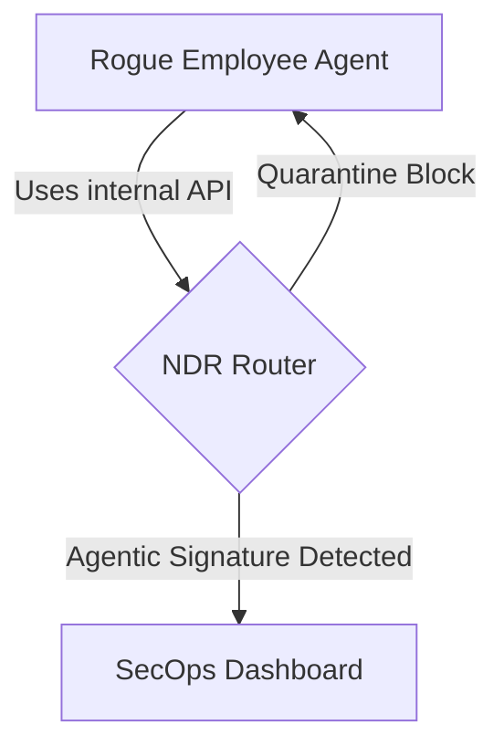
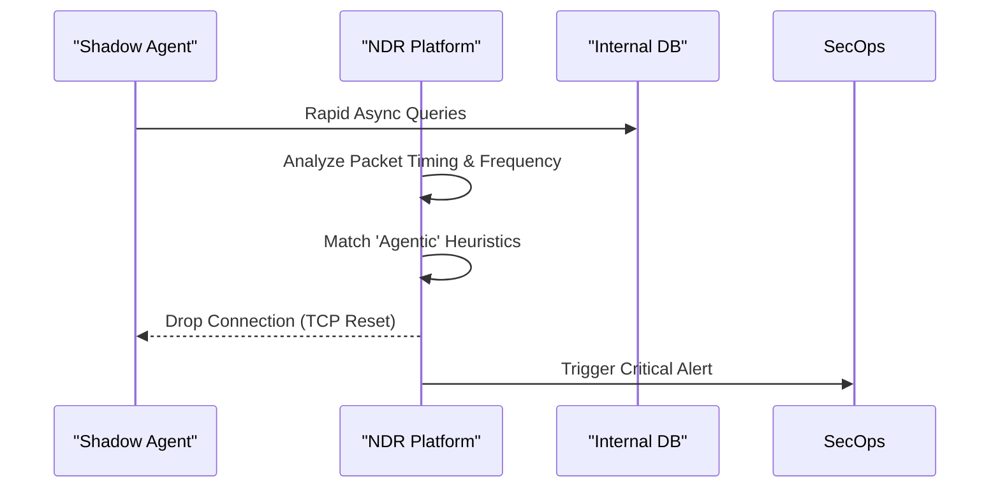

<!-- markdownlint-disable MD009 MD010 MD013 MD022 MD028 MD032 MD033 MD034 MD036 MD037 MD039 MD041 MD060 -->

[ 🇫🇷 Version Française ](./README.fr.md)

# ShadowAgent Hunter

> **Executive Summary:** A Network Detection and Response (NDR) platform designed to identify, map, and block unauthorized rogue AI agents deployed secretly by employees.

---

## 1. Visual Overview & Wow Effect

## 2. Contrarian Thesis (Peter Thiel Style)

**Popular Belief:** Existing Data Loss Prevention (DLP) and firewalls can stop unauthorized AI usage.

**Hidden Truth:** Shadow AI agents use legitimate credentials and behave asynchronously, bypassing traditional DLP tools completely.

## 3. Problem & Target Market

**Business Model:** B2B
**Target Audience:** CISOs, SecOps teams, and network administrators in large enterprises.
**Urgent Pain Point:** Employees secretly deploy local agents that access internal DBs and manipulate sensitive data, causing un-auditable critical security breaches.

## 4. Technical Architecture & Infrastructure

**Technical Approach:** An NDR platform mapping agentic behavioral signatures. Integrates with firewalls to analyze real-time traffic, spotting superhuman request frequencies and undocumented M2M loops to quarantine rogue scripts.

## 5. Business Model & Financial Viability

| Metric                     | Value                                                 |
| :------------------------- | :---------------------------------------------------- |
| **Pricing Structure**      | Enterprise License based on Network Bandwidth / Nodes |
| **12-Month Target**        | 25 Enterprise Contracts                               |
| **Revenue Formula**        | 25 contracts \* $4k/mo = $100k/mo                     |
| **Estimated Gross Margin** | 85%                                                   |

## 6. Distribution Engine & Moat

**Acquisition Strategy:** Enterprise cybersecurity channel partners and direct CISO outreach.

**Moat (Defensibility):** LLMs are text generators, not packet analyzers. Identifying autonomous scripts requires low-level network infrastructure and heuristics over terabytes of TCP/IP logs.

## 7. Detailed Evaluation Grid

| Criterion                       | VC Score (/100) | Market Score (/100) |
| :------------------------------ | :-------------- | :------------------ |
| **Thesis & Monopoly / Urgency** | -- / 25         | -- / 25             |
| **Moat / LLM Immunity**         | -- / 25         | -- / 25             |
| **Scalability / UX Friction**   | -- / 25         | -- / 25             |
| **Unit Economics / ROI**        | -- / 25         | -- / 25             |
| **TOTAL**                       | -- / 100        | -- / 100            |

> **VC Verdict:** Pending evaluation.
> **Market Verdict:** Pending evaluation.
