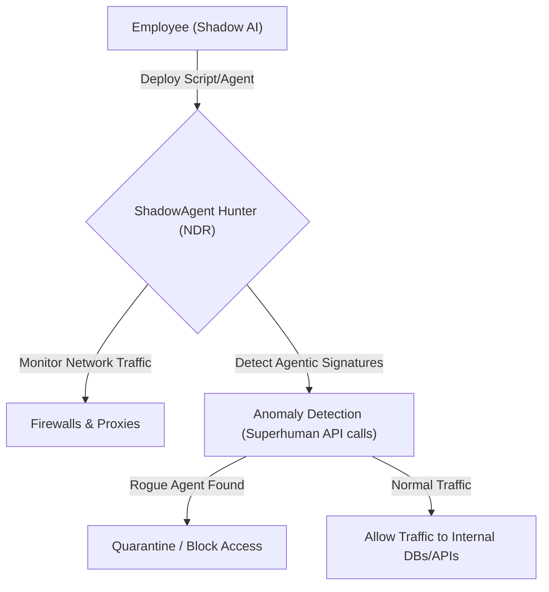
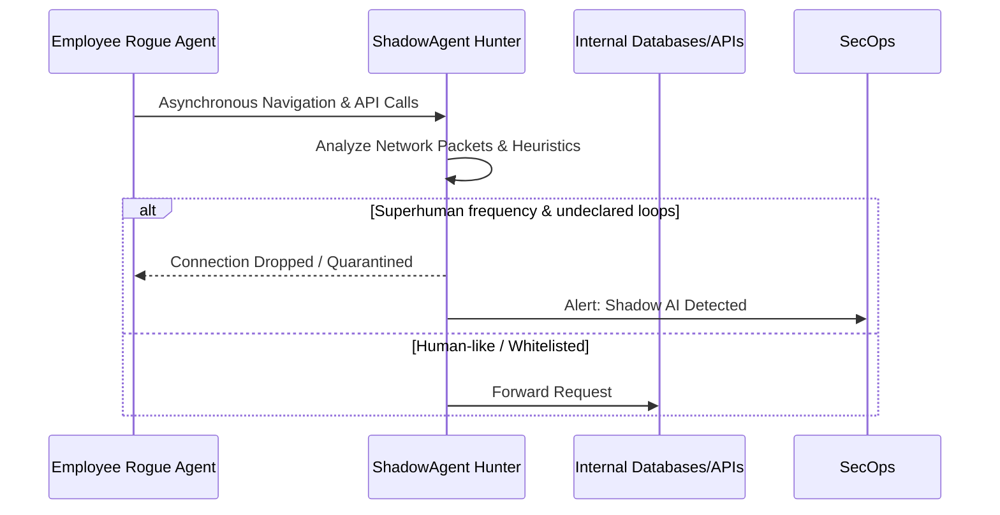

<!-- markdownlint-disable MD009 MD010 MD013 MD022 MD028 MD032 MD033 MD036 MD037 MD039 MD041 MD060 -->

[ 🇫🇷 Version Française ](./README.fr.md)

# ShadowAgent Hunter

> **Executive Summary:*x A Network Detection and Response (NDR) platform specifically designed to identify, quarantine, and block unauthorized "rogue" autonomous AI agents deployed by employees.

---

## 1. Visual Overview & Wow Effect

## 2. Contrarian Thesis (Peter Thiel Style)

- **Popular Belief:*x Shadow IT is a solved problem thanks to modern Identity Management and Cloud Access Security Brokers (CASBs).
- **Hidden Truth:*x "Shadow AI" is rapidly replacing Shadow IT. Employees are deploying their own autonomous agents that use personal API keys and local scripts to access internal databases, bypassing traditional Data Loss Prevention (DLP) and creating unauditable, critical security breaches.

## 3. Problem & Target Market

- **Business Model:*x B2B
- **Target Audience:*x CISOs, SecOps teams, and network administrators in large enterprises.
- **Urgent Pain Point:*x Unsupervised AI agents manipulate sensitive data without the company's knowledge. They evade classic security controls and expose the organization to massive compliance and data exfiltration risks that are impossible to audit manually.

## 4. Technical Architecture & Infrastructure

## 5. Business Model & Financial Viability

| Metric                 | Value                                          |
| ---------------------- | ---------------------------------------------- |
| Pricing Structure      | Enterprise License / Number of Protected Nodes |
| 12-Month Target        | 50 Enterprise Clients                          |
| Revenue Formula        | 50 _ €2,000 / month _ 12 = 1.2M€               |
| Estimated Gross Margin | 85%                                            |

## 6. Distribution Engine & Moat

- **Acquisition Strategy:*x Direct B2B sales to enterprise security teams. Integration with existing enterprise firewalls and proxy solutions as an "AI Security" module.
- **Moat (Defensibility):*x A generative text model (LLM) cannot interface with enterprise routers, inspect real-time TCP/IP traffic, or apply detection heuristics on terabytes of network logs. This requires dedicated, low-level network inspection infrastructure that is hard to replicate.

## 7. Detailed Evaluation Grid

| Criterion                   | VC Score (/100) | Market Score (/100) |
| --------------------------- | --------------- | ------------------- |
| Thesis & Monopoly / Urgency | -- / 25         | -- / 25             |
| Moat / LLM Immunity         | -- / 25         | -- / 25             |
| Scalability / UX Friction   | -- / 25         | -- / 25             |
| Unit Economics / ROI        | -- / 25         | -- / 25             |
| **TOTAL*x                   | **-- / 100*x    | **-- / 100*x        |

> **VC Verdict:*x Pending evaluation.

> **Market Verdict:*x Pending evaluation.
