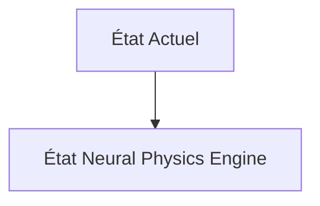
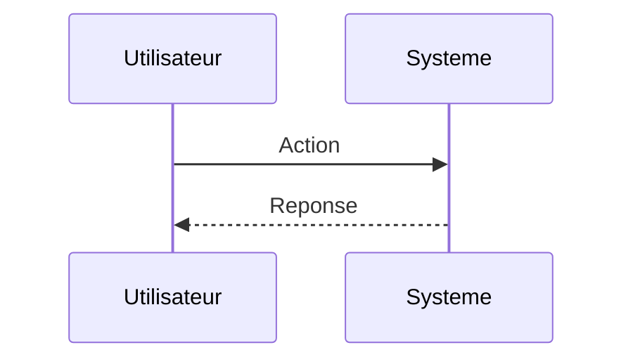

<!-- markdownlint-disable MD009 MD010 MD013 MD022 MD028 MD032 MD033 MD034 MD036 MD037 MD039 MD041 MD060 -->

[ 🇬🇧 English Version ](./README.md)

# Neural Physics Engine

> **Résumé exécutif :** Un moteur de "Neural Physics" qui remplace les solveurs physiques classiques par des réseaux de neurones graphiques (GNN) capables d'apprendre et de simuler la physique de contact complexe, les fluides et les objets mous en temps réel avec un rendu différentiable.

---

## 1. Aperçu visuel & Effet Wahou

## 2. La thèse contrariante (Peter Thiel Style)

**La croyance populaire :** Les solutions généralistes IA peuvent résoudre ce problème.

**La vérité cachée :** Les moteurs de jeu existants (Unreal, Unity) privilégient l'apparence visuelle sur la précision physique rigoureuse. Les LLMs n'ont aucune notion de la physique spatiale, de la gravité, ou de la dynamique des corps rigides.

## 3. Le problème & La cible

**Modèle économique :** B2B

**Cible précise :** Fabricants de robots humanoïdes et constructeurs automobiles autonomes (Head of Robotics, VP Autonomy).

**La douleur urgente :** L'entraînement de politiques de contrôle robotique dans le monde réel est trop lent et coûteux. Le transfert des simulations actuelles vers la réalité (sim-to-real gap) échoue à cause de la modélisation inexacte de la physique de contact (friction, matériaux déformables).

## 4. Architecture technique & Plomberie

## 5. Modèle économique & Viabilité financière

| Métrique                    | Valeur                        |
| --------------------------- | ----------------------------- |
| Structure de prix           | Abonnement SaaS               |
| Objectif 12 mois            | 10 clients                    |
| Calcul du CA (Target 100k€) | 10 clients \* 10k€/an = 100k€ |
| Marge brute estimée         | 80%                           |

## 6. Moteur de distribution & Fossé défensif (Moat)

**Stratégie d'acquisition :** Vente directe B2B

**Moat (Barrière à l'entrée) :** Dépendance au hardware (NVIDIA Omniverse), difficulté à prouver l'universalité du solveur neuronal sur de nouveaux matériaux, barrière technologique extrêmement élevée.

## 7. Grille d'évaluation détaillée

| Critère                           | Score VC (/100) | Score Terrain (/100) |
| --------------------------------- | --------------- | -------------------- |
| Thèse & Monopole / Urgence        | -- / 25         | -- / 25              |
| Moat / Résistance aux LLM natifs  | -- / 25         | -- / 25              |
| Scalabilité / Friction d'adoption | -- / 25         | -- / 25              |
| Unit Economics / ROI direct       | -- / 25         | -- / 25              |
| **TOTAL**                         | **-- / 100**    | **-- / 100**         |

> **Verdict VC :** En attente d'évaluation.

> **Verdict Terrain :** En attente d'évaluation.
