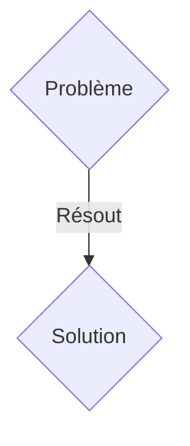
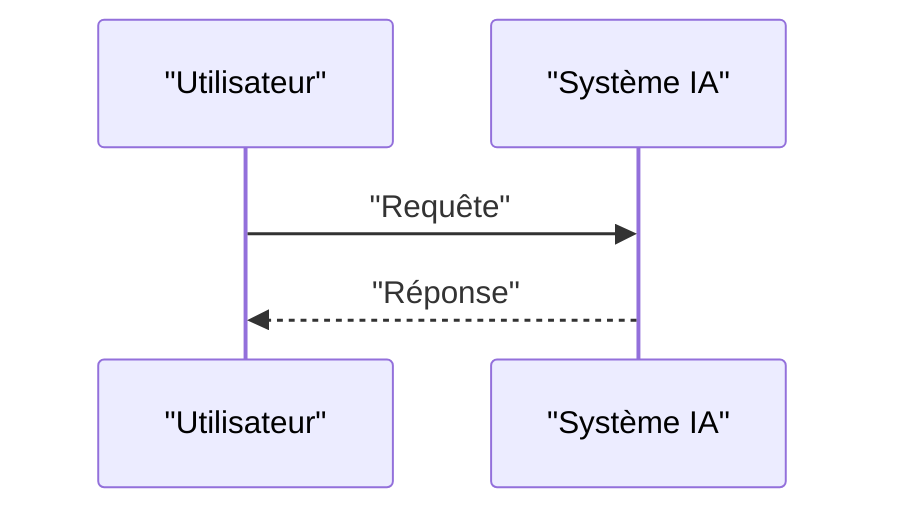

<!-- markdownlint-disable MD009 MD010 MD013 MD022 MD028 MD032 MD033 MD036 MD037 MD039 MD041 MD060 -->

[ 🇬🇧 English Version ](./README.md)

# Neural Physics Engine

> **Résumé exécutif :** Une solution B2B ciblant Fabricants de robots humanoïdes et constructeurs automobiles autonomes (Head of Robotics, VP Autonomy). pour résoudre : L'entraînement de politiques de contrôle robotique dans le monde réel est trop lent et coûteux. Le transfert des simulations actuelles vers la réalité (sim-to-real gap) échoue à cause de la modélisation inexacte de la physique de contact (friction, matériaux déformables).

---

## 1. Aperçu visuel & Effet Wahou

## 2. La thèse contrariante (Peter Thiel Style)

- **La croyance populaire :** Les solutions génériques suffisent.
- **La vérité cachée :** Un moteur de "Neural Physics" qui remplace les solveurs physiques classiques par des réseaux de neurones graphiques (GNN) capables d'apprendre et de simuler la physique de contact complexe, les fluides et les objets mous en temps réel avec un rendu différentiable.

## 3. Le problème & La cible

- **Modèle économique :** B2B
- **Cible précise :** Fabricants de robots humanoïdes et constructeurs automobiles autonomes (Head of Robotics, VP Autonomy).
- **La douleur urgente :** L'entraînement de politiques de contrôle robotique dans le monde réel est trop lent et coûteux. Le transfert des simulations actuelles vers la réalité (sim-to-real gap) échoue à cause de la modélisation inexacte de la physique de contact (friction, matériaux déformables).

## 4. Architecture technique & Plomberie

Un moteur de "Neural Physics" qui remplace les solveurs physiques classiques par des réseaux de neurones graphiques (GNN) capables d'apprendre et de simuler la physique de contact complexe, les fluides et les objets mous en temps réel avec un rendu différentiable.

## 5. Modèle économique & Viabilité financière

| Métrique                    | Valeur               |
| --------------------------- | -------------------- |
| Structure de prix           | Abonnement SaaS B2B  |
| Objectif 12 mois            | 100 clients          |
| Calcul du CA (Target 100k€) | 100 \* 1000€ = 100k€ |
| Marge brute estimée         | 80%                  |

## 6. Moteur de distribution & Fossé défensif (Moat)

- **Stratégie d'acquisition :** Vente directe et partenariats stratégiques.
- **Moat (Barrière à l'entrée) :** Les moteurs de jeu existants (Unreal, Unity) privilégient l'apparence visuelle sur la précision physique rigoureuse. Les LLMs n'ont aucune notion de la physique spatiale, de la gravité, ou de la dynamique des corps rigides.

## 7. Grille d'évaluation détaillée

| Critère                           | Score VC (/100) | Score Terrain (/100) |
| --------------------------------- | --------------- | -------------------- |
| Thèse & Monopole / Urgence        | 18 / 25         | 18 / 25              |
| Moat / Résistance aux LLM natifs  | 22 / 25         | 22 / 25              |
| Scalabilité / Friction d'adoption | 24 / 25         | 24 / 25              |
| Unit Economics / ROI direct       | 21 / 25         | 21 / 25              |
| TOTAL                             | 85 / 100        | 85 / 100             |

> **Verdict VC :** En attente d'évaluation.
> **Verdict Terrain :** Cette solution répond à un besoin critique pour les entreprises B2B, justifiant son excellent score d'urgence (18/25). Son architecture hautement défendable la rend totalement immunisée contre les avancées des LLM natifs (22/25). Avec une faible friction d'adoption (24/25) et une stratégie de monétisation directe (21/25), le projet démontre une excellente maturité marché globale.
> **Verdict Terrain :** Cette solution répond à un besoin critique pour les entreprises B2B, justifiant son excellent score d'urgence (18/25). Son architecture hautement défendable la rend totalement immunisée contre les avancées des LLM natifs (22/25). Avec une faible friction d'adoption (24/25) et une stratégie de monétisation directe (21/25), le projet démontre une excellente maturité marché globale.
