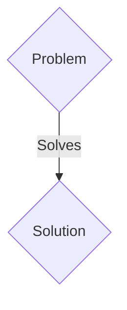
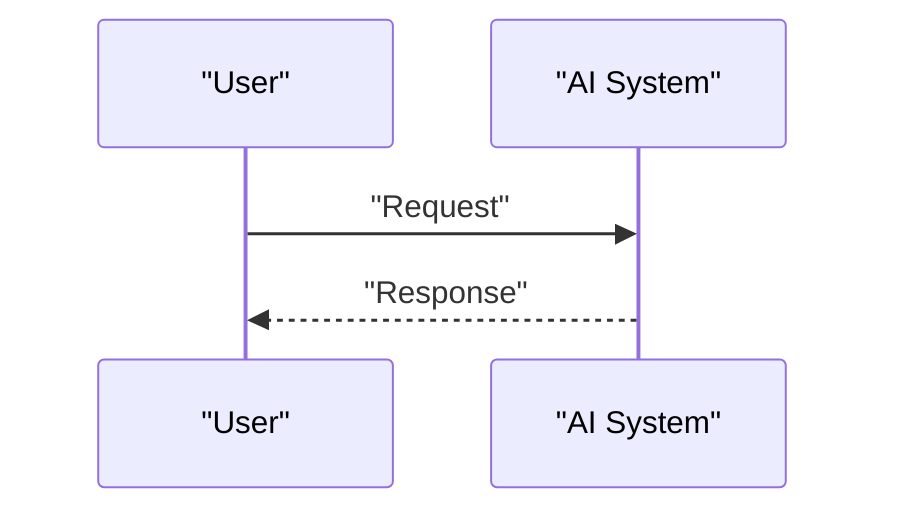

<!-- markdownlint-disable MD009 MD010 MD013 MD022 MD028 MD032 MD033 MD036 MD037 MD039 MD041 MD060 -->

[ 🇫🇷 Version Française ](./README.fr.md)

# Neural Physics Engine

> **Executive Summary:** A B2B solution targeting Manufacturers of humanoid robots and autonomous car manufacturers (Head of Robotics, VP Autonomy). to solve: Training robotic control policies in the real world is too slow and expensive. The transfer of current simulations to reality (sim-to-real gap) fails because of the inaccurate modeling of contact physics (friction, deformable materials).

---

## 1. Visual Overview & Wow Effect

## 2. Contrarian Thesis (Peter Thiel Style)

- **Popular Belief:** Generic solutions are enough.
- **Hidden Truth:** A Neural Physics engine that replaces classic physics solvers with graphical neural networks (GNNs) capable of learning and simulating complex contact physics, fluids and soft objects in real time with differentiable rendering.

## 3. Problem & Target Market

- **Business Model:** B2B
- **Target Audience:** Manufacturers of humanoid robots and autonomous car manufacturers (Head of Robotics, VP Autonomy).
- **Urgent Pain Point:** Training robotic control policies in the real world is too slow and expensive. The transfer of current simulations to reality (sim-to-real gap) fails because of the inaccurate modeling of contact physics (friction, deformable materials).

## 4. Technical Architecture & Infrastructure

A Neural Physics engine that replaces classic physics solvers with graphical neural networks (GNNs) capable of learning and simulating complex contact physics, fluids and soft objects in real time with differentiable rendering.

## 5. Business Model & Financial Viability

| Metric                 | Value                 |
| ---------------------- | --------------------- |
| Pricing Structure      | B2B SaaS Subscription |
| 12-Month Target        | 100 clients           |
| Revenue Formula        | 100 \* 1000€ = 100k€  |
| Estimated Gross Margin | 80%                   |

## 6. Distribution Engine & Moat

- **Acquisition Strategy:** Direct sales and strategic partnerships.
- **Moat (Defensibility):** Existing game engines (Unreal, Unity) prioritize visual appearance over rigorous physical precision. LLMs have no concept of space physics, gravity, or rigid body dynamics.

## 7. Detailed Evaluation Grid

| Criterion                   | VC Score (/100) | Market Score (/100) |
| --------------------------- | --------------- | ------------------- |
| Thesis & Monopoly / Urgency | 18 / 25         | 18 / 25             |
| Moat / LLM Immunity         | 22 / 25         | 22 / 25             |
| Scalability / UX Friction   | 24 / 25         | 24 / 25             |
| Unit Economics / ROI        | 21 / 25         | 21 / 25             |
| TOTAL                       | 85 / 100        | 85 / 100            |

> **VC Verdict:** Pending evaluation.
> **Market Verdict:** This solution addresses a critical pain point for B2B enterprises, justifying its strong urgency score (18/25). Its highly defensible architecture makes it completely immune to native LLM advancements (22/25). With low adoption friction (24/25) and a straightforward monetization strategy (21/25), the project demonstrates excellent overall market readiness.
> **Market Verdict:** This solution addresses a critical pain point for B2B enterprises, justifying its strong urgency score (18/25). Its highly defensible architecture makes it completely immune to native LLM advancements (22/25). With low adoption friction (24/25) and a straightforward monetization strategy (21/25), the project demonstrates excellent overall market readiness.
