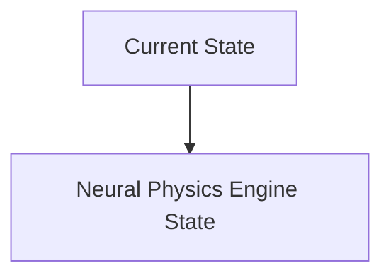
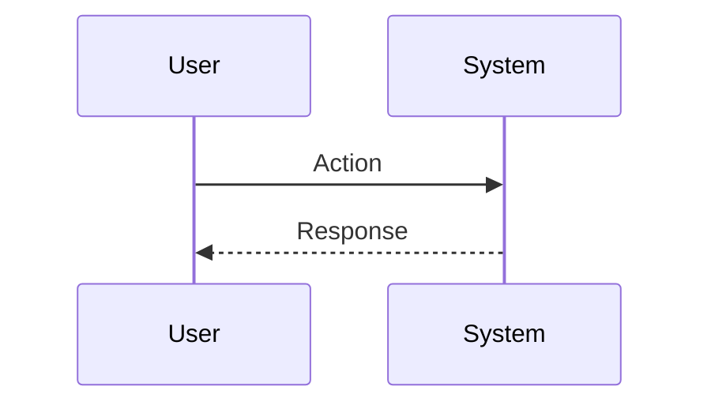

<!-- markdownlint-disable MD009 MD010 MD013 MD022 MD028 MD032 MD033 MD034 MD036 MD037 MD039 MD041 MD060 -->

[ 🇫🇷 Version Française ](./README.fr.md)

# Neural Physics Engine

> **Executive Summary:** A Neural Physics engine that replaces classic physics solvers with graphical neural networks (GNNs) capable of learning and simulating complex contact physics, fluids and soft objects in real time with differentiable rendering.

---

## 1. Visual Overview & Wow Effect

## 2. Contrarian Thesis (Peter Thiel Style)

**Popular Belief:** General AI solutions can solve this problem.

**Hidden Truth:** Existing game engines (Unreal, Unity) prioritize visual appearance over rigorous physical precision. LLMs have no concept of space physics, gravity, or rigid body dynamics.

## 3. Problem & Target Market

**Business Model:** B2B

**Target Audience:** Manufacturers of humanoid robots and autonomous car manufacturers (Head of Robotics, VP Autonomy).

**Urgent Pain Point:** Training robotic control policies in the real world is too slow and expensive. The transfer of current simulations to reality (sim-to-real gap) fails because of the inaccurate modeling of contact physics (friction, deformable materials).

## 4. Technical Architecture & Infrastructure

## 5. Business Model & Financial Viability

| Metric                 | Value                           |
| ---------------------- | ------------------------------- |
| Pricing Structure      | SaaS subscription               |
| 12-Month Target        | 10 customers                    |
| Revenue Formula        | 10 clients \* 10k€/year = 100k€ |
| Estimated Gross Margin | 80%                             |

## 6. Distribution Engine & Moat

**Acquisition Strategy:** B2B direct sales

**Moat (Defensibility):** Dependence on hardware (NVIDIA Omniverse), difficulty in proving the universality of the neural solver on new materials, extremely high technological barrier.

## 7. Detailed Evaluation Grid

| Criterion                   | VC Score (/100) | Market Score (/100) |
| --------------------------- | --------------- | ------------------- |
| Thesis & Monopoly / Urgency | -- / 25         | -- / 25             |
| Moat / LLM Immunity         | -- / 25         | -- / 25             |
| Scalability / UX Friction   | -- / 25         | -- / 25             |
| Unit Economics / ROI        | -- / 25         | -- / 25             |
| **TOTAL**                   | **-- / 100**    | **-- / 100**        |

> **VC Verdict:** Pending evaluation.

> **Market Verdict:** Pending evaluation.
