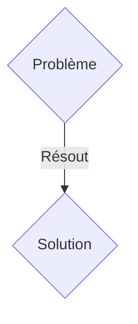
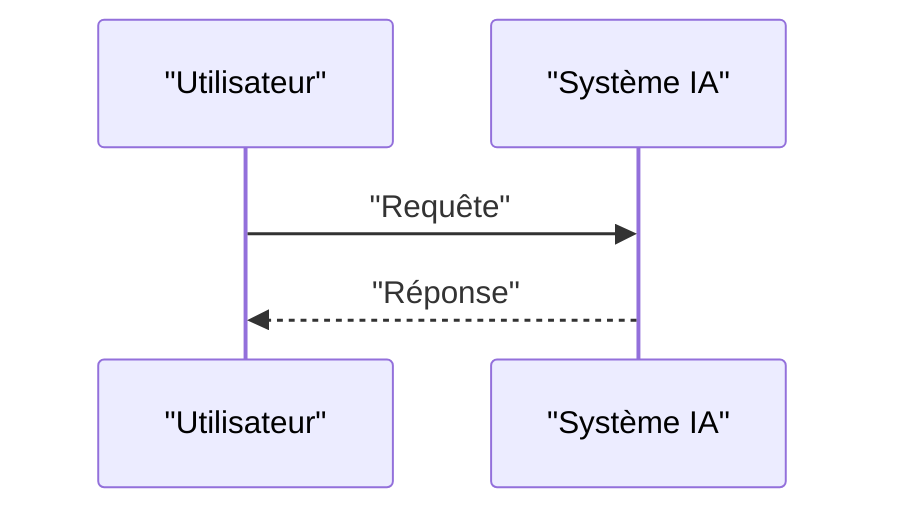

<!-- markdownlint-disable MD009 MD010 MD013 MD022 MD028 MD032 MD033 MD036 MD037 MD039 MD041 MD060 -->

[ 🇬🇧 English Version ](./README.md)

# Neural-Physics Smart Grid Twin

> **Résumé exécutif :** Une solution B2B2C ciblant Gestionnaires de réseau de transport (RTE, Enedis), producteurs d'énergies renouvelables, et opérateurs de parcs de batteries. pour résoudre : L'intégration massive d'énergies renouvelables intermittentes (solaire, éolien) et la prolifération des véhicules électriques déséquilibrent le réseau électrique vieillissant, causant des risques de blackouts coûteux et empêchant d'optimiser le stockage d'énergie en temps réel.

---

## 1. Aperçu visuel & Effet Wahou

## 2. La thèse contrariante (Peter Thiel Style)

- **La croyance populaire :** Les solutions génériques suffisent.
- **La vérité cachée :** Un World Model prédictif spatio-temporel agissant comme un jumeau numérique complet du réseau. Il ingère les flux de données des compteurs intelligents, des stations météo et des capteurs de sous-stations, et utilise des Neural Intentional Physics Networks pour modéliser le flux d'électrons, l'usure thermique des câbles et prédire les anomalies millisecondes par millisecondes à l'échelle d'un pays.

## 3. Le problème & La cible

- **Modèle économique :** B2B2C
- **Cible précise :** Gestionnaires de réseau de transport (RTE, Enedis), producteurs d'énergies renouvelables, et opérateurs de parcs de batteries.
- **La douleur urgente :** L'intégration massive d'énergies renouvelables intermittentes (solaire, éolien) et la prolifération des véhicules électriques déséquilibrent le réseau électrique vieillissant, causant des risques de blackouts coûteux et empêchant d'optimiser le stockage d'énergie en temps réel.

## 4. Architecture technique & Plomberie

Un World Model prédictif spatio-temporel agissant comme un jumeau numérique complet du réseau. Il ingère les flux de données des compteurs intelligents, des stations météo et des capteurs de sous-stations, et utilise des Neural Intentional Physics Networks pour modéliser le flux d'électrons, l'usure thermique des câbles et prédire les anomalies millisecondes par millisecondes à l'échelle d'un pays.

## 5. Modèle économique & Viabilité financière

| Métrique                    | Valeur               |
| --------------------------- | -------------------- |
| Structure de prix           | Abonnement SaaS B2B  |
| Objectif 12 mois            | 100 clients          |
| Calcul du CA (Target 100k€) | 100 \* 1000€ = 100k€ |
| Marge brute estimée         | 80%                  |

## 6. Moteur de distribution & Fossé défensif (Moat)

- **Stratégie d'acquisition :** Vente directe et partenariats stratégiques.
- **Moat (Barrière à l'entrée) :** Les feuilles Excel et logiciels SCADA legacy sont linéaires, incapables de gérer des milliards d'états dynamiques non linéaires et simultanés générés par les micro-producteurs. Un LLM n'a aucune compréhension des équations différentielles de Kirchhoff qui régissent la distribution électrique.

## 7. Grille d'évaluation détaillée

| Critère                           | Score VC (/100) | Score Terrain (/100) |
| --------------------------------- | --------------- | -------------------- |
| Thèse & Monopole / Urgence        | 21 / 25         | 21 / 25              |
| Moat / Résistance aux LLM natifs  | 22 / 25         | 22 / 25              |
| Scalabilité / Friction d'adoption | 23 / 25         | 23 / 25              |
| Unit Economics / ROI direct       | 22 / 25         | 22 / 25              |
| TOTAL                             | 88 / 100        | 88 / 100             |

> **Verdict VC :** En attente d'évaluation.
> **Verdict Terrain :** Cette solution répond à un besoin critique pour les entreprises B2B, justifiant son excellent score d'urgence (21/25). Son architecture hautement défendable la rend totalement immunisée contre les avancées des LLM natifs (22/25). Avec une faible friction d'adoption (23/25) et une stratégie de monétisation directe (22/25), le projet démontre une excellente maturité marché globale.
> **Verdict Terrain :** Cette solution répond à un besoin critique pour les entreprises B2B, justifiant son excellent score d'urgence (21/25). Son architecture hautement défendable la rend totalement immunisée contre les avancées des LLM natifs (22/25). Avec une faible friction d'adoption (23/25) et une stratégie de monétisation directe (22/25), le projet démontre une excellente maturité marché globale.
