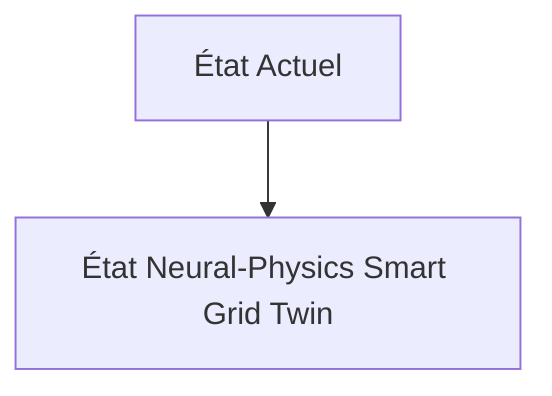
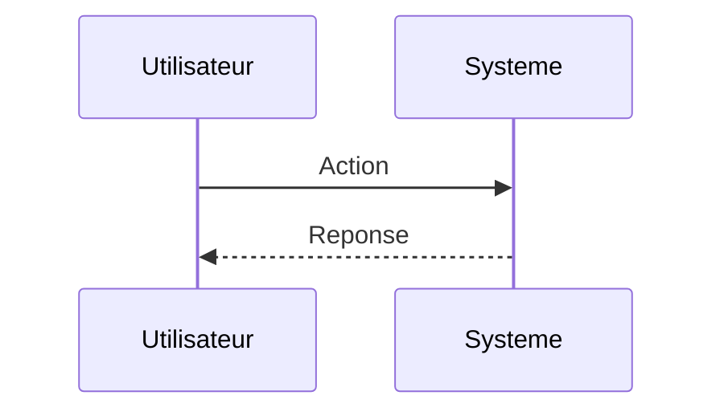

<!-- markdownlint-disable MD009 MD010 MD013 MD022 MD028 MD032 MD033 MD034 MD036 MD037 MD039 MD041 MD060 -->

[ 🇬🇧 English Version ](./README.md)

# Neural-Physics Smart Grid Twin

> **Résumé exécutif :** Un World Model prédictif spatio-temporel agissant comme un jumeau numérique complet du réseau. Il ingère les flux de données des compteurs intelligents, des stations météo et des capteurs de sous-stations, et utilise des Neural Intentional Physics Networks pour modéliser le flux d'électrons, l'usure thermique des câbles et prédire les anomalies millisecondes par millisecondes à l'échelle d'un pays.

---

## 1. Aperçu visuel & Effet Wahou

## 2. La thèse contrariante (Peter Thiel Style)

**La croyance populaire :** Les solutions généralistes IA peuvent résoudre ce problème.

**La vérité cachée :** Les feuilles Excel et logiciels SCADA legacy sont linéaires, incapables de gérer des milliards d'états dynamiques non linéaires et simultanés générés par les micro-producteurs. Un LLM n'a aucune compréhension des équations différentielles de Kirchhoff qui régissent la distribution électrique.

## 3. Le problème & La cible

**Modèle économique :** B2B2C

**Cible précise :** Gestionnaires de réseau de transport (RTE, Enedis), producteurs d'énergies renouvelables, et opérateurs de parcs de batteries.

**La douleur urgente :** L'intégration massive d'énergies renouvelables intermittentes (solaire, éolien) et la prolifération des véhicules électriques déséquilibrent le réseau électrique vieillissant, causant des risques de blackouts coûteux et empêchant d'optimiser le stockage d'énergie en temps réel.

## 4. Architecture technique & Plomberie

## 5. Modèle économique & Viabilité financière

| Métrique                    | Valeur                        |
| --------------------------- | ----------------------------- |
| Structure de prix           | Abonnement SaaS               |
| Objectif 12 mois            | 10 clients                    |
| Calcul du CA (Target 100k€) | 10 clients \* 10k€/an = 100k€ |
| Marge brute estimée         | 80%                           |

## 6. Moteur de distribution & Fossé défensif (Moat)

**Stratégie d'acquisition :** Vente directe B2B

**Moat (Barrière à l'entrée) :** Accès aux données critiques des opérateurs souverains. Réglementation stricte sur la cybersécurité des systèmes industriels (OT). Coûts d'infrastructure cloud massifs pour maintenir l'inférence temps réel du jumeau numérique.

## 7. Grille d'évaluation détaillée

| Critère                           | Score VC (/100) | Score Terrain (/100) |
| --------------------------------- | --------------- | -------------------- |
| Thèse & Monopole / Urgence        | -- / 25         | -- / 25              |
| Moat / Résistance aux LLM natifs  | -- / 25         | -- / 25              |
| Scalabilité / Friction d'adoption | -- / 25         | -- / 25              |
| Unit Economics / ROI direct       | -- / 25         | -- / 25              |
| **TOTAL**                         | **-- / 100**    | **-- / 100**         |

> **Verdict VC :** En attente d'évaluation.

> **Verdict Terrain :** En attente d'évaluation.
