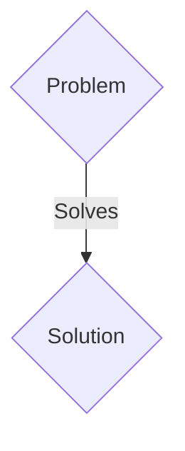
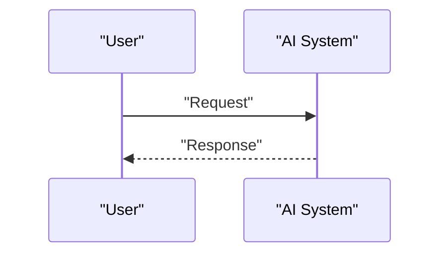

<!-- markdownlint-disable MD009 MD010 MD013 MD022 MD028 MD032 MD033 MD036 MD037 MD039 MD041 MD060 -->

[ 🇫🇷 Version Française ](./README.fr.md)

# Neural-Physics Smart Grid Twin

> **Executive Summary:** A B2B2C solution targeting Transport network managers (RTE, Enedis), renewable energy producers, and battery park operators. to solve: The massive integration of intermittent renewable energies (solar, wind) and the proliferation of electric vehicles are unbalancing the aging electricity network, causing the risk of costly blackouts and preventing the optimization of energy storage in real time.

---

## 1. Visual Overview & Wow Effect

## 2. Contrarian Thesis (Peter Thiel Style)

- **Popular Belief:** Generic solutions are enough.
- **Hidden Truth:** A spatio-temporal predictive World Model acting as a complete digital twin of the network. It ingests data streams from smart meters, weather stations and substation sensors, and uses Neural Intentional Physics Networks to model electron flow, thermal wear of cables and predict millisecond-by-millisecond anomalies on a country scale.

## 3. Problem & Target Market

- **Business Model:** B2B2C
- **Target Audience:** Transport network managers (RTE, Enedis), renewable energy producers, and battery park operators.
- **Urgent Pain Point:** The massive integration of intermittent renewable energies (solar, wind) and the proliferation of electric vehicles are unbalancing the aging electricity network, causing the risk of costly blackouts and preventing the optimization of energy storage in real time.

## 4. Technical Architecture & Infrastructure

A spatio-temporal predictive World Model acting as a complete digital twin of the network. It ingests data streams from smart meters, weather stations and substation sensors, and uses Neural Intentional Physics Networks to model electron flow, thermal wear of cables and predict millisecond-by-millisecond anomalies on a country scale.

## 5. Business Model & Financial Viability

| Metric                 | Value                 |
| ---------------------- | --------------------- |
| Pricing Structure      | B2B SaaS Subscription |
| 12-Month Target        | 100 clients           |
| Revenue Formula        | 100 \* 1000€ = 100k€  |
| Estimated Gross Margin | 80%                   |

## 6. Distribution Engine & Moat

- **Acquisition Strategy:** Direct sales and strategic partnerships.
- **Moat (Defensibility):** Excel sheets and legacy SCADA software are linear, incapable of managing billions of non-linear and simultaneous dynamic states generated by micro-producers. An LLM has no understanding of the Kirchhoff differential equations that govern electrical distribution.

## 7. Detailed Evaluation Grid

| Criterion                   | VC Score (/100) | Market Score (/100) |
| --------------------------- | --------------- | ------------------- |
| Thesis & Monopoly / Urgency | -- / 25         | -- / 25             |
| Moat / LLM Immunity         | -- / 25         | -- / 25             |
| Scalability / UX Friction   | -- / 25         | -- / 25             |
| Unit Economics / ROI        | -- / 25         | -- / 25             |
| TOTAL                       | -- / 100        | -- / 100            |

> **VC Verdict:** Pending evaluation.
> **Market Verdict:** Pending evaluation.
