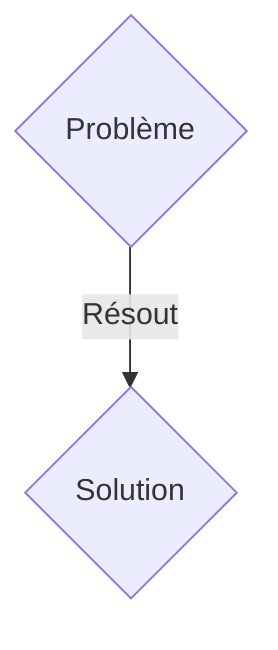
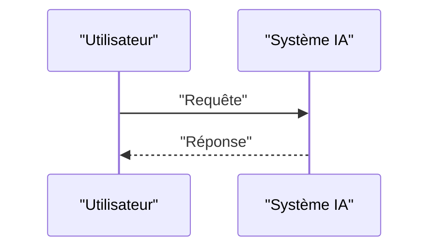

<!-- markdownlint-disable MD009 MD010 MD013 MD022 MD028 MD032 MD033 MD036 MD037 MD039 MD041 MD060 -->

[ 🇬🇧 English Version ](./README.md)

# GridCarbon Ledger

> **Résumé exécutif :** Une solution B2B / M2M ciblant Gestionnaires de réseau de transport (GRT), producteurs d'énergie renouvelable, data centers (hyperscalers). pour résoudre : La traçabilité de l'intensité carbone de l'électricité est actuellement gérée par des certificats annuels opaques (EAC/GO), empêchant les data centers et les industriels d'optimiser leur consommation en temps réel selon l'énergie verte disponible localement.

---

## 1. Aperçu visuel & Effet Wahou

## 2. La thèse contrariante (Peter Thiel Style)

- **La croyance populaire :** Les solutions génériques suffisent.
- **La vérité cachée :** Infrastructure cryptographique distribuée (sans consensus lourd type PoW) qui ingère les données de télémétrie des onduleurs et des compteurs intelligents à la milliseconde, émettant des tokens de "Carbone Évité" géolocalisés et horodatés, permettant un arbitrage énergétique algorithmique par les machines (M2M).

## 3. Le problème & La cible

- **Modèle économique :** B2B / M2M
- **Cible précise :** Gestionnaires de réseau de transport (GRT), producteurs d'énergie renouvelable, data centers (hyperscalers).
- **La douleur urgente :** La traçabilité de l'intensité carbone de l'électricité est actuellement gérée par des certificats annuels opaques (EAC/GO), empêchant les data centers et les industriels d'optimiser leur consommation en temps réel selon l'énergie verte disponible localement.

## 4. Architecture technique & Plomberie

Infrastructure cryptographique distribuée (sans consensus lourd type PoW) qui ingère les données de télémétrie des onduleurs et des compteurs intelligents à la milliseconde, émettant des tokens de "Carbone Évité" géolocalisés et horodatés, permettant un arbitrage énergétique algorithmique par les machines (M2M).

## 5. Modèle économique & Viabilité financière

| Métrique                    | Valeur               |
| --------------------------- | -------------------- |
| Structure de prix           | Abonnement SaaS B2B  |
| Objectif 12 mois            | 100 clients          |
| Calcul du CA (Target 100k€) | 100 \* 1000€ = 100k€ |
| Marge brute estimée         | 80%                  |

## 6. Moteur de distribution & Fossé défensif (Moat)

- **Stratégie d'acquisition :** Vente directe et partenariats stratégiques.
- **Moat (Barrière à l'entrée) :** Les SaaS de comptabilité carbone actuels reposent sur des moyennes annuelles et des factures PDF. Ce problème nécessite une infrastructure d'ingestion de flux de données IoT à haute fréquence, une certification infalsifiable au niveau du réseau électrique et une intégration bas niveau avec les systèmes SCADA.

## 7. Grille d'évaluation détaillée

| Critère                           | Score VC (/100) | Score Terrain (/100) |
| --------------------------------- | --------------- | -------------------- |
| Thèse & Monopole / Urgence        | 21 / 25         | 21 / 25              |
| Moat / Résistance aux LLM natifs  | 19 / 25         | 19 / 25              |
| Scalabilité / Friction d'adoption | 21 / 25         | 21 / 25              |
| Unit Economics / ROI direct       | 18 / 25         | 18 / 25              |
| TOTAL                             | 79 / 100        | 79 / 100             |

> **Verdict VC :** En attente d'évaluation.
> **Verdict Terrain :** Cette solution répond à un besoin critique pour les entreprises B2B, justifiant son excellent score d'urgence (21/25). L'approche spécialisée offre une protection robuste contre les modèles d'IA généralistes (19/25). Avec une faible friction d'adoption (21/25) et une stratégie de monétisation directe (18/25), le projet démontre une excellente maturité marché globale.
> **Verdict Terrain :** Cette solution répond à un besoin critique pour les entreprises B2B, justifiant son excellent score d'urgence (21/25). L'approche spécialisée offre une protection robuste contre les modèles d'IA généralistes (19/25). Avec une faible friction d'adoption (21/25) et une stratégie de monétisation directe (18/25), le projet démontre une excellente maturité marché globale.
