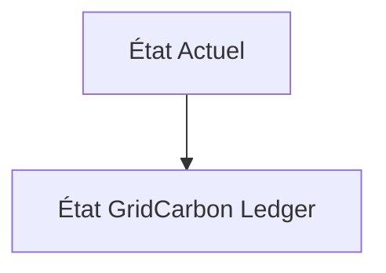
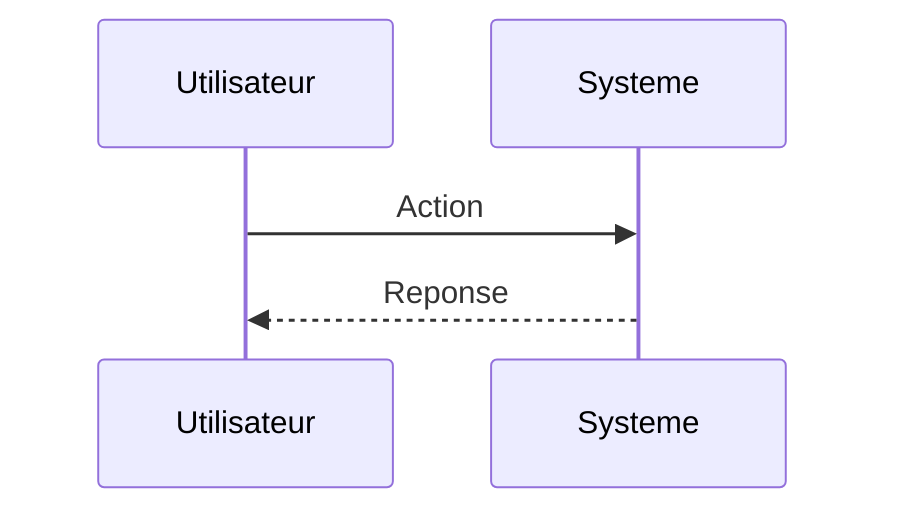

<!-- markdownlint-disable MD009 MD010 MD013 MD022 MD028 MD032 MD033 MD034 MD036 MD037 MD039 MD041 MD060 -->

[ 🇬🇧 English Version ](./README.md)

# GridCarbon Ledger

> **Résumé exécutif :** Infrastructure cryptographique distribuée (sans consensus lourd type PoW) qui ingère les données de télémétrie des onduleurs et des compteurs intelligents à la milliseconde, émettant des tokens de "Carbone Évité" géolocalisés et horodatés, permettant un arbitrage énergétique algorithmique par les machines (M2M).

---

## 1. Aperçu visuel & Effet Wahou

## 2. La thèse contrariante (Peter Thiel Style)

**La croyance populaire :** Les solutions généralistes IA peuvent résoudre ce problème.

**La vérité cachée :** Les SaaS de comptabilité carbone actuels reposent sur des moyennes annuelles et des factures PDF. Ce problème nécessite une infrastructure d'ingestion de flux de données IoT à haute fréquence, une certification infalsifiable au niveau du réseau électrique et une intégration bas niveau avec les systèmes SCADA.

## 3. Le problème & La cible

**Modèle économique :** B2B / M2M

**Cible précise :** Gestionnaires de réseau de transport (GRT), producteurs d'énergie renouvelable, data centers (hyperscalers).

**La douleur urgente :** La traçabilité de l'intensité carbone de l'électricité est actuellement gérée par des certificats annuels opaques (EAC/GO), empêchant les data centers et les industriels d'optimiser leur consommation en temps réel selon l'énergie verte disponible localement.

## 4. Architecture technique & Plomberie

## 5. Modèle économique & Viabilité financière

| Métrique                    | Valeur                        |
| --------------------------- | ----------------------------- |
| Structure de prix           | Abonnement SaaS               |
| Objectif 12 mois            | 10 clients                    |
| Calcul du CA (Target 100k€) | 10 clients \* 10k€/an = 100k€ |
| Marge brute estimée         | 80%                           |

## 6. Moteur de distribution & Fossé défensif (Moat)

**Stratégie d'acquisition :** Vente directe B2B

**Moat (Barrière à l'entrée) :** Dépendance au bon vouloir et aux APIs des gestionnaires de réseau existants; l'adoption nécessite de nouveaux standards réglementaires (ex: 24/7 CFE par Google/Microsoft) pour obliger le marché à adopter cette granularité.

## 7. Grille d'évaluation détaillée

| Critère                           | Score VC (/100) | Score Terrain (/100) |
| --------------------------------- | --------------- | -------------------- |
| Thèse & Monopole / Urgence        | -- / 25         | -- / 25              |
| Moat / Résistance aux LLM natifs  | -- / 25         | -- / 25              |
| Scalabilité / Friction d'adoption | -- / 25         | -- / 25              |
| Unit Economics / ROI direct       | -- / 25         | -- / 25              |
| **TOTAL**                         | **-- / 100**    | **-- / 100**         |

> **Verdict VC :** En attente d'évaluation.

> **Verdict Terrain :** En attente d'évaluation.
