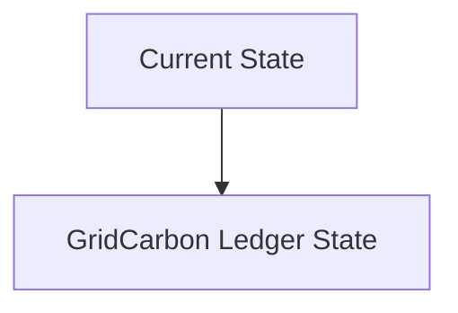
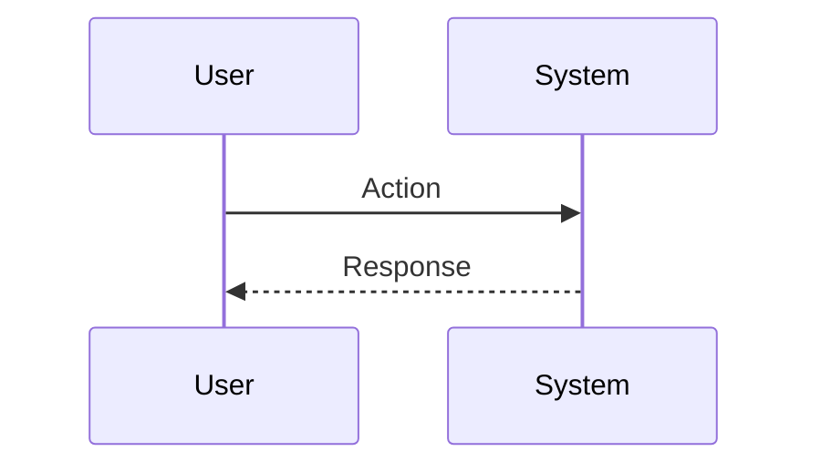

<!-- markdownlint-disable MD009 MD010 MD013 MD022 MD028 MD032 MD033 MD034 MD036 MD037 MD039 MD041 MD060 -->

[ 🇫🇷 Version Française ](./README.fr.md)

# GridCarbon Ledger

> **Executive Summary:** Distributed cryptographic infrastructure (without heavy consensus such as PoW) which ingests telemetry data from inverters and smart meters at the millisecond rate, issuing geolocated and time-stamped “Avoided Carbon” tokens, allowing algorithmic energy arbitrage by machines (M2M).

---

## 1. Visual Overview & Wow Effect

## 2. Contrarian Thesis (Peter Thiel Style)

**Popular Belief:** General AI solutions can solve this problem.

**Hidden Truth:** Current carbon accounting SaaS relies on annual averages and PDF invoices. This problem requires high-frequency IoT data stream ingestion infrastructure, tamper-proof certification at the power grid level, and low-level integration with SCADA systems.

## 3. Problem & Target Market

**Business Model:** B2B / M2M

**Target Audience:** Transport network operators (TSO), renewable energy producers, data centers (hyperscalers).

**Urgent Pain Point:** Traceability of the carbon intensity of electricity is currently managed by opaque annual certificates (EAC/GO), preventing data centers and manufacturers from optimizing their consumption in real time according to locally available green energy.

## 4. Technical Architecture & Infrastructure

## 5. Business Model & Financial Viability

| Metric                 | Value                           |
| ---------------------- | ------------------------------- |
| Pricing Structure      | SaaS subscription               |
| 12-Month Target        | 10 customers                    |
| Revenue Formula        | 10 clients \* 10k€/year = 100k€ |
| Estimated Gross Margin | 80%                             |

## 6. Distribution Engine & Moat

**Acquisition Strategy:** B2B direct sales

**Moat (Defensibility):** Dependence on the goodwill and APIs of existing network managers; adoption requires new regulatory standards (e.g.: 24/7 CFE by Google/Microsoft) to force the market to adopt this granularity.

## 7. Detailed Evaluation Grid

| Criterion                   | VC Score (/100) | Market Score (/100) |
| --------------------------- | --------------- | ------------------- |
| Thesis & Monopoly / Urgency | -- / 25         | -- / 25             |
| Moat / LLM Immunity         | -- / 25         | -- / 25             |
| Scalability / UX Friction   | -- / 25         | -- / 25             |
| Unit Economics / ROI        | -- / 25         | -- / 25             |
| **TOTAL**                   | **-- / 100**    | **-- / 100**        |

> **VC Verdict:** Pending evaluation.

> **Market Verdict:** Pending evaluation.
