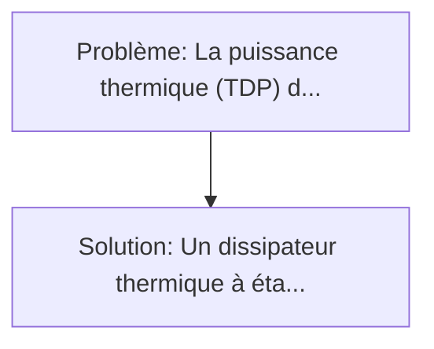
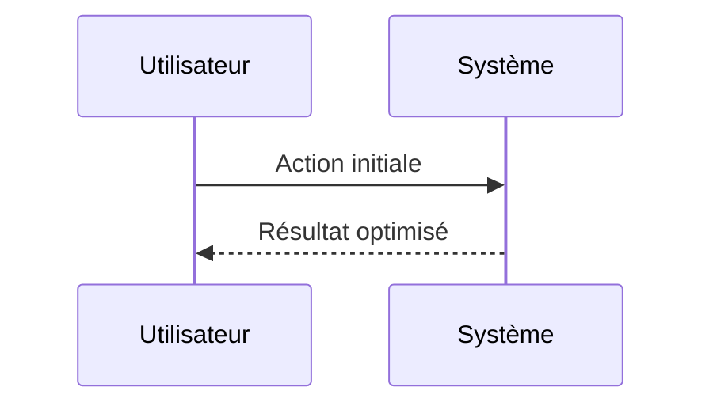

<!-- markdownlint-disable MD013 MD033 -->

[🇬🇧 English Version](./README.md)

# Puce de Refroidissement Quantique à État Solide (Solid-State Quantum Cooling Chip)

> **Résumé exécutif :** Un dissipateur thermique à état solide (sans pièces mobiles ni fluides) exploitant l'effet thermoélectrique à l'échelle nanométrique (matériaux de pointe de type Heusler à demi-métal ou phonons directionnels) intégré directement sur le package de la puce (Direct-to-Chip). La puissance thermique (TDP) des puces IA de nouvelle génération (Nvidia Blackwell et futurs GPU) approche les 1000W à 1500W par puce.

---

## 1. Aperçu visuel & Effet Wahou

## 2. La thèse contrariante (Peter Thiel Style)

**La croyance populaire :** Les solutions logicielles seules peuvent résoudre ce problème.
**La vérité cachée :** C'est un problème fondamental de la physique des matériaux et de thermodynamique. Aucun logiciel ne peut refroidir un GPU de 1200W dans un rack 1U. La solution nécessite la création de nouveaux matériaux semi-conducteurs et des procédés de fabrication de wafers compatibles CMOS.

## 3. Le problème & La cible

- **Modèle économique :** B2B
- **Cible précise :** Fabricants de serveurs IA à ultra-haute densité, opérateurs de data centers hyperscale (AWS, Google, Meta), et concepteurs de systèmes HPC et edge computing militaire.
- **La douleur urgente :** La puissance thermique (TDP) des puces IA de nouvelle génération (Nvidia Blackwell et futurs GPU) approche les 1000W à 1500W par puce. Le refroidissement par air est déjà obsolète, et le refroidissement liquide direct (DLC) atteint ses limites de transfert thermique, posant des risques de fuites critiques et nécessitant une infrastructure de plomberie lourde et coûteuse dans les data centers.

## 4. Architecture technique & Plomberie

## 5. Modèle économique & Viabilité financière

| Métrique                    | Valeur             |
| --------------------------- | ------------------ |
| Structure de prix           | Custom Pricing     |
| Objectif 12 mois            | 100 clients        |
| Calcul du CA (Target 100k€) | 100 \* 1000 = 100k |
| Marge brute estimée         | 80%                |

## 6. Moteur de distribution & Fossé défensif (Moat)

- **Stratégie d'acquisition :** Ventes B2B directes
- **Moat (Barrière à l'entrée) :** C'est un problème fondamental de la physique des matériaux et de thermodynamique. Aucun logiciel ne peut refroidir un GPU de 1200W dans un rack 1U. La solution nécessite la création de nouveaux matériaux semi-conducteurs et des procédés de fabrication de wafers compatibles CMOS.

## 7. Grille d'évaluation détaillée

| Critère                           | Score VC (/100) | Score Terrain (/100) |
| --------------------------------- | --------------- | -------------------- |
| Thèse & Monopole / Urgence        | -- / 25         | -- / 25              |
| Moat / Résistance aux LLM natifs  | -- / 25         | -- / 25              |
| Scalabilité / Friction d'adoption | -- / 25         | -- / 25              |
| Unit Economics / ROI direct       | -- / 25         | -- / 25              |
| **TOTAL**                         | **-- / 100**    | **-- / 100**         |

> **Verdict VC :** En attente d'évaluation.

> **Verdict Terrain :** En attente d'évaluation.
