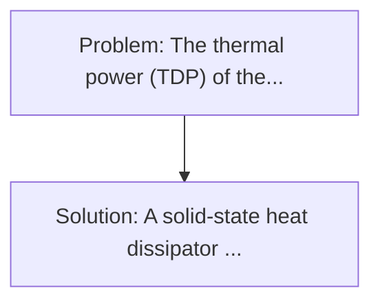
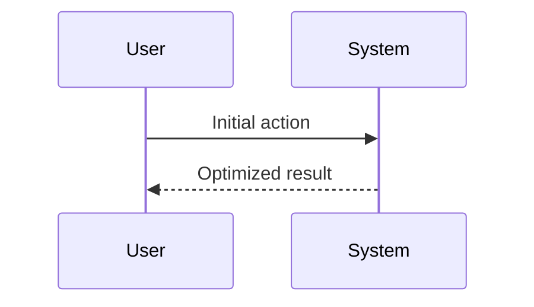

<!-- markdownlint-disable MD013 MD033 -->

[🇫🇷 Version Française](./README.fr.md)

# Solid-State Quantum Cooling Chip

> **Executive Summary:** A solid-state heat dissipator (without moving parts or fluids) that uses the thermoelectric effect on the nanoscale (half-metal Heusler type cutting-edge materials or directional phonons) integrated directly into the chip package (Direct-to-Chip). The thermal power (TDP) of the next generation IA chips (Nvidia Blackwell and future GPU) is approaching 1000W to 1500W per chip.

---

## 1. Visual Overview & Wow Effect

## 2. Contrarian Thesis (Peter Thiel Style)

**Popular Belief:** Generic software solutions can solve this.
**Hidden Truth:** It is a fundamental problem of material physics and thermodynamics. No software can cool a 1200W GPU in a 1U rack. The solution requires the creation of new semiconductor materials and CMOS-compatible wafer manufacturing processes.

## 3. Problem & Target Market

- **Business Model:** B2B
- **Target Audience:** Manufacturers of ultra-high density IA servers, hyperscale data center operators (AWS, Google, Meta), and HPC system designers and military edge computing.
- **Urgent Pain Point:** The thermal power (TDP) of the next generation IA chips (Nvidia Blackwell and future GPU) is approaching 1000W to 1500W per chip. Air cooling is already obsolete, and direct liquid cooling (DLC) reaches its thermal transfer limits, posing risks of critical leaks and requiring heavy and expensive plumbing infrastructure in data centers.

## 4. Technical Architecture & Infrastructure

## 5. Business Model & Financial Viability

| Metric                 | Value              |
| ---------------------- | ------------------ |
| Pricing Structure      | Custom Pricing     |
| 12-Month Target        | 100 customers      |
| Revenue Formula        | 100 \* 1000 = 100k |
| Estimated Gross Margin | 80%                |

## 6. Distribution Engine & Moat

- **Acquisition Strategy:** Direct B2B Sales
- **Moat (Defensibility):** It is a fundamental problem of material physics and thermodynamics. No software can cool a 1200W GPU in a 1U rack. The solution requires the creation of new semiconductor materials and CMOS-compatible wafer manufacturing processes.

## 7. Detailed Evaluation Grid

| Criterion                   | VC Score (/100) | Market Score (/100) |
| --------------------------- | --------------- | ------------------- |
| Thesis & Monopoly / Urgency | -- / 25         | -- / 25             |
| Moat / LLM Immunity         | -- / 25         | -- / 25             |
| Scalability / UX Friction   | -- / 25         | -- / 25             |
| Unit Economics / ROI        | -- / 25         | -- / 25             |
| **TOTAL**                   | **-- / 100**    | **-- / 100**        |

> **VC Verdict:** Pending evaluation.

> **Market Verdict:** Pending evaluation.
