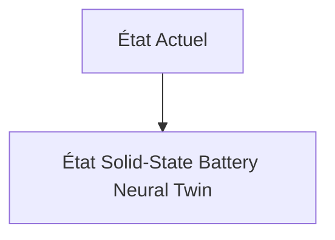
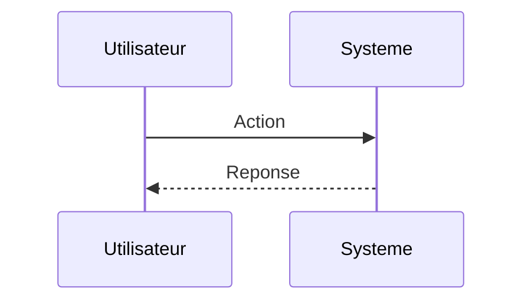

<!-- markdownlint-disable MD009 MD010 MD013 MD022 MD028 MD032 MD033 MD034 MD036 MD037 MD039 MD041 MD060 -->

[ 🇬🇧 English Version ](./README.md)

# Solid-State Battery Neural Twin

> **Résumé exécutif :** Création d'un "World Model" (moteur de physique neuronale) entraîné spécifiquement sur des données multi-échelles (atomique, microstructurelle et macroscopique). Ce modèle génératif spatio-temporel simule en temps réel les contraintes électromécaniques et la croissance dendritique aux interfaces, remplaçant la résolution numérique des équations différentielles partielles (PDEs) par des opérateurs neuronaux capables de prédire la durée de vie et les points de rupture en quelques secondes.

---

## 1. Aperçu visuel & Effet Wahou

## 2. La thèse contrariante (Peter Thiel Style)

**La croyance populaire :** Les solutions généralistes IA peuvent résoudre ce problème.

**La vérité cachée :** Un LLM textuel ne comprend pas la physique quantique ni la mécanique des matériaux. Les logiciels de simulation classique (COMSOL, ANSYS) ne passent pas à l'échelle pour des structures stochastiques complexes sur des millions de cycles. Il faut une architecture de Neural Physics Engine capable de généraliser les dynamiques électrochimiques non-linéaires, ce qui exige une IP forte en apprentissage géométrique (Geometric Deep Learning) et des jeux de données expérimentaux très pointus (données synchrotron, cryo-MEB).

## 3. Le problème & La cible

**Modèle économique :** B2B

**Cible précise :** Fabricants de batteries (Gigafactories), constructeurs automobiles (OEMs), et startups deeptech en sciences des matériaux (Directeurs R&D, Chief Science Officers).

**La douleur urgente :** Le développement des batteries à semi-conducteurs (Solid-State Batteries) bloque sur la dégradation aux interfaces solide-solide (formation de dendrites, stress mécanique extrême lors des cycles de charge/décharge). Actuellement, résoudre ces problèmes nécessite des années de tests itératifs en laboratoire (wet-lab) ou des simulations par éléments finis (FEM) classiques qui sont prohibitives en termes de temps de calcul (des mois pour simuler quelques micromètres). Le "Time-to-Market" est une question de survie pour l'industrie automobile électrique.

## 4. Architecture technique & Plomberie

## 5. Modèle économique & Viabilité financière

| Métrique                    | Valeur                        |
| --------------------------- | ----------------------------- |
| Structure de prix           | Abonnement SaaS               |
| Objectif 12 mois            | 10 clients                    |
| Calcul du CA (Target 100k€) | 10 clients \* 10k€/an = 100k€ |
| Marge brute estimée         | 80%                           |

## 6. Moteur de distribution & Fossé défensif (Moat)

**Stratégie d'acquisition :** Vente directe B2B

**Moat (Barrière à l'entrée) :** Dépendance critique à l'accès initial à des données expérimentales de haute fidélité (Cold Start problem). Coûts de calcul massifs pour l'entraînement du modèle fondamental. Risque que les matériaux découverts "in-silico" soient impossibles à manufacturer à l'échelle industrielle avec les processus actuels.

## 7. Grille d'évaluation détaillée

| Critère                           | Score VC (/100) | Score Terrain (/100) |
| --------------------------------- | --------------- | -------------------- |
| Thèse & Monopole / Urgence        | -- / 25         | -- / 25              |
| Moat / Résistance aux LLM natifs  | -- / 25         | -- / 25              |
| Scalabilité / Friction d'adoption | -- / 25         | -- / 25              |
| Unit Economics / ROI direct       | -- / 25         | -- / 25              |
| **TOTAL**                         | **-- / 100**    | **-- / 100**         |

> **Verdict VC :** En attente d'évaluation.

> **Verdict Terrain :** En attente d'évaluation.
