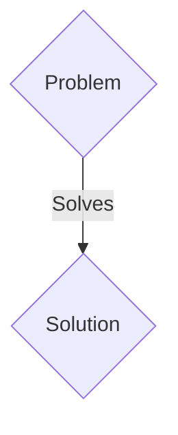
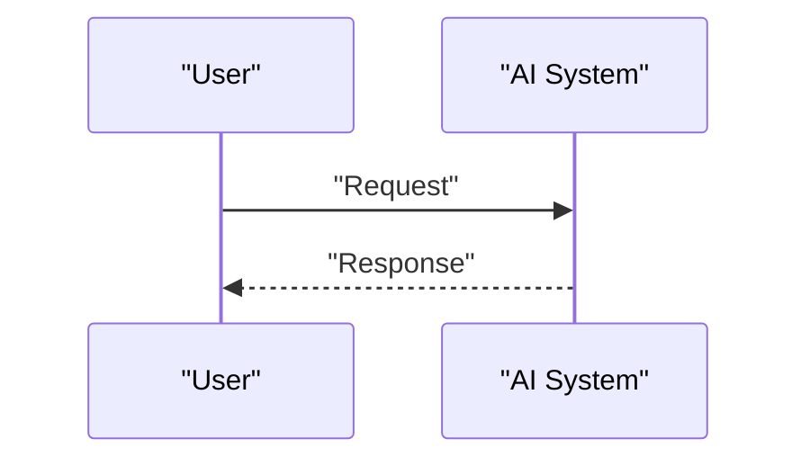

<!-- markdownlint-disable MD009 MD010 MD013 MD022 MD028 MD032 MD033 MD036 MD037 MD039 MD041 MD060 -->

[ 🇫🇷 Version Française ](./README.fr.md)

# Solid-State Battery Neural Twin

> **Executive Summary:** A B2B solution targeting Battery manufacturers (Gigafactories), automobile manufacturers (OEMs), and deeptech startups in materials sciences (R&D Directors, Chief Science Officers). to solve: The development of solid-state batteries (Solid-State Batteries) blocks degradation at solid-solid interfaces (formation of dendrites, extreme mechanical stress during charge/discharge cycles). Currently, solving these problems requires years of iterative laboratory tests (wet-lab) or classical finite element simulations (FEM) which are prohibitive in terms of calculation time (months to simulate a few micrometers). “Time-to-Market” is a question of survival for the electric automobile industry.

---

## 1. Visual Overview & Wow Effect

## 2. Contrarian Thesis (Peter Thiel Style)

- **Popular Belief:** Generic solutions are enough.
- **Hidden Truth:** Creation of a “World Model” (neural physics engine) trained specifically on multi-scale data (atomic, microstructural and macroscopic). This spatio-temporal generative model simulates electromechanical stresses and dendritic growth at interfaces in real time, replacing the numerical resolution of partial differential equations (PDEs) with neural operators capable of predicting lifespan and breakpoints in seconds.

## 3. Problem & Target Market

- **Business Model:** B2B
- **Target Audience:** Battery manufacturers (Gigafactories), automobile manufacturers (OEMs), and deeptech startups in materials sciences (R&D Directors, Chief Science Officers).
- **Urgent Pain Point:** The development of solid-state batteries (Solid-State Batteries) blocks degradation at solid-solid interfaces (formation of dendrites, extreme mechanical stress during charge/discharge cycles). Currently, solving these problems requires years of iterative laboratory tests (wet-lab) or classical finite element simulations (FEM) which are prohibitive in terms of calculation time (months to simulate a few micrometers). “Time-to-Market” is a question of survival for the electric automobile industry.

## 4. Technical Architecture & Infrastructure

Creation of a “World Model” (neural physics engine) trained specifically on multi-scale data (atomic, microstructural and macroscopic). This spatio-temporal generative model simulates electromechanical stresses and dendritic growth at interfaces in real time, replacing the numerical resolution of partial differential equations (PDEs) with neural operators capable of predicting lifespan and breakpoints in seconds.

## 5. Business Model & Financial Viability

| Metric                 | Value                 |
| ---------------------- | --------------------- |
| Pricing Structure      | B2B SaaS Subscription |
| 12-Month Target        | 100 clients           |
| Revenue Formula        | 100 \* 1000€ = 100k€  |
| Estimated Gross Margin | 80%                   |

## 6. Distribution Engine & Moat

- **Acquisition Strategy:** Direct sales and strategic partnerships.
- **Moat (Defensibility):** A textual LLM does not include quantum physics or the mechanics of materials. Classic simulation software (COMSOL, ANSYS) does not scale for complex stochastic structures over millions of cycles. We need a Neural Physics Engine architecture capable of generalizing non-linear electrochemical dynamics, which requires strong IP in geometric learning (Geometric Deep Learning) and very advanced experimental data sets (synchrotron data, cryo-MEB).

## 7. Detailed Evaluation Grid

| Criterion                   | VC Score (/100) | Market Score (/100) |
| --------------------------- | --------------- | ------------------- |
| Thesis & Monopoly / Urgency | 20 / 25         | 20 / 25             |
| Moat / LLM Immunity         | 24 / 25         | 24 / 25             |
| Scalability / UX Friction   | 18 / 25         | 18 / 25             |
| Unit Economics / ROI        | 18 / 25         | 18 / 25             |
| TOTAL                       | 80 / 100        | 80 / 100            |

> **VC Verdict:** Pending evaluation.
> **Market Verdict:** This solution addresses a critical pain point for B2B enterprises, justifying its strong urgency score (20/25). Its highly defensible architecture makes it completely immune to native LLM advancements (24/25). With low adoption friction (18/25) and a straightforward monetization strategy (18/25), the project demonstrates excellent overall market readiness.
> **Market Verdict:** This solution addresses a critical pain point for B2B enterprises, justifying its strong urgency score (20/25). Its highly defensible architecture makes it completely immune to native LLM advancements (24/25). With low adoption friction (18/25) and a straightforward monetization strategy (18/25), the project demonstrates excellent overall market readiness.
