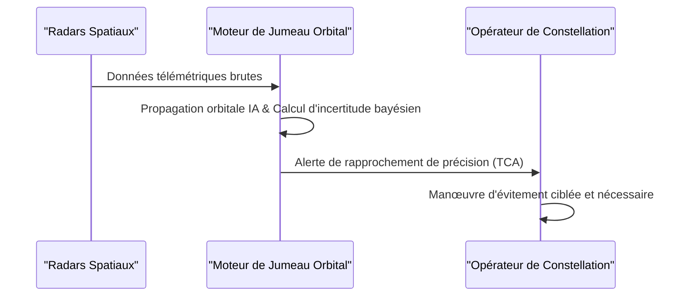

<!-- markdownlint-disable MD009 MD010 MD013 MD022 MD028 MD032 MD033 MD034 MD036 MD037 MD039 MD041 MD058 MD060 -->

[🇬🇧 English Version](./README.md)

# Space Debris Collision Twin

> **Résumé exécutif :** Un moteur de prédiction orbitale couplant des données de radars spatiaux hétérogènes avec une propagation orbitale assistée par IA pour prédire les trajectoires de débris millimétriques et prévenir le syndrome de Kessler.


---

## 1. Aperçu visuel & Effet Wahou

```mermaid
graph TD
    %% Schéma comparatif Problème vs Solution ou Flux d'architecture
    A[Orbite Terrestre Basse Saturée] -->|Risque de Syndrome de Kessler| B[Suivi imprécis & faux positifs]
    B -->|Ergol gaspillé & manœuvres inutiles| C[Perte économique pour les opérateurs]
    A -->|Données radars hétérogènes| D{Space Debris Collision Twin}
    D -->|Propagation orbitale non-linéaire assistée par IA| E[Alertes de collision précises (TCA)]
```

## 2. La thèse contrariante (Peter Thiel Style)

La croyance populaire : Les modèles standards d'apprentissage automatique peuvent être appliqués aux données radars spatiales pour améliorer les prédictions de collision.
La vérité cachée : Les algorithmes d'apprentissage machine standards ne conservent pas l'énergie et la quantité de mouvement sur le long terme. Les perturbations orbitales (pression de radiation solaire, traînée atmosphérique imprévisible) exigent des solveurs d'astrodynamique non-linéaires massifs strictement contraints par la physique.

## 3. Le problème & La cible

Modèle économique : B2B / B2G
Cible précise : Opérateurs de constellations satellitaires (Starlink, Kuiper), agences spatiales (ESA, NASA), assurances spatiales.
La douleur urgente : L'orbite terrestre basse (LEO) est saturée. Le syndrome de Kessler (réaction en chaîne de collisions de débris) menace l'économie spatiale. Les bases de données de suivi actuelles manquent de précision orbitale et prédisent trop de "faux positifs", forçant les satellites à gaspiller de l'ergol précieux pour des manœuvres d'évitement inutiles.

## 4. Architecture technique & Plomberie



## 5. Modèle économique & Viabilité financière

| Métrique                    | Valeur                                         |
| --------------------------- | ---------------------------------------------- |
| Structure de prix           | Abonnement par satellite surveillé / accès API |
| Objectif 12 mois            | 1 à 2 opérateurs de constellations ou agences  |
| Calcul du CA (Target 100k€) | 2 \* 50k = 100k                                |
| Marge brute estimée         | 85%                                            |

## 6. Moteur de distribution & Fossé défensif (Moat)

Stratégie d'acquisition : Ventes directes aux opérateurs de méga-constellations et aux agences spatiales gouvernementales.
Moat (Barrière à l'entrée) : Le besoin de solveurs d'astrodynamique non-linéaires massifs et la difficulté extrême d'accéder à des données de capteurs radars classifiées ou très coûteuses (ex: US Space Command) créent une barrière à l'entrée immense pour les entreprises technologiques standards.

## 7. Grille d'évaluation détaillée

| Critère                           | Score VC (/100) | Score Terrain (/100) |
| --------------------------------- | --------------- | -------------------- |
| Thèse & Monopole / Urgence        | -- / 25         | -- / 25              |
| Moat / Résistance aux LLM natifs  | -- / 25         | -- / 25              |
| Scalabilité / Friction d'adoption | -- / 25         | -- / 25              |
| Unit Economics / ROI direct       | -- / 25         | -- / 25              |
| **TOTAL**                         | **-- / 100**    | **-- / 100**         |

> **Verdict VC :** En attente d'évaluation.

> **Verdict Terrain :** En attente d'évaluation.
