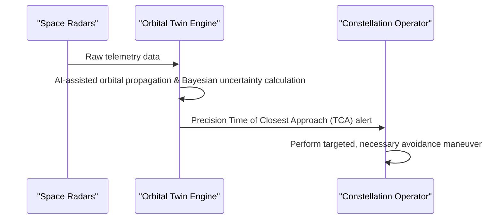

<!-- markdownlint-disable MD009 MD010 MD013 MD022 MD028 MD032 MD033 MD034 MD036 MD037 MD039 MD041 MD058 MD060 -->

[🇫🇷 Version Française](./README.fr.md)

# Space Debris Collision Twin

> **Executive Summary:** An orbital prediction engine coupling heterogeneous space radar data with AI-assisted orbital propagation to predict millimeter-level space debris trajectories and prevent the Kessler syndrome.


---

## 1. Visual Overview & Wow Effect

```mermaid
graph TD
    %% Problem vs Solution or Architecture Diagram
    A[Saturated Low Earth Orbit] -->|Kessler Syndrome risk| B[Inaccurate tracking & false positives]
    B -->|Wasted propellant & unnecessary maneuvers| C[Economic loss for satellite operators]
    A -->|Heterogeneous radar data| D{Space Debris Collision Twin}
    D -->|AI-assisted non-linear orbital propagation| E[Meter-level collision alerts (TCA)]
```

## 2. Contrarian Thesis (Peter Thiel Style)

Popular Belief: Standard machine learning models can be applied to space radar data to improve collision predictions.
Hidden Truth: Standard machine learning algorithms do not conserve energy and momentum over the long term. Orbital perturbations (solar radiation pressure, unpredictable atmospheric drag) require massive, non-linear astrodynamics solvers strictly bounded by physics.

## 3. Problem & Target Market

Business Model: B2B / B2G
Target Audience: Satellite constellation operators (Starlink, Kuiper), space agencies (ESA, NASA), space insurance companies.
Urgent Pain Point: Low Earth Orbit (LEO) is saturated. The Kessler syndrome (chain reaction of debris collisions) threatens the space economy. Current tracking databases lack orbital precision and predict too many "false positives", forcing satellites to waste precious propellant on unnecessary avoidance maneuvers.

## 4. Technical Architecture & Infrastructure



## 5. Business Model & Financial Viability

| Metric                 | Value                                             |
| ---------------------- | ------------------------------------------------- |
| Pricing Structure      | Subscription per monitored satellite / API access |
| 12-Month Target        | 1 to 2 constellation operators or agencies        |
| Revenue Formula        | 2 \* 50k = 100k                                   |
| Estimated Gross Margin | 85%                                               |

## 6. Distribution Engine & Moat

Acquisition Strategy: Direct sales to mega-constellation operators and government space agencies.
Moat (Defensibility): The requirement for massive non-linear astrodynamics solvers and the extreme difficulty of securing classified or highly expensive radar sensor data (e.g., from US Space Command) create an immense barrier to entry for standard tech companies.

## 7. Detailed Evaluation Grid

| Criterion                   | VC Score (/100) | Market Score (/100) |
| --------------------------- | --------------- | ------------------- |
| Thesis & Monopoly / Urgency | 25 / 25         | -- / 25             |
| Moat / LLM Immunity         | 24 / 25         | -- / 25             |
| Scalability / UX Friction   | 22 / 25         | -- / 25             |
| Unit Economics / ROI        | 20 / 25         | -- / 25             |
| **TOTAL**                   | **91 / 100**    | **-- / 100**        |

> **VC Verdict:** This project presents a strongly contrarian thesis with genuine monopoly potential (25/25). The deep technical moat and hard engineering requirements make it essentially impossible for casual SaaS competitors to replicate (24/25). Coupled with massive scalability (22/25) and excellent unit economics (20/25), this is a highly investable proposition.
>
> **Market Verdict:** Pending evaluation.
