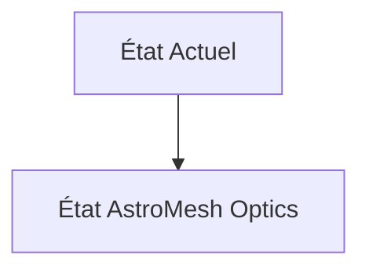
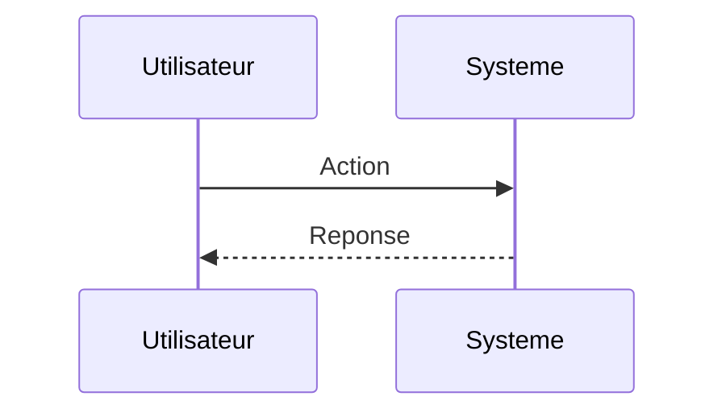

<!-- markdownlint-disable MD009 MD010 MD013 MD022 MD028 MD032 MD033 MD034 MD036 MD037 MD039 MD041 MD060 -->

[ 🇬🇧 English Version ](./README.md)

# AstroMesh Optics

> **Résumé exécutif :** Un système d'exploitation de réseau distribué (Network OS) pour les constellations optiques spatiales, utilisant l'IA prédictive pour calculer les topologies de maillage optimales en temps réel, pointant les lasers de communication en anticipant les orbites, les perturbations atmosphériques et la météo spatiale.

---

## 1. Aperçu visuel & Effet Wahou

## 2. La thèse contrariante (Peter Thiel Style)

**La croyance populaire :** Les solutions généralistes IA peuvent résoudre ce problème.

**La vérité cachée :** Les algorithmes de routage terrestre (OSPF, BGP) supposent des nœuds fixes ou à faible mobilité. Dans l'espace, les nœuds se déplacent à 27 000 km/h. Il faut une maîtrise de la mécanique orbitale, de la balistique et de l'ingénierie optique de précision.

## 3. Le problème & La cible

**Modèle économique :** B2B / M2M

**Cible précise :** Opérateurs de constellations de satellites (Starlink, Kuiper), agences spatiales, fournisseurs de télécommunications.

**La douleur urgente :** Le transfert de données entre satellites LEO (Low Earth Orbit) et la Terre souffre de limites de bande passante radio (RF) et de latence. Les liaisons inter-satellites (ISL) optiques existent, mais manquent d'un protocole de routage dynamique capable de gérer les interruptions de lien, le suivi de cibles en mouvement ultra-rapide et l'évitement des débris.

## 4. Architecture technique & Plomberie

## 5. Modèle économique & Viabilité financière

| Métrique                    | Valeur                        |
| --------------------------- | ----------------------------- |
| Structure de prix           | Abonnement SaaS               |
| Objectif 12 mois            | 10 clients                    |
| Calcul du CA (Target 100k€) | 10 clients \* 10k€/an = 100k€ |
| Marge brute estimée         | 80%                           |

## 6. Moteur de distribution & Fossé défensif (Moat)

**Stratégie d'acquisition :** Vente directe B2B

**Moat (Barrière à l'entrée) :** Coût d'accès à l'espace prohibitif pour tester en conditions réelles; dépendance au lancement de matériel par des tiers; marché naissant avec peu d'acteurs capables d'acheter la solution.

## 7. Grille d'évaluation détaillée

| Critère                           | Score VC (/100) | Score Terrain (/100) |
| --------------------------------- | --------------- | -------------------- |
| Thèse & Monopole / Urgence        | -- / 25         | -- / 25              |
| Moat / Résistance aux LLM natifs  | -- / 25         | -- / 25              |
| Scalabilité / Friction d'adoption | -- / 25         | -- / 25              |
| Unit Economics / ROI direct       | -- / 25         | -- / 25              |
| **TOTAL**                         | **-- / 100**    | **-- / 100**         |

> **Verdict VC :** En attente d'évaluation.

> **Verdict Terrain :** En attente d'évaluation.
