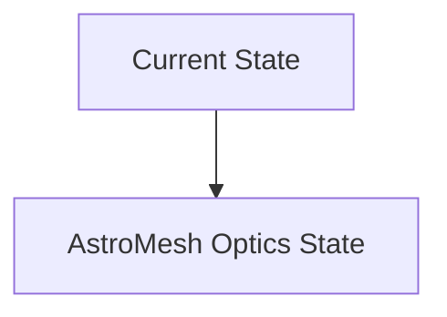
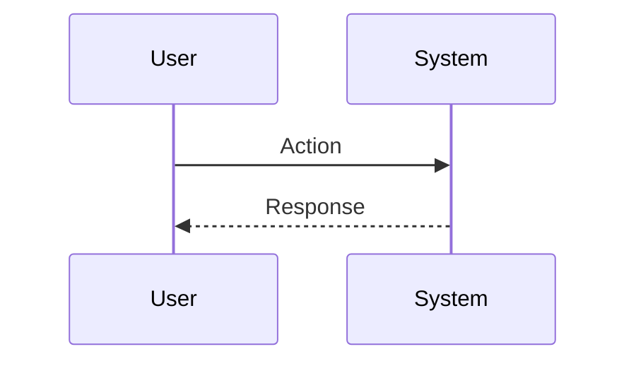

<!-- markdownlint-disable MD009 MD010 MD013 MD022 MD028 MD032 MD033 MD034 MD036 MD037 MD039 MD041 MD060 -->

[ 🇫🇷 Version Française ](./README.fr.md)

# AstroMesh Optics

> **Executive Summary:** A distributed network operating system (Network OS) for space optical constellations, using predictive AI to calculate optimal mesh topologies in real time, pointing communications lasers in anticipation of orbits, atmospheric disturbances and space weather.

---

## 1. Visual Overview & Wow Effect

## 2. Contrarian Thesis (Peter Thiel Style)

**Popular Belief:** General AI solutions can solve this problem.

**Hidden Truth:** Terrestrial routing algorithms (OSPF, BGP) assume fixed or low mobility nodes. In space, the nodes move at 27,000 km/h. It requires mastery of orbital mechanics, ballistics and precision optical engineering.

## 3. Problem & Target Market

**Business Model:** B2B / M2M

**Target Audience:** Satellite constellation operators (Starlink, Kuiper), space agencies, telecommunications providers.

**Urgent Pain Point:** Data transfer between Low Earth Orbit (LEO) satellites and Earth suffers from radio bandwidth (RF) and latency limitations. Optical inter-satellite links (ISLs) exist, but lack a dynamic routing protocol capable of handling link interruptions, tracking of ultra-fast moving targets, and debris avoidance.

## 4. Technical Architecture & Infrastructure

## 5. Business Model & Financial Viability

| Metric                 | Value                           |
| ---------------------- | ------------------------------- |
| Pricing Structure      | SaaS subscription               |
| 12-Month Target        | 10 customers                    |
| Revenue Formula        | 10 clients \* 10k€/year = 100k€ |
| Estimated Gross Margin | 80%                             |

## 6. Distribution Engine & Moat

**Acquisition Strategy:** B2B direct sales

**Moat (Defensibility):** Cost of access to space prohibitive to test in real conditions; dependence on third-party hardware launches; emerging market with few players capable of purchasing the solution.

## 7. Detailed Evaluation Grid

| Criterion                   | VC Score (/100) | Market Score (/100) |
| --------------------------- | --------------- | ------------------- |
| Thesis & Monopoly / Urgency | -- / 25         | -- / 25             |
| Moat / LLM Immunity         | -- / 25         | -- / 25             |
| Scalability / UX Friction   | -- / 25         | -- / 25             |
| Unit Economics / ROI        | -- / 25         | -- / 25             |
| **TOTAL**                   | **-- / 100**    | **-- / 100**        |

> **VC Verdict:** Pending evaluation.

> **Market Verdict:** Pending evaluation.
